# 🪰 FruitFlyBrain — the fruit-fly brain, from connectome to a fly you can teach

[](LICENSE)
[](datasets/README.md)
[](https://www.python.org/)

[](projects/09_flylab)
[](https://rohitcraftsyt.github.io/FruitFlyBrain/projects/09_flylab/dashboard/)

Nine working projects built on **officially released *Drosophila melanogaster*
brain data**. They go from network science on a 3.5-million-synapse connectome,
through machine-learning models trained on its wiring, to **FlyLab**: a
physics-simulated fruit fly whose brains keep training continuously and
perform tasks you give them in plain English.

Everything uses reputable primary sources (Janelia HHMI, the Princeton/MRC
FlyWire consortium, EPFL's NeuroMechFly), downloads without a login, and has
been **run end-to-end**. Every animation below was generated by the code in this
repo ([`make_gifs.py`](make_gifs.py)).

<p align="center">
  <br>
  <em>FlyLab: a brain that only has its two antennae steers NeuroMechFly (a micro-CT-based fruit-fly
  body) to food in MuJoCo physics. The HUD shows what it smells and the descending commands it sends to its legs.</em>
</p>

**👉 Watch the brains train live: [training dashboard](https://rohitcraftsyt.github.io/FruitFlyBrain/projects/09_flylab/dashboard/)**

---

## Contents

- [FlyLab: teach a physics-simulated fruit fly](#-flylab--teach-a-physics-simulated-fruit-fly-project-09) (flagship)
- [The data](#the-data--two-complementary-connectomes)
- [Quick start](#quick-start)
- [Connectome analysis projects 01–05](#connectome-analysis)
- [Machine-learning projects 06–08](#-machine-learning-on-the-connectome)
- [Results at a glance](#results-at-a-glance)
- [Repository layout](#repository-layout) · [Reproducing the animations](#reproducing-the-animations) · [Citations & license](#citations)

---

## 🎮 FlyLab — teach a physics-simulated fruit fly ([Project 09](projects/09_flylab))

Type *"find the food"*, *"go to the light"* or *"turn left 90"*. The fly's brain
for that skill trains, then drives **NeuroMechFly v2** (EPFL; a body built from a
micro-CT scan of a real adult *Drosophila*, with 42 actuated leg joints, leg
adhesion and ground contact) in **MuJoCo physics** through the official FlyGym
walking controller.

- **7 skills, 7 brains.** Each skill has its **own neural network and its own
  training process**, so learning one skill never overwrites another. An
  earlier single shared brain forgot skills: it fell from 86% to 57% physics
  success after a long curriculum.
- **Continuous training with physics in the loop.** Each round runs 100
  Evolution-Strategies generations in a surrogate body calibrated against
  physics, then validates in real MuJoCo. A brain is only replaced when it does
  better **in physics**, and every new best is scored on **held-out physics
  arenas never used for selection**. Mastery is progressive over three levels
  (6 → 12 → 24 validation arenas).
- **Realistic senses.** Odor is sampled at the model's **measured aristae**
  (0.52 mm ahead of the thorax, 0.38 mm apart), there are two compound eyes,
  and the gait wobble (0.15 mm and 3.6° per step), measured in physics, is fed
  back into training.

### The seven brains in physics
*Each film is the current best brain on an arena it has never seen, rendered
automatically as training improves it.*

| Walk forward & stop | Turn in place | Go to a location |
|:---:|:---:|:---:|
| 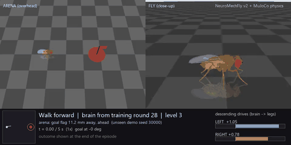 | 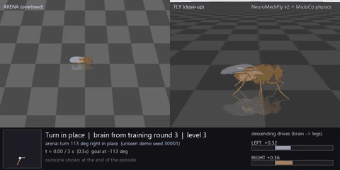 | 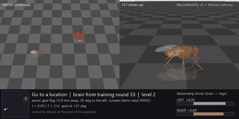 |
| **Find food by smell** | **Escape a bad smell** | **Walk toward light** |
| 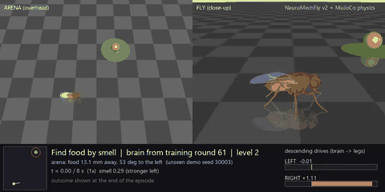 | 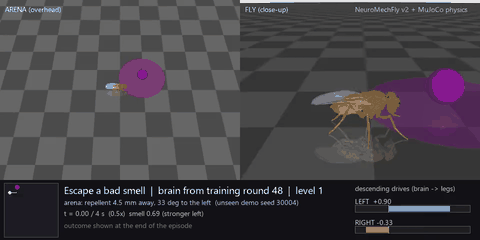 | 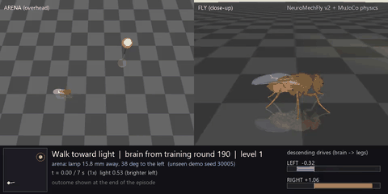 |
| **Hide from light** | | |
| 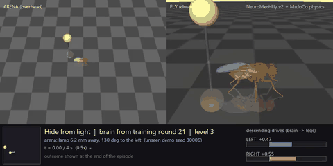 | | |

### Training, round by round

<p align="center">
  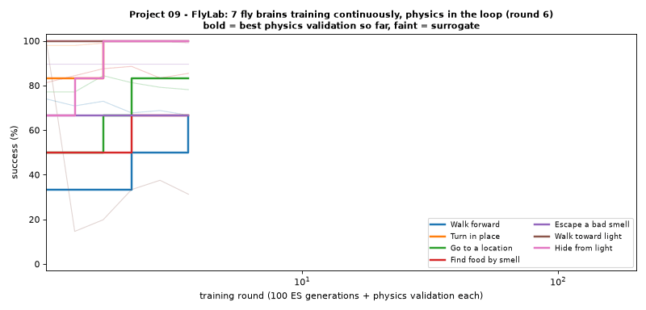
</p>

**Snapshot (2026-09-26)**, from [`training/TRAINING.md`](projects/09_flylab/training/TRAINING.md);
the [dashboard](https://rohitcraftsyt.github.io/FruitFlyBrain/projects/09_flylab/dashboard/) is always current:

| Skill brain | Rounds | Physics validation | **Held-out physics test** (95% CI) | Status |
|---|---:|---:|---:|---|
| Walk forward | 28 | 100% of 24 | **100% of 32** (89–100%) | ✅ optimal |
| Turn in place | 3 | 96% of 24 | **91% of 32** (76–97%) | ✅ optimal |
| Go to a location | 33 | 100% of 24 | **100% of 32** (89–100%) | ✅ optimal |
| Find food by smell | 61 | 100% of 24 | **100% of 32** (89–100%) | ✅ optimal |
| Hide from light | 21 | 100% of 24 | **100% of 32** (89–100%) | ✅ optimal |
| Escape a bad smell | 201 | 100% of 6 | 100% of 8 (68–100%) | 🔄 training (level 1/3) |
| Walk toward light | 193 | 100% of 6 | 62% of 8 (31–86%) | 🔄 training (level 1/3) |

**How it got here** (full [engineering log](projects/09_flylab/README.md#making-skills-survive-the-jump-to-physics-engineering-log)):
each failure was measured in physics and then fixed.

- Physics initially ran at 0.02× real time. Updating the controller at 1 kHz
  made it **~20× faster** with the gait verified unchanged.
- The fly circled food instead of stopping, so the task now rewards dwell time.
- Escaping a smell scored 100% in the surrogate but 0% in physics. The cause
  was measured gait wobble; the fix was domain randomization plus sensory
  integration.
- The fly "stood still" by rocking one side backward, so the surrogate now
  models leg-activity sway.
- Walking toward light fidgeted at an eye-level lamp, so the lamp moved
  overhead.
- A shared brain forgot skills, so every skill now has its own brain.

```bash
python -m venv .venv-sim && .venv-sim\Scripts\pip install -r requirements-sim.txt
cd projects\09_flylab
..\..\.venv-sim\Scripts\python flylab.py              # then type: find the food
..\..\.venv-sim\Scripts\python supervise.py           # keep every brain training
```

---

## The data — two complementary connectomes

| Dataset | What it is | Scale | Source |
|---|---|---|---|
| **hemibrain v1.2** | dense reconstruction of the central brain: *every traced neuron + synapse* | 21,739 neurons · 3.55 M connections · 14.3 M synapses | Janelia FlyEM (CC BY 4.0) |
| **FlyWire FAFB** | annotations for a *complete* adult brain | 139,248 neurons · 8,840 cell types | FlyWire consortium (CC BY 4.0) |
| **NeuroMechFly v2** | biomechanical fly body + locomotion controllers (Project 09) | 42 actuated joints, MuJoCo | EPFL NeLy lab, FlyGym (Apache-2.0) |

Provenance, licenses, SHA-256 checksums and citations are in
[`datasets/README.md`](datasets/README.md).

## Quick start

```bash
# from the FruitFlyBrain/ directory: projects 01-08
python -m venv .venv
.venv\Scripts\pip install -r requirements.txt        # Windows (macOS/Linux: source .venv/bin/activate)
python download_datasets.py                          # connectome data, ~275 MB, first run only

.venv\Scripts\python projects\01_connectome_graph_analysis\analyze.py
.venv\Scripts\python projects\02_neurotransmitter_atlas\atlas.py
.venv\Scripts\python projects\03_shortest_path_circuits\trace.py
.venv\Scripts\python projects\04_connectome_neural_network\simulate.py
.venv\Scripts\python projects\05_navis_3d_viewer\view_neurons.py
.venv\Scripts\python projects\06_celltype_classifier\train_classifier.py
.venv\Scripts\python projects\07_neuron_embeddings\embed_and_cluster.py
.venv\Scripts\python projects\08_synapse_link_prediction\link_prediction.py

# project 09 (FlyLab) has its own environment: see the FlyLab section above
```

Each script prints a summary and writes its figures and tables to its own
`outputs/` folder. Each project's `README.md` has usage, options and a sanity
check against known fly neuroscience.

---

## Connectome analysis

### 01 · [Connectome graph analysis](projects/01_connectome_graph_analysis) · hemibrain
The brain as a directed, weighted network: degree distributions, hubs and
connected components. The biggest hubs come out as **APL** and **DPM**, the
giant mushroom-body neurons known from the literature.

<p align="center">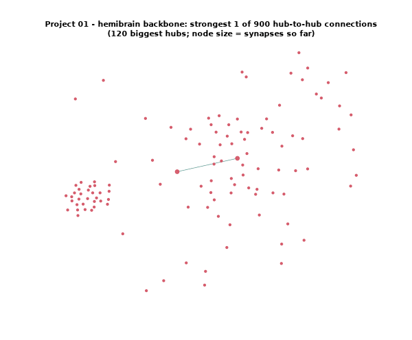</p>

### 02 · [Neurotransmitter & cell-type atlas](projects/02_neurotransmitter_atlas) · FlyWire
A census of a *complete* brain: 139,248 neurons by super-class and predicted
neurotransmitter. The brain is **~62% cholinergic**, 18% glutamatergic and 14%
GABAergic, matching the published figures.

<p align="center">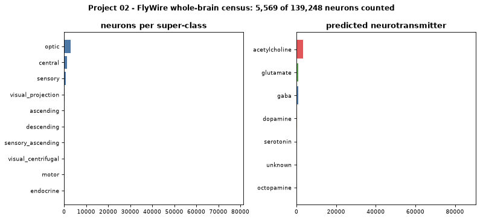</p>

### 03 · [Synaptic pathway tracer](projects/03_shortest_path_circuits) · hemibrain
The strongest multi-synapse routes between cell types (edge cost = 1 / synapses).
**Kenyon cells → MBONs** recovers the mushroom body's learning connection
directly, plus routes through the modulatory APL/DPM neurons.

<p align="center">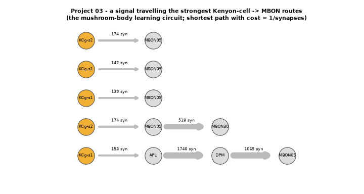</p>

### 04 · [Connectome-constrained neural network](projects/04_connectome_neural_network) · hemibrain
A recurrent network whose weights **are** the real central-complex wiring
(1,968 neurons, 243,743 connections). Stimulating **ER** ring neurons drives
the **EL/EPG** "compass" neurons, the known navigation pathway.

<p align="center">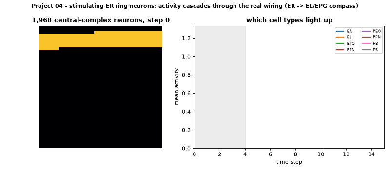</p>

### 05 · [3-D neuron morphology viewer](projects/05_navis_3d_viewer) · NAVis
Real neuron shapes as a static render **and an interactive 3-D HTML** (drag to
rotate). `--neuprint` fetches the top hubs found by Project 01.

<p align="center">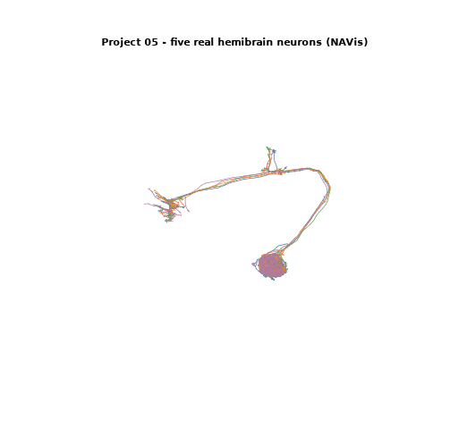</p>

---

## 🤖 Machine learning on the connectome

### 06 · [Connectivity-based cell-type classifier](projects/06_celltype_classifier) · supervised
Predicts a neuron's cell-type family from *who it connects to* alone.
RandomForest **88.2%** / neural net **87.6%** accuracy across **53 families**
(18,590 neurons), against an 11.3% majority baseline. The animation shows the
neural net training epoch by epoch.

<p align="center">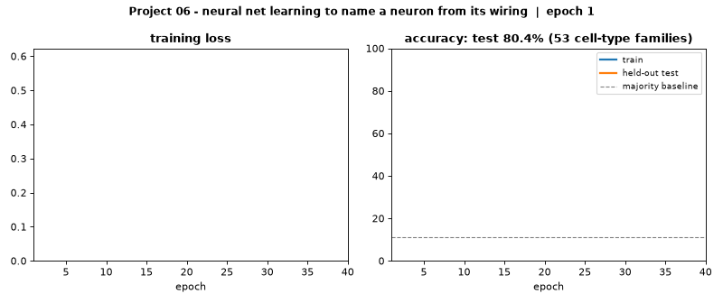</p>

### 07 · [Neuron embeddings & unsupervised cell typing](projects/07_neuron_embeddings) · unsupervised
128-d embeddings learned from wiring alone recover cell types **without any
labels**: NMI **0.59**, 63% mean cluster purity. The animation shows t-SNE
separating the families.

<p align="center">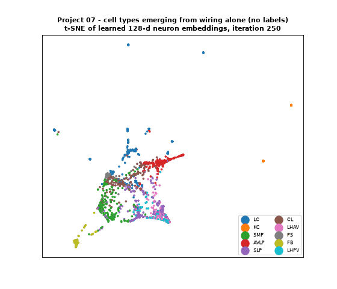</p>

### 08 · [Synapse link prediction](projects/08_synapse_link_prediction) · graph ML
Does neuron A synapse onto neuron B? The split is leakage-free (embeddings are
learned from training edges only). Gradient boosting reaches **0.971 ROC-AUC /
0.968 PR-AUC** on held-out connections. The animation shows the ROC curve
sharpening as trees are added.

<p align="center">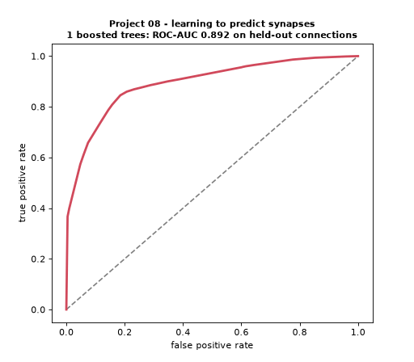</p>

---

## Results at a glance

| # | Project | Headline result |
|---|---|---|
| 01 | Connectome graph analysis | heavy-tailed wiring; top hubs **APL** (227k synapses) and **DPM** |
| 02 | Neurotransmitter atlas | **62%** cholinergic, 18% glutamate, 14% GABA across 139k neurons |
| 03 | Pathway tracer | strongest **KC → MBON** learning route recovered |
| 04 | Connectome-constrained dynamics | **ER → EPG** compass pathway emerges from raw wiring |
| 05 | 3-D morphology | interactive neuron viewer, linked to Project 01's hubs |
| 06 | Cell-type classifier | **88%** accuracy, 53 classes (baseline 11%) |
| 07 | Unsupervised cell typing | NMI **0.59** with no labels |
| 08 | Synapse link prediction | ROC-AUC **0.971** on unseen connections |
| 09 | FlyLab | **5 of 7** brains optimal (91–100% on held-out physics tests); 2 still training |

📄 **[`RESUME.md`](RESUME.md)** has paste-ready, quantified résumé bullets for all of this.

## Repository layout

```
FruitFlyBrain/
├── README.md · RESUME.md · CITATION.cff · LICENSE
├── requirements.txt          # projects 01-08
├── requirements-sim.txt      # project 09 (FlyGym / MuJoCo)
├── download_datasets.py      # fetches the connectome data
├── make_gifs.py              # builds every animation in this README
├── datasets/                 # provenance docs (data itself is downloaded)
├── docs/gifs/                # the animations
└── projects/
    ├── 01_connectome_graph_analysis/    05_navis_3d_viewer/
    ├── 02_neurotransmitter_atlas/       06_celltype_classifier/
    ├── 03_shortest_path_circuits/       07_neuron_embeddings/
    ├── 04_connectome_neural_network/    08_synapse_link_prediction/
    └── 09_flylab/
        ├── flylab.py           # talk to the fly
        ├── train_brains.py     # continuous per-brain training, physics in the loop
        ├── supervise.py        # keeps every brain training, re-films and publishes
        ├── training/           # per-brain logs, curves and reports (TRAINING.md)
        ├── state/brains/       # the trained brains (~5 KB each)
        └── dashboard/          # the live GitHub Pages dashboard
```

## Reproducing the animations

```bash
.venv\Scripts\python make_gifs.py                    # projects 01-08 + FlyLab training curves
.venv-sim\Scripts\python make_gifs.py flylab_videos  # FlyLab brain films
```

Every animation is computed from the real data by each project's own code.
Projects 06 and 08 re-run their pipelines and record the model while it trains.

## Environment used
Python 3.12 · pandas 3.0 · numpy 2.5 · networkx 3.6 · matplotlib 3.11 · scipy 1.18 ·
scikit-learn 1.9 · navis 1.12 · plotly 7.1 · FlyGym 2.1 · MuJoCo 3.9

## Going further
- **FlyWire synapse-level edges:** free account on [Codex](https://codex.flywire.ai),
  or programmatic access via [`CAVEclient`](https://github.com/seung-lab/CAVEclient) /
  [`fafbseg`](https://github.com/navis-org/fafbseg-py).
- **neuPrint queries:** [`neuprint-python`](https://github.com/connectome-neuprint/neuprint-python) (free token).
- **FlyLab realism roadmap:** [`REALISM_AUDIT.md`](projects/09_flylab/REALISM_AUDIT.md), a fact-checked
  list of what would make the simulated fly more lifelike.

## Citations
Please cite the original works when using them:
- Scheffer et al. (2020). *A connectome and analysis of the adult Drosophila central brain.* eLife 9:e57443.
- Dorkenwald et al. (2024). *Neuronal wiring diagram of an adult brain.* Nature 634, 124–138.
- Schlegel et al. (2024). *Whole-brain annotation and multi-connectome cell typing of Drosophila.* Nature 634, 139–152.
- Wang-Chen et al. (2024). *NeuroMechFly v2: simulating embodied sensorimotor control in adult Drosophila.* Nature Methods 21, 2353–2362.

Full references are in [`datasets/README.md`](datasets/README.md) and [`CITATION.cff`](CITATION.cff).

## License
- **Code & docs in this repo:** [MIT](LICENSE) © 2026 Rohit (ROHITCRAFTSYT).
- **Connectome datasets:** owned by their creators and used under **CC BY 4.0**.
- **NeuroMechFly / FlyGym:** EPFL, Apache-2.0 (installed as a dependency, not redistributed).
