# 🪰 FruitFlyBrain — *Drosophila* connectome datasets & projects

[](LICENSE)
[](datasets/README.md)
[](https://www.python.org/)

[](projects/09_flylab)

An organized, self-contained workspace built around **officially released fruit
fly (*Drosophila melanogaster*) brain connectome data**, with **nine working,
runnable projects** that analyze, trace, simulate, visualize and **train
machine-learning models on** the fly brain, including **FlyLab**, a
physics-simulated fruit fly you teach in plain English.

Everything here comes from reputable primary sources (Janelia HHMI and the
Princeton/MRC FlyWire consortium), was downloaded with **no login required**,
and has been **run end-to-end** — every image below was produced by the code in
this repo.

<p align="center">
  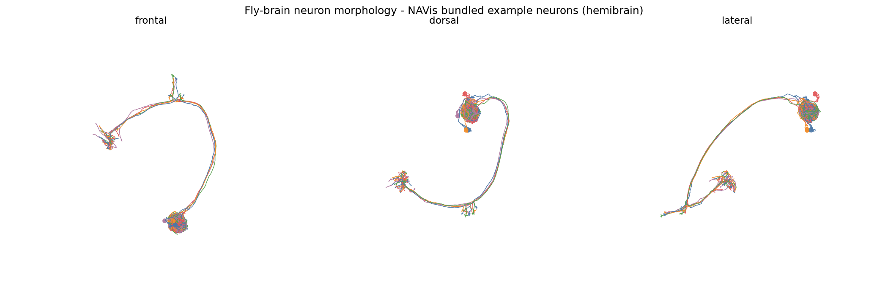<br>
  <em>Real hemibrain neurons rendered by Project 5 (NAVis) — frontal · dorsal · lateral.</em>
</p>

---

## 🎮 FlyLab — teach a physics-simulated fruit fly ([Project 09](projects/09_flylab))

Type *"find the food"*, *"go to the light"* or *"turn left 90"*. The fly's brain
**trains on that task**, and the trained brain then drives **NeuroMechFly v2**
(EPFL; a body built from a micro-CT scan of a real *Drosophila*) in **MuJoCo
physics**, performing your request on camera. The brain is saved after every
lesson and rehearses old skills while learning new ones, so it keeps getting
better across sessions.

<p align="center">
  <br>
  <em>A lesson, recorded by FlyLab: overhead arena, close-up of the fly, and the brain's live senses and descending drives.</em>
</p>

**Results so far:** in the recorded demo the physics fly succeeded on **7 of 9**
commanded tasks, finding food by smell alone and walking to a lamp by sight.
Every skill now has **its own brain and its own continuous training process**
with physics-in-the-loop validation and a held-out physics test. Live results
per brain are in [`projects/09_flylab/training/TRAINING.md`](projects/09_flylab/training/TRAINING.md).

```bash
python -m venv .venv-sim && .venv-sim\Scripts\pip install -r requirements-sim.txt
cd projects\09_flylab
..\..\.venv-sim\Scripts\python flylab.py            # then type: find the food
```

---

## The data — two complementary connectomes

| Dataset | What it is | Scale | Source |
|---|---|---|---|
| **hemibrain v1.2** | dense reconstruction of the central brain — *every traced neuron + synapse* | 21,739 neurons · 3.55 M connections · 14.3 M synapses | Janelia FlyEM (CC BY 4.0) |
| **FlyWire FAFB** | annotations for a *complete* adult brain | 139,248 neurons · 8,840 cell types | FlyWire consortium (CC BY 4.0) |

Provenance, licenses, SHA-256 checksums and citations are in
[`datasets/README.md`](datasets/README.md).

## Quick start

```bash
# from the FruitFlyBrain/ directory
python -m venv .venv
.venv\Scripts\pip install -r requirements.txt        # Windows
# source .venv/bin/activate && pip install -r requirements.txt   # macOS/Linux

python download_datasets.py          # fetch the connectome data (~275 MB, first run only)

.venv\Scripts\python projects\01_connectome_graph_analysis\analyze.py
.venv\Scripts\python projects\02_neurotransmitter_atlas\atlas.py
.venv\Scripts\python projects\03_shortest_path_circuits\trace.py
.venv\Scripts\python projects\04_connectome_neural_network\simulate.py
.venv\Scripts\python projects\05_navis_3d_viewer\view_neurons.py
.venv\Scripts\python projects\06_celltype_classifier\train_classifier.py
.venv\Scripts\python projects\07_neuron_embeddings\embed_and_cluster.py
.venv\Scripts\python projects\08_synapse_link_prediction\link_prediction.py

# Project 09 (FlyLab) uses its own environment -- see the FlyLab section above
```

Each script writes figures and CSV tables into its own `outputs/` folder and
prints a summary to the console. **Résumé bullets** with all the ML metrics are
in [`RESUME.md`](RESUME.md).

---

## The projects

Each folder has its own `README.md` with usage, options and a sanity check that
confirms the result matches known fly neuroscience.

### 1 · [Connectome graph analysis](projects/01_connectome_graph_analysis) &nbsp;·&nbsp; hemibrain
Treats the brain as a directed, weighted network: degree distributions, hub
neurons, and connected components. The top hubs come out as **APL** and **DPM**
— the giant mushroom-body neurons known from the literature. ✔

<p align="center">
  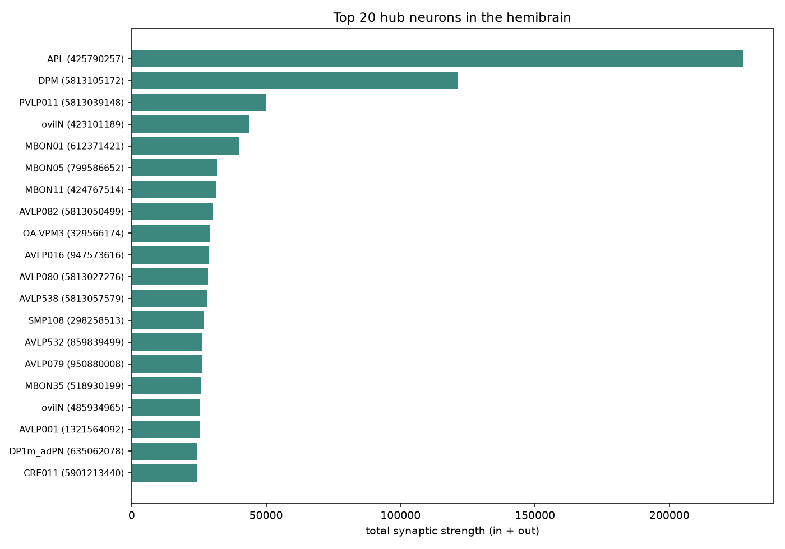
  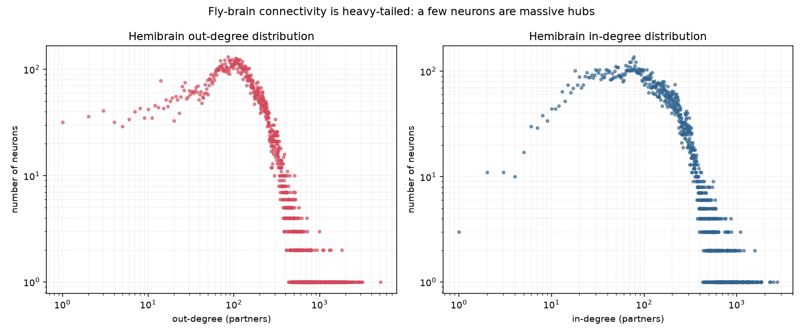
</p>

### 2 · [Neurotransmitter & cell-type atlas](projects/02_neurotransmitter_atlas) &nbsp;·&nbsp; FlyWire
A census of a *complete* brain: neurons per super-class, cell types, symmetry,
and the predicted neurotransmitter mix — **~62 % cholinergic**, 18 % glutamate,
14 % GABA, matching the published figures. ✔

<p align="center">
  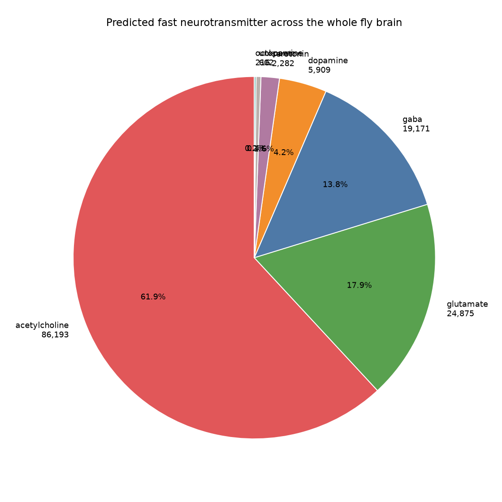
  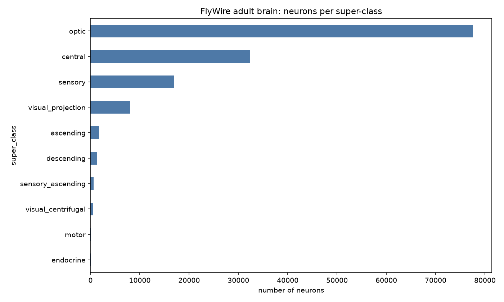
</p>

### 3 · [Synaptic pathway tracer](projects/03_shortest_path_circuits) &nbsp;·&nbsp; hemibrain
Finds the strongest multi-synapse routes between cell types (edge distance =
1 ⁄ synapse-weight). The default **KC → MBON** trace returns the fundamental
learning connection, plus an alternative route via the modulatory APL/DPM. ✔

<p align="center">
  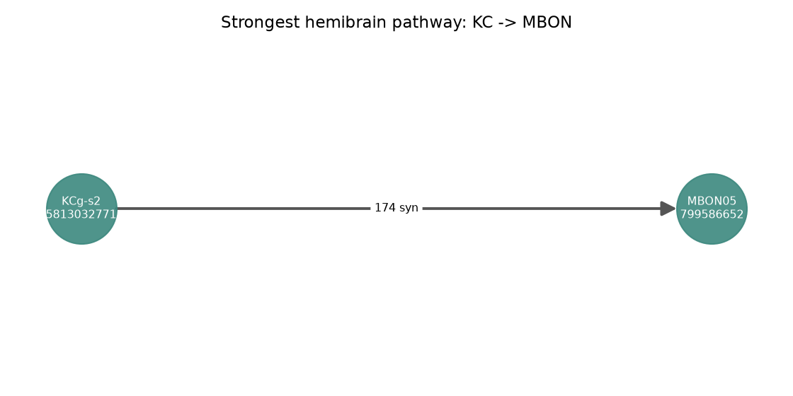
</p>

### 4 · [Connectome-constrained neural network](projects/04_connectome_neural_network) &nbsp;·&nbsp; hemibrain
Builds a recurrent network whose weight matrix **is the real connectome**, then
watches a stimulus cascade through it. Stimulating **ER** ring neurons most
strongly drives the **EPG** compass — the known navigation pathway. ✔

<p align="center">
  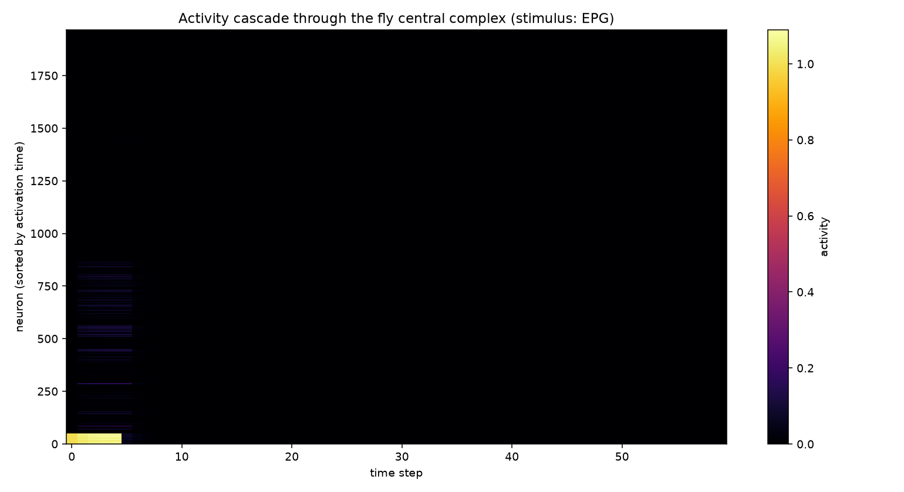
  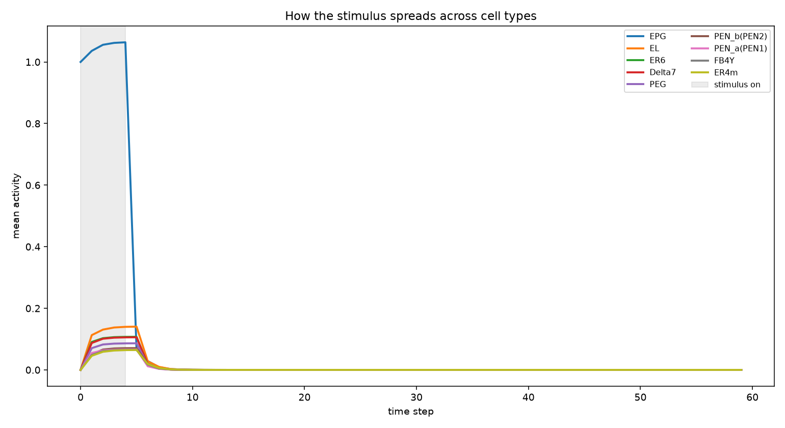
</p>

### 5 · [3D neuron morphology viewer](projects/05_navis_3d_viewer) &nbsp;·&nbsp; NAVis
Renders neuron shapes as a static multi-view PNG **and an interactive 3D HTML**
(drag to rotate, scroll to zoom). Works with zero setup on bundled neurons;
`--neuprint` pulls the top hub neurons straight from Project 1's output. ✔

*(See the hero image at the top of this README.)*

---

## 🤖 Machine-learning projects

These train real models on the connectome and report reproducible, held-out
metrics. Full write-ups in each folder; résumé bullets in [`RESUME.md`](RESUME.md).

### 6 · [Connectivity-based cell-type classifier](projects/06_celltype_classifier) &nbsp;·&nbsp; supervised
Predicts a neuron's cell-type family from its synaptic fingerprint alone.
RandomForest + neural net reach **88% accuracy / 0.85 macro-F1** across **53
cell-type families** (18,590 neurons) vs. an 11% majority baseline. ✔

<p align="center">
  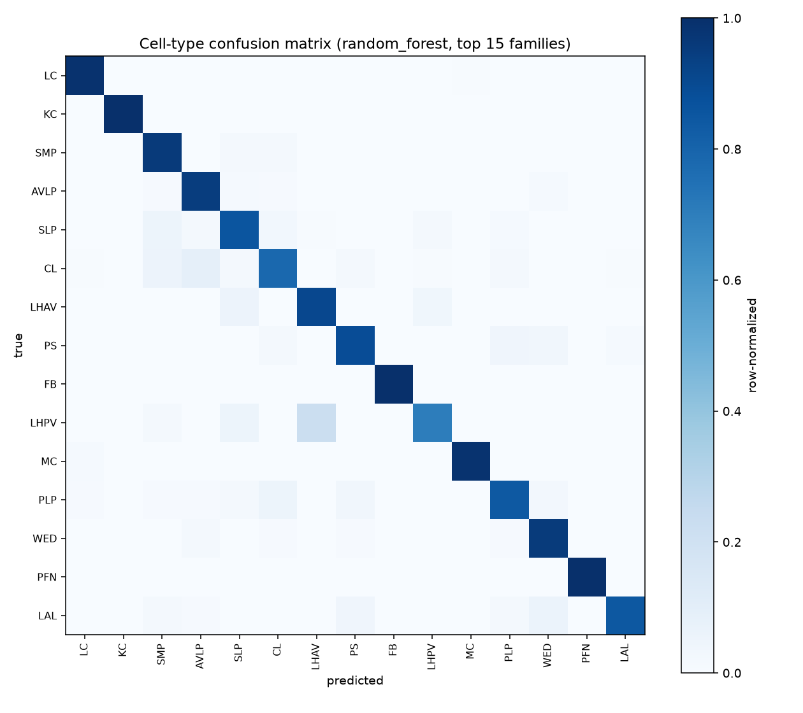
  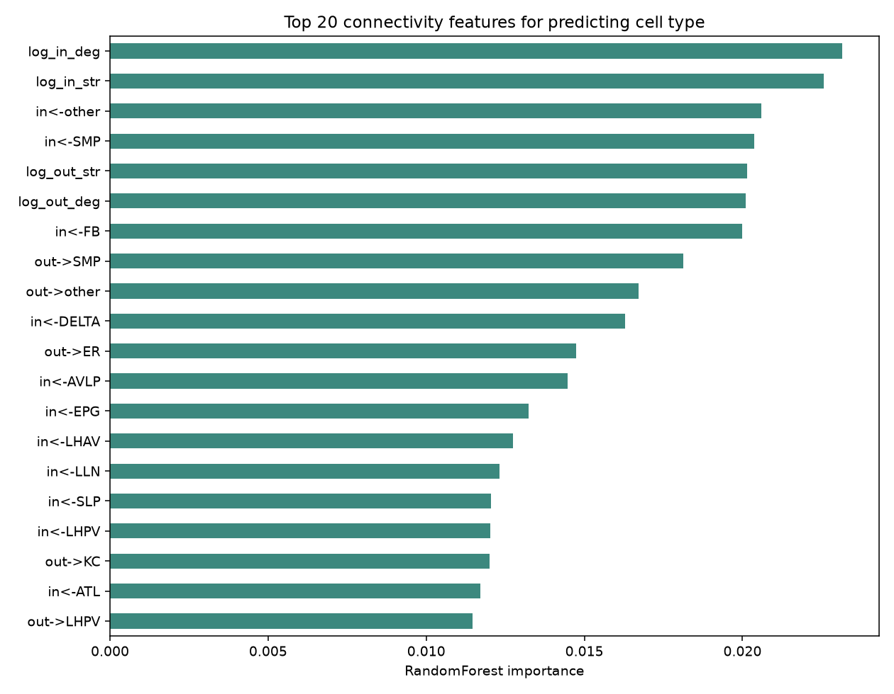
</p>

### 7 · [Neuron embeddings & unsupervised cell typing](projects/07_neuron_embeddings) &nbsp;·&nbsp; unsupervised
Learns 128-d neuron embeddings from the wiring and recovers known cell types
**without labels** — **NMI 0.59**, 63% mean cluster purity. ✔

<p align="center">
  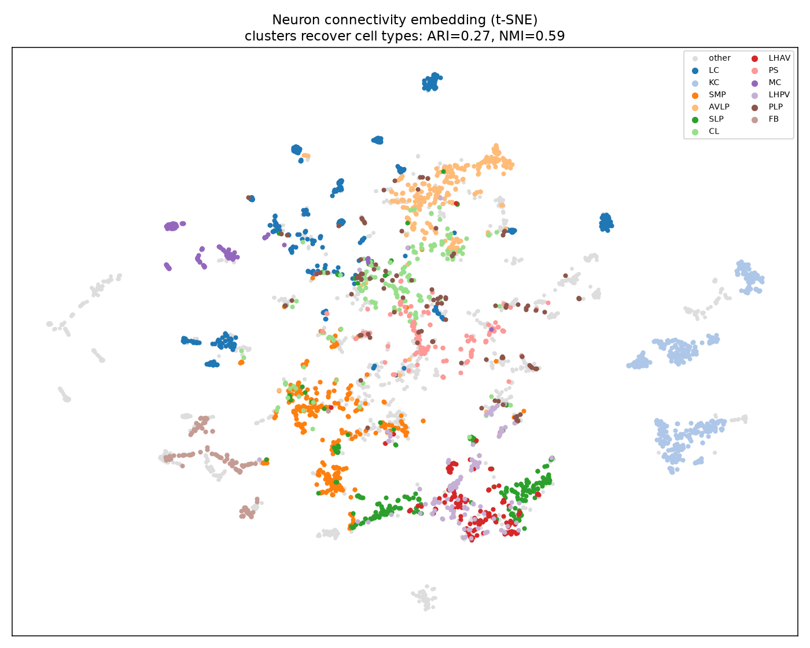
</p>

### 8 · [Synapse link prediction](projects/08_synapse_link_prediction) &nbsp;·&nbsp; graph ML
Predicts whether one neuron synapses onto another, with a leakage-free edge
split. Gradient boosting on graph embeddings hits **0.97 ROC-AUC / 0.97
PR-AUC** on held-out connections. ✔

<p align="center">
  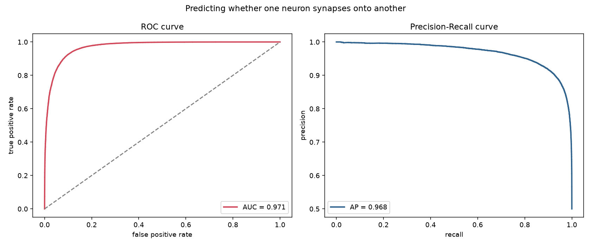
</p>

---

## Environment used
Python 3.12 · pandas 3.0 · numpy 2.5 · networkx 3.6 · matplotlib 3.11 · scipy 1.18 · scikit-learn 1.9 · navis 1.12 · plotly 7.1

## Going further
- **FlyWire synapse-level edges:** free account on [Codex](https://codex.flywire.ai)
  (Info → Download Data), or programmatic access via
  [`CAVEclient`](https://github.com/seung-lab/CAVEclient) /
  [`fafbseg`](https://github.com/navis-org/fafbseg-py).
- **neuPrint hemibrain queries:** [`neuprint-python`](https://github.com/connectome-neuprint/neuprint-python) (free token).
- **3D neuron morphologies & visualization:** [`navis`](https://github.com/navis-org/navis).

## License
- **Code & docs in this repo:** [MIT](LICENSE) © 2026 Rohit (ROHITCRAFTSYT).
- **Connectome datasets:** owned by their creators and used under **CC BY 4.0** —
  not covered by the MIT license. Please cite the original works (Scheffer et al.
  2020 *eLife*; Dorkenwald et al. 2024 and Schlegel et al. 2024 *Nature*); full
  references in [`datasets/README.md`](datasets/README.md).
