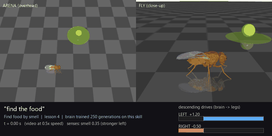
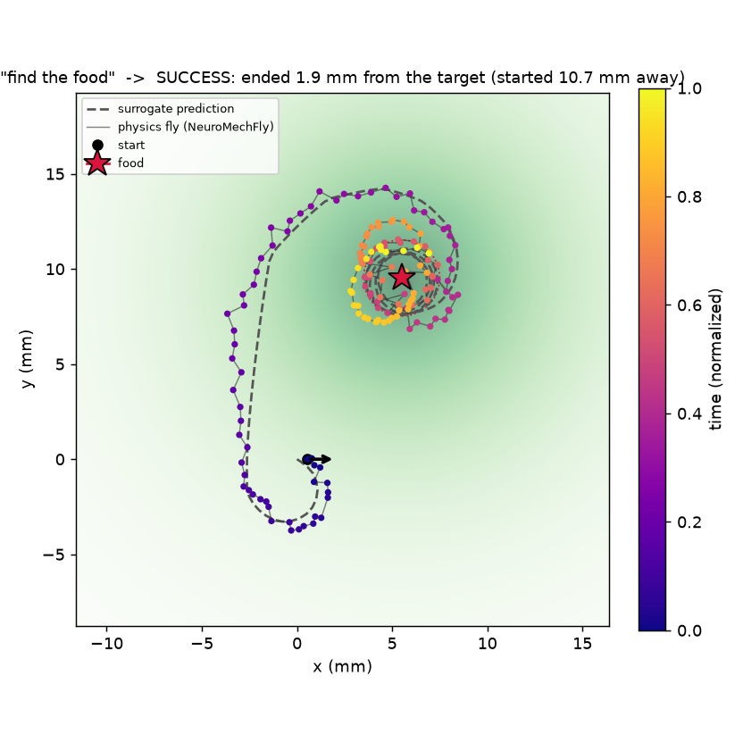
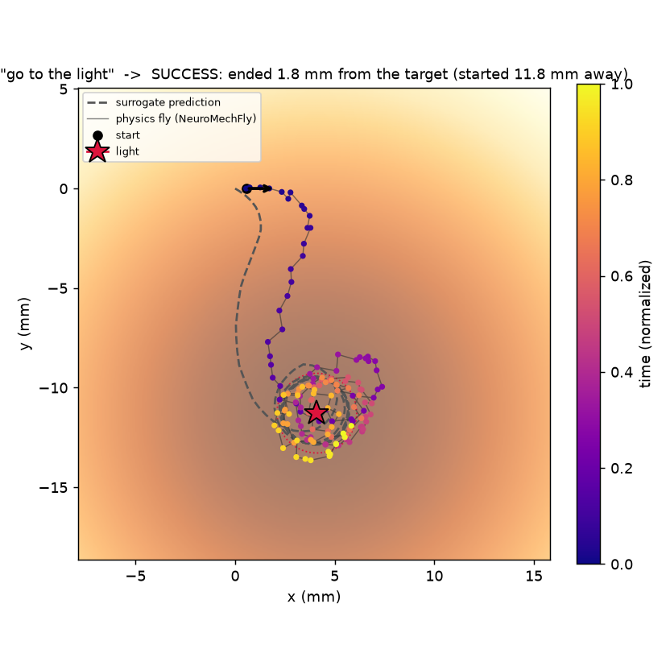
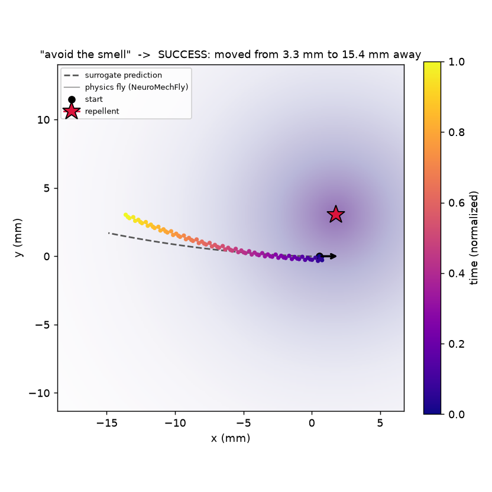
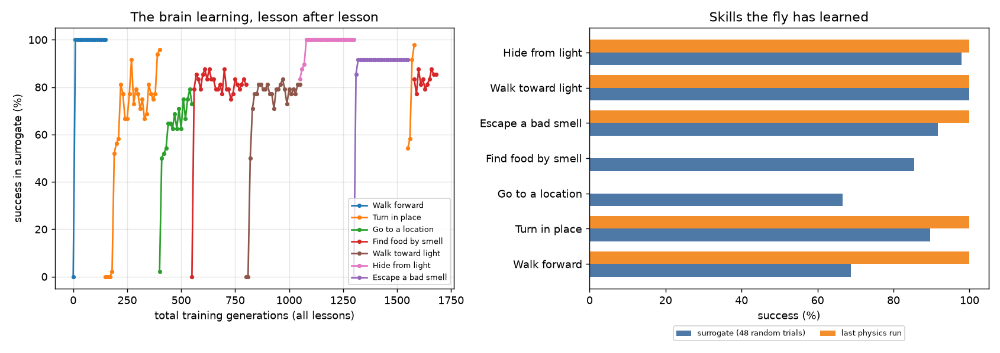
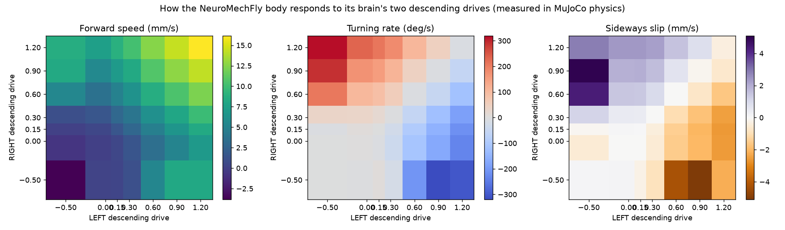

# Project 09 — FlyLab: teach a physics-simulated fruit fly 🪰🎮

Type what you want the fly to do in plain English (*"find the food"*, *"go to the
light"*, *"turn left 90"*). The fly's brain **trains on that task**, then the
trained brain is loaded into a **full physics model of a real fruit fly**, which
performs your request on camera. **Every skill has its own brain and its own
training process**, and `train_brains.py` keeps improving all of them with
physics in the loop. Brains are saved after every lesson and every round, so the
fly keeps learning across sessions without one skill overwriting another.

<p align="center">
  <br>
  <em>"find the food": the NeuroMechFly body in MuJoCo, steered by a brain that
  only has its two antennae. The HUD shows what it smells and its descending drives.</em>
</p>

**The recorded demo** (`flylab.py demo`, one newborn brain, 9 lessons): the
physics fly succeeded on **7 of 9** commanded tasks right after each lesson.
It walked 12 mm and stopped within 1.2 mm, turned 90° to within 3°, found food
by smell alone, walked to a lamp by sight, fled a light and a repellent, and
re-learned a partly forgotten turn in 19 s (54% → 98%) instead of the original
48 s. Both misses were close approaches just outside the 2 mm success radius.

<p align="center">
  
  
  
  <br><em>Physics trajectories (dots, coloured by time) vs. the surrogate's
  prediction (dashed) for three lessons.</em>
</p>

<p align="center">
  
</p>

## What's "real" here

| Layer | What it is | Source |
|---|---|---|
| **Body** | NeuroMechFly v2: a biomechanical model built from a **micro-CT scan of a real adult female *Drosophila***; 42 actuated leg joints, leg adhesion, ground contact, in MuJoCo physics at 10 kHz | EPFL Neuroengineering Lab, [FlyGym 2.1](https://github.com/NeLy-EPFL/flygym) (Apache-2.0) |
| **Spinal cord (VNC)** | The official hybrid **turning controller**: central pattern generators + leg-coordination rules turn two descending signals into a tripod gait | FlyGym |
| **Brains** | *This project.* **One small neural network per skill** (7 brains): bilateral **antennae** (smell) + bilateral **compound eyes** (light) + a goal compass → **left/right descending drives** | trained here |
| **Senses** | Odor sampled at the **measured aristae positions** of the model (0.52 mm ahead of the thorax, ±0.19 mm apart); light via two eyes tuned ±30°; ~0.1 s sensory integration | `world.py` |

The brain → VNC interface is two numbers, the left and right descending drive.
That mirrors real flies, where descending neurons carry the brain's steering
commands to the ventral nerve cord that patterns the legs.

## How the progressive training works

```
 you: "find the food"
   │
   ▼
 1. parse ─► task = odor_seek (the fly must use its antennae; no goal compass)
 2. TRAIN that skill's own brain in the calibrated surrogate body
      (32 candidate brains × 16 randomized arenas per generation)
      Evolution Strategies (antithetic, rank-shaped, Adam, common random numbers)
 3. DEPLOY the trained brain into NeuroMechFly physics (MuJoCo)
      brain 20 Hz → turning controller 1 kHz → physics 10 kHz
 4. RECORD: overhead + close-up video with a live brain HUD, trajectory map
      (surrogate prediction vs. physics reality), learning chart, diary page
 5. SAVE the brain → next command continues from here
```

**Why a surrogate?** On a laptop CPU the full physics fly runs at ~0.4× real
time, so training directly in physics would take ~30–50 min per skill. Instead,
`calibrate.py` measures the real body once: for 36 combinations of left/right
drive, it records forward speed, sideways slip and turning rate in MuJoCo, plus
the CPG response lag. The surrogate replays those measurements, so thousands
of flies train in parallel in seconds. The trained brain then runs in the real
physics fly (**sim-to-sim transfer**), and every lesson's map overlays the
surrogate's prediction on what the physics fly actually did.

<p align="center">
  
  <br><em>Measured in MuJoCo: how the NeuroMechFly body moves for each pair of left/right descending drives.</em>
</p>

## Making skills survive the jump to physics (engineering log)

Every fix below came from watching the physics fly fail and measuring why:

| Problem seen in physics | Diagnosis (measured) | Fix |
|---|---|---|
| Physics ran at **0.02× real time** | profiler: leg controller 3.5 ms + readout 1.3 ms per 0.1 ms physics step | update the controller at **1 kHz** instead of 10 kHz; gait unchanged (12.72 vs 12.73 mm/s), **~20× faster** |
| Fly **circled the food** instead of stopping | reward only checked the final position | reward **dwell time** inside the goal zone |
| "Turn" learned **turn-and-sprint** (32 mm away) | displacement barely penalized | success now requires staying within 6 mm |
| **Escape-the-smell: 100% surrogate, 0% physics** | physics thorax wobbles **0.15 mm and 3.6° every step**; near the source that swings the antennae's signal wildly | **domain randomization** (±20% gains, veer, lag, *measured* gait wobble on the senses) + a ~0.1 s **sensory integrator**, like real insect neurons |
| Training stalled under randomization | 32 candidate brains saw different random noise, so fitness ranked luck | **common random numbers** + per-skill rank shaping |
| Old skills **forgotten** as new ones arrived | rehearsal covered only some skills, averaged away | rehearse **every** skill, each ranked separately; a `sleep` command consolidates |
| Fly reached the goal, then **crept 3.6 mm away** | measured: a 0.10 "stop" command still creeps 0.77 mm/s; exact 0 stops dead | **motor gate** (tiny drives → exact halt) + a finer calibration grid near zero |
| Smell learning then **flat-lined at 2%** | "no goal" inputs looked like "arrived, stop"; a hard deadband made every candidate identical | explicit **"goal known"** input + a *ramped* gate that keeps a learning signal |
| After a 9-lesson curriculum, **one shared brain scored 57%** in physics | skills that were excellent right after their lesson (walk: 0.5 mm stop, turn: 2°) drifted as later lessons reshaped the shared weights (walk 1/5, turn 0/5); rehearsal and a `sleep` consolidation step only partly helped | **one brain per skill** + **continuous training with physics in the loop** (below) |
| Walk / go-to / smell brains **plateaued at ~70-80%** for 13-28 rounds; physics misses all landed at 1.5-2.6 mm (goal radius 2 mm) | surrogate: median stop 1.7 mm and the fly never halts, it circles with drives pinned at the limits (right 1.20, left -0.50). That's the body's tightest turning circle (~1.6 mm; the gait can't pivot). All 7 brains inherited saturated output weights (Σ\|W2\| ≈ 35 per motor) from the shared curriculum brain. A precision reward, a distance-scaled goal vector and shrinking W2 each left it at 1.7-1.8 mm; a **fresh** brain masters goto in 100 generations (100%, median stop 0.05-0.1 mm, with the original sensors and reward) and scored 5/6 in physics with misses mostly under 1 mm | **reseed** stuck lineages from fresh weights (step 6 below), keeping the old brain deployed until the new lineage beats it in physics |

Physics-transfer success (random arenas in full MuJoCo, same evaluator
throughout): **67%** (first version) → **86%** (domain randomization, fresh
curriculum) → **57%** (shared brain after a long curriculum: forgetting) →
per-skill brains with continuous physics-validated training:
<!-- FINAL_TRANSFER --> see [`training/TRAINING.md`](training/TRAINING.md) (updated live).

## Continuous training: every brain, its own process

```bash
..\..\.venv-sim\Scripts\python train_brains.py                    # all 7 brains, until mastered
..\..\.venv-sim\Scripts\python train_brains.py --skills odor_seek   # just one
```

Each skill brain loops through **rounds**:

1. **Surrogate training:** 100 ES generations, with exploration noise and
   step size **annealed** to the brain's current skill (explore early, polish late).
2. **Physics validation:** the new weights drive the full NeuroMechFly body in
   MuJoCo on 6 fixed validation arenas.
3. **Keep-the-best selection:** the deployed brain (`state/brains/<skill>.npy`)
   is replaced **only if physics performance improved**.
4. **Held-out test:** every new best is scored on 8 separate physics arenas that
   are **never used for selection**. These are the honest headline numbers.
5. **Patience:** 4 rounds without improvement and the working copy restarts from
   the best checkpoint.
6. **Reseed:** a lineage that still hasn't mastered even the surrogate after 8
   rounds is stuck in a local optimum, so the working copy starts over from fresh
   random weights (with double patience). The deployed brain stays in place
   until the new lineage beats it in physics.

The loop always trains the **weakest** skill next, is fully **resumable**
(stop it and run it again at any time), and writes everything down:
`training/<skill>/log.jsonl` (every round), `training/<skill>/REPORT.md` +
`curve.png` (per brain) and [`training/TRAINING.md`](training/TRAINING.md)
(all brains). A skill counts as **mastered** at 100% physics validation and
≥95% surrogate success; FlyLab then just performs it instead of retraining.

## Setup (separate environment; FlyGym pins its own versions)

```bash
# from the FruitFlyBrain/ root
python -m venv .venv-sim
.venv-sim\Scripts\pip install -r requirements-sim.txt
```

## Use it

```bash
cd projects\09_flylab
..\..\.venv-sim\Scripts\python flylab.py                     # interactive: type commands
..\..\.venv-sim\Scripts\python flylab.py "find the food"     # one command
..\..\.venv-sim\Scripts\python flylab.py demo                # teach every skill in sequence
```

| Say… | Skill | What the fly has to use |
|---|---|---|
| `find the food`, `follow the smell`, `eat the banana` | Find food by smell | two antennae only (chemotaxis) |
| `avoid the smell`, `escape the repellent` | Escape a bad smell | two antennae only |
| `go to the light`, `walk toward the sun` | Walk toward light | two eyes only (phototaxis) |
| `hide from the light`, `avoid the light` | Hide from light | two eyes only |
| `go to 10, 5` | Go to a location (mm, fly starts at 0,0 facing +x) | goal compass |
| `walk forward 12 mm` | Walk forward and stop | goal compass |
| `turn left 90`, `turn right 45`, `turn around` | Turn on the spot | goal compass |
| `practice find the food 200` | extra training, no video | — |
| `skills`, `show`, `reset`, `help`, `quit` | status / replay / newborn brain | — |

Repeat a command and the fly practises it: a new skill gets 150 generations
(250 for smell, light and turning), an unmastered skill 100, and a
well-trained skill a quick 30-generation refresh. A skill **mastered in
physics** by `train_brains.py` is performed as-is, without retraining. Don't
run FlyLab lessons while `train_brains.py` is training the same skill.
Everything is logged to `outputs/fly_diary.html` (videos, maps, numbers).

Flags: `--no-video` (physics but no rendering, faster), `--no-physics`
(train only), `--no-open` (don't auto-play the video), `--verbose`.

## Files

| File | Role |
|---|---|
| `flylab.py` | the console you talk to; runs lessons, keeps the diary |
| `tasks.py` | task library: scenario sampling, rewards, success tests, English parser |
| `world.py` | odor and light fields, and the fly's senses (shared by surrogate and physics) |
| `brain.py` | one neural-network brain per skill, persisted to `state/brains/` |
| `trainer.py` | Evolution Strategies (common random numbers, annealing) |
| `train_brains.py` | continuous per-brain training with physics validation, held-out tests and reports |
| `surrogate.py` | calibrated fast body model, vectorized over thousands of flies |
| `physics.py` | NeuroMechFly/MuJoCo bridge: calibration, deployment, cameras, scene markers |
| `calibrate.py` | measures the physics body → `state/calibration.npz` |
| `evaluate_physics.py` | runs the current brain on random arenas in full physics → transfer success table |
| `render.py` | composite video + HUD, trajectory maps, learning charts |

## Honest limits

- The **brain is learned, not connectome-wired**. Projects 01–08 analyze the
  real connectome; this project focuses on embodiment and learning. A natural
  next step is constraining the brain's hidden layer with connectome structure,
  e.g. central-complex wiring from Project 04.
- Odor and light are simple analytic fields (no turbulent plumes, no ray-traced
  vision). FlyGym's compound-eye renderer exists and could replace the
  two-eye model.
- Transfer is sim-to-sim (surrogate → physics). The trajectory maps show where
  the two agree and where physics differs.
