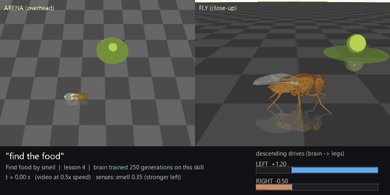
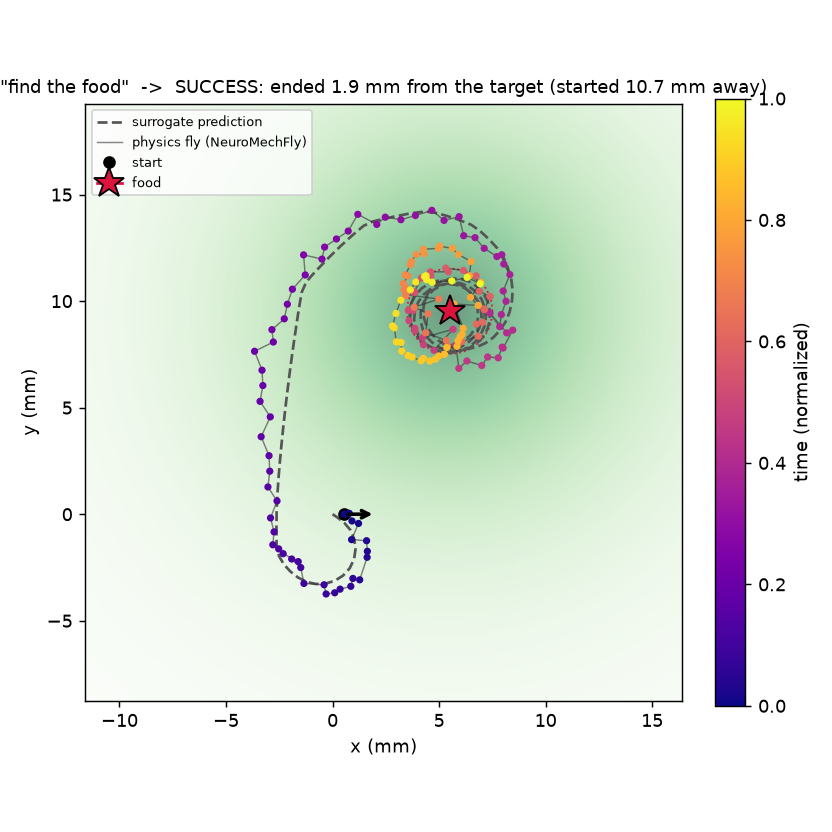
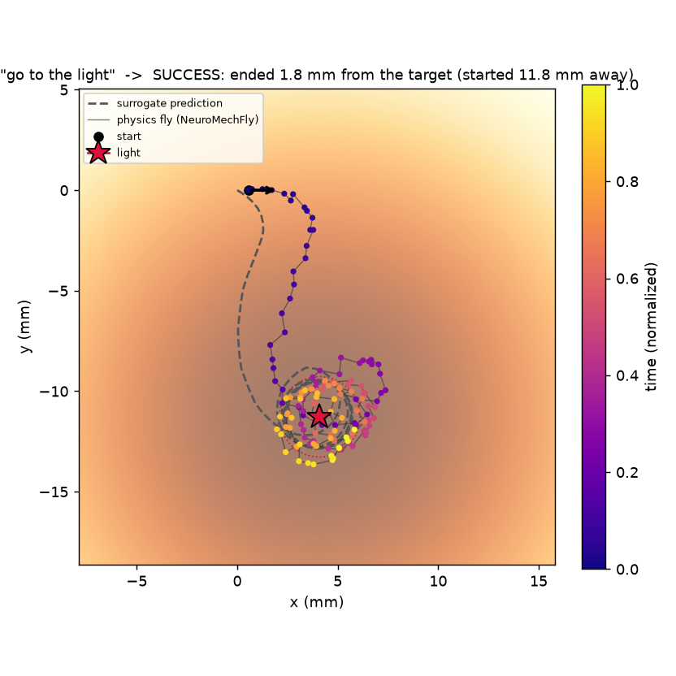
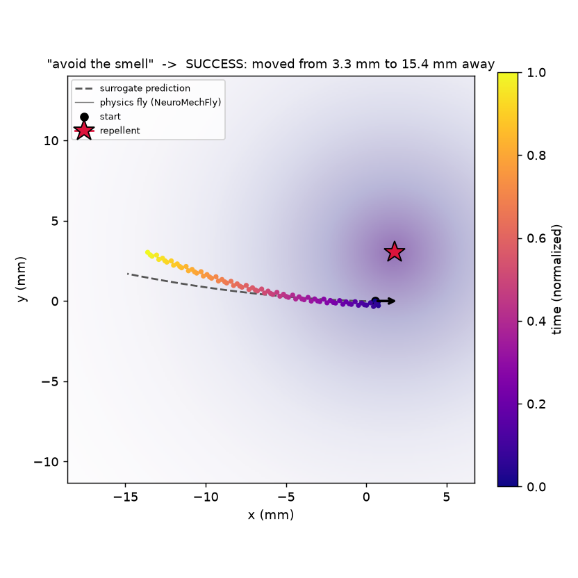
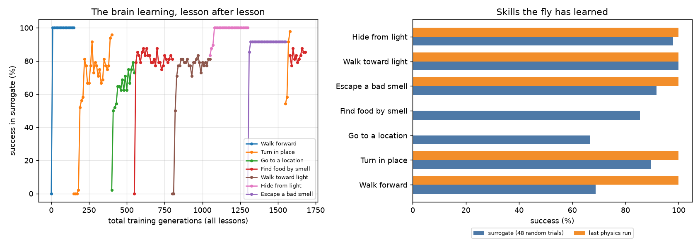
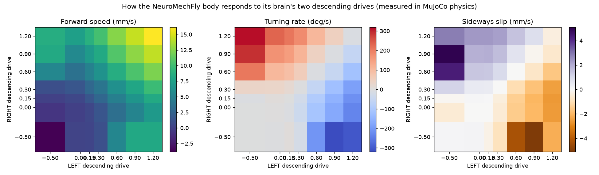

# Project 09 — FlyLab: teach a physics-simulated fruit fly 🪰🎮

> **Watch it train:** the [live training dashboard](https://rohitcraftsyt.github.io/FruitFlyBrain/projects/09_flylab/dashboard/)
> shows every brain's progress, held-out physics results and real MuJoCo footage, updated hourly
> by the training supervisor. How realistic the simulation is: [REALISM_AUDIT.md](REALISM_AUDIT.md).

Type what you want the fly to do in plain English (*"find the food"*, *"go to the
light"*, *"turn left 90"*). The fly's brain **trains on that task**, then the
trained brain is loaded into a **full physics model of a real fruit fly**, which
performs your request on camera. **Every skill has its own brain and its own
training process**, and `train_brains.py` keeps improving all of them with
physics in the loop. Brains are saved after every lesson and every round, so the
fly keeps learning across sessions without one skill overwriting another.

<p align="center">
  <br>
  <em>"find the food": the NeuroMechFly body in MuJoCo, steered by a brain that
  only has its two antennae. The HUD shows what it smells and its descending drives.</em>
</p>

**The recorded demo** (`flylab.py demo`, one newborn brain, 9 lessons): the
physics fly succeeded on **7 of 9** commanded tasks right after each lesson.
It walked 12 mm and stopped within 1.2 mm, turned 90° to within 3°, found food
by smell alone, walked to a lamp by sight, fled a light and a repellent, and
re-learned a partly forgotten turn in 19 s (54% → 98%) instead of the original
48 s. Both misses were close approaches just outside the 2 mm success radius.

<p align="center">
  
  
  
  <br><em>Physics trajectories (dots, coloured by time) vs. the surrogate's
  prediction (dashed) for three lessons.</em>
</p>

<p align="center">
  
</p>

## What's "real" here

| Layer | What it is | Source |
|---|---|---|
| **Body** | NeuroMechFly v2: a biomechanical model built from a **micro-CT scan of a real adult female *Drosophila***; 42 actuated leg joints, leg adhesion, ground contact, in MuJoCo physics at 10 kHz | EPFL Neuroengineering Lab, [FlyGym 2.1](https://github.com/NeLy-EPFL/flygym) (Apache-2.0) |
| **Spinal cord (VNC)** | The official hybrid **turning controller**: central pattern generators + leg-coordination rules turn two descending signals into a tripod gait | FlyGym |
| **Brains** | *This project.* **One small neural network per skill** (7 brains): bilateral **antennae** (smell) + bilateral **compound eyes** (light) + a goal compass → **left/right descending drives** | trained here |
| **Senses** | Odor sampled at the **measured aristae positions** of the model (0.52 mm ahead of the thorax, ±0.19 mm apart); light via two eyes tuned ±30°; ~0.1 s sensory integration | `world.py` |

The brain → VNC interface is two numbers, the left and right descending drive.
That mirrors real flies, where descending neurons carry the brain's steering
commands to the ventral nerve cord that patterns the legs.

## How the progressive training works

```
 you: "find the food"
   │
   ▼
 1. parse ─► task = odor_seek (the fly must use its antennae; no goal compass)
 2. TRAIN that skill's own brain in the calibrated surrogate body
      (32 candidate brains × 16 randomized arenas per generation)
      Evolution Strategies (antithetic, rank-shaped, Adam, common random numbers)
 3. DEPLOY the trained brain into NeuroMechFly physics (MuJoCo)
      brain 20 Hz → turning controller 1 kHz → physics 10 kHz
 4. RECORD: overhead + close-up video with a live brain HUD, trajectory map
      (surrogate prediction vs. physics reality), learning chart, diary page
 5. SAVE the brain → next command continues from here
```

**Why a surrogate?** On a laptop CPU the full physics fly runs at ~0.4× real
time, so training directly in physics would take ~30–50 min per skill. Instead,
`calibrate.py` measures the real body once: for 36 combinations of left/right
drive, it records forward speed, sideways slip and turning rate in MuJoCo, plus
the CPG response lag. The surrogate replays those measurements, so thousands
of flies train in parallel in seconds. The trained brain then runs in the real
physics fly (**sim-to-sim transfer**), and every lesson's map overlays the
surrogate's prediction on what the physics fly actually did.

<p align="center">
  
  <br><em>Measured in MuJoCo: how the NeuroMechFly body moves for each pair of left/right descending drives.</em>
</p>

## Making skills survive the jump to physics (engineering log)

Every fix below came from watching the physics fly fail and measuring why:

| Problem seen in physics | Diagnosis (measured) | Fix |
|---|---|---|
| Physics ran at **0.02× real time** | profiler: leg controller 3.5 ms + readout 1.3 ms per 0.1 ms physics step | update the controller at **1 kHz** instead of 10 kHz; gait unchanged (12.72 vs 12.73 mm/s), **~20× faster** |
| Fly **circled the food** instead of stopping | reward only checked the final position | reward **dwell time** inside the goal zone |
| "Turn" learned **turn-and-sprint** (32 mm away) | displacement barely penalized | success now requires staying within 6 mm |
| **Escape-the-smell: 100% surrogate, 0% physics** | physics thorax wobbles **0.15 mm and 3.6° every step**; near the source that swings the antennae's signal wildly | **domain randomization** (±20% gains, veer, lag, *measured* gait wobble on the senses) + a ~0.1 s **sensory integrator**, like real insect neurons |
| Training stalled under randomization | 32 candidate brains saw different random noise, so fitness ranked luck | **common random numbers** + per-skill rank shaping |
| Old skills **forgotten** as new ones arrived | rehearsal covered only some skills, averaged away | rehearse **every** skill, each ranked separately; a `sleep` command consolidates |
| Fly reached the goal, then **crept 3.6 mm away** | measured: a 0.10 "stop" command still creeps 0.77 mm/s; exact 0 stops dead | **motor gate** (tiny drives → exact halt) + a finer calibration grid near zero |
| Smell learning then **flat-lined at 2%** | "no goal" inputs looked like "arrived, stop"; a hard deadband made every candidate identical | explicit **"goal known"** input + a *ramped* gate that keeps a learning signal |
| After a 9-lesson curriculum, **one shared brain scored 57%** in physics | skills that were excellent right after their lesson (walk: 0.5 mm stop, turn: 2°) drifted as later lessons reshaped the shared weights (walk 1/5, turn 0/5); rehearsal and a `sleep` consolidation step only partly helped | **one brain per skill** + **continuous training with physics in the loop** (below) |
| Walk / go-to / smell brains **plateaued at ~70-80%** for 13-28 rounds; physics misses all landed at 1.5-2.6 mm (goal radius 2 mm) | surrogate: median stop 1.7 mm and the fly never halts, it circles with drives pinned at the limits (right 1.20, left -0.50). That's the body's tightest turning circle (~1.6 mm; the gait can't pivot). All 7 brains inherited saturated output weights (Σ\|W2\| ≈ 35 per motor) from the shared curriculum brain. A precision reward, a distance-scaled goal vector and shrinking W2 each left it at 1.7-1.8 mm; a **fresh** brain masters goto in 100 generations (100%, median stop 0.05-0.1 mm, with the original sensors and reward) and scored 5/6 in physics with misses mostly under 1 mm | **reseed** stuck lineages from fresh weights (step 6 below), keeping the old brain deployed until the new lineage beats it in physics |
| Smell-seeking stayed at **~81% even after reseeds**; its 6-arena "best" then scored **25%** on the held-out test | fresh brains deliberately **circle the food** (drives pinned at left 1.15 / right -0.50, even with noise off): the ~1.6 mm turning circle fits inside the 2 mm goal zone, so orbiting earns almost full reward. Failed fixes, each measured and reverted: a steeper diffusion-like odor near-field (1.67 mm median) and dwell credited only when still (1.65 mm). A hand-written chemotaxis reflex using only the odor senses *does* stop on the source (median 0.47 mm), so the sense is adequate and the brains were trapped in a basin | reseeds of `odor_seek` start from an **innate reflex** behavior-cloned into the network (`reflexes.py`, like a fly's inborn chemotaxis); ES then refines it: surrogate **100%**, median stop 0.18 mm, 5/6 physics arenas with stops of ~0.4 mm |
| A [realism audit](REALISM_AUDIT.md) (fact-checked by a second agent) found that some headline numbers didn't measure the behavior they claimed | a **blind** straight sprint passed **100%** of physics val/test for both escape tasks (4 s of sprinting covers ~60 mm from a source 2.5-8 mm away), and under stricter rules the deployed `odor_avoid` brain did no better than blind (64% vs 62% in the surrogate) and `light_avoid` did worse (28% vs 58%). Seek success ignored speed, so orbiting counted as arriving. "Optimal" ignored the held-out test (turn 91%, light_avoid 88%) | **task rules v2**: seeking must end within 1.5 mm *and standing still* (<1.5 mm/s over the last 0.5 s), and escapes must gain 6 mm *without first approaching the source* (the blind sprint drops to ~60%, far below the 95-100% level bars). **Optimal** now also needs ≥90% on the 32 held-out test arenas, and reports show 95% Wilson CIs. Brains are re-scored under the new rules from level 1 and retrained |
| Under v2, smell-seeking scored **98% in the surrogate but 0% in physics** for 4 rounds | the brain "stood still" at the food by commanding drives of about (0.04, -0.47): the left legs stop and the right legs step backward. In the surrogate that goes nowhere (0.2 mm/s), and physics agrees on *net* motion (0.3 mm/s). But stepping legs rock the thorax at **~2 mm/s** path speed (a true halt: 0.01 mm/s), above the 1.5 mm/s "still" bar. The surrogate put gait wobble only on the senses, scaled by net speed, so stepping in place looked perfectly still | gait sway now follows **leg activity** (\|drive\|, calibrated to the measured 0.15 mm wobble of a full stride) and is part of the recorded thorax path, so "still" means the legs stopped. The surrogate now reproduces physics (pivot 2.15 mm/s, halt 0), and the exploiting brain's surrogate score fell **98% → 8%**, in line with physics. Not solved yet: after the fix, brains reach the food in physics (closest 0.04-0.1 mm) but a forward/back lurch loop driven by the "smell getting stronger" input carries them ~2 mm off. Open-loop reversal tests show surrogate transients within ~10% of physics except a ~0.2 s forward lurch when starting to walk backward (audit item F4), so physics selection keeps working on it |
| After the fix, smell-seeking became **optimal within 1.5 h** (100% of 24 val, 100% of 32 held-out test arenas). Light-seeking under v2 stayed at **17% physics val for ~180 rounds**, even though the fly got to within 0.05-0.2 mm of the light | the light was a point at eye level. Within ~0.1 mm of it, gait sway moves the light from "ahead" to "behind" the thorax, where the cosine-tuned eyes are blind. Brightness then swung 1.67 ↔ 0.29 and its time-derivative saturated at ±3 every few steps, and the brain answered with backward lurches (drive -0.45). The fly fidgeted on the target at 0.7-3.7 mm/s and failed "still" | the lamp now hangs **1 mm above** the arena (`world.LIGHT_HEIGHT_MM`). As the fly walks under it, the light moves into the dorsal field that both eyes share, so the senses are continuous at the source. The far field is almost unchanged (+0.5% at 10 mm), and the optimal hide-from-light brain scores the same in the surrogate (97.9% before and after). The old light_seek brain relied on the artifact (surrogate 78% → 4%); retrained, it reached 94% in 1000 generations and holds on the lamp in physics (ends 0.5-0.8 mm away). Training continues with physics selection |
| Escape-the-smell used up **200 rounds at level 1**: physics 100% (6 val + 8 test) but the surrogate was stuck at 85-89%, below the 95% level bar | every surrogate failure had the source **within ±45° dead ahead** (38% success there vs ~100% elsewhere). The fly walked forward before it could tell ahead from behind, and approached by a median 0.7 mm (slack 0.5 mm). A source dead ahead or behind gives the two antennae equal readings, and absolute intensity is ambiguous because the start distance varies. The surrogate was right and physics had been lucky: on all 14 ahead-facing val+test arenas physics passed 10 and the surrogate 8, with the same misses | an innate **escape reflex** for reseeds (`reflexes.odor_escape`): creep forward (drive 0.3) steering away from the stronger antenna, and if the smell gets stronger anyway, **walk straight backward**, like the moonwalker descending neurons real flies use to back away. Parameters were picked from a flat 95-96% plateau on random training arenas. Cloned into the network it scores 95% in the surrogate (the old brain 87%) and 11/14 on the hard physics arenas, with the misses at 0.68-0.72 mm. The round cap was raised to 400 |
| Walk-toward-light made **no new best in 9 rounds** after the overhead lamp, although fresh candidates reached 100% in the surrogate and 67-83% physics val | the champion it had to beat (round 190: 100% val, 62% test) was scored by a trainer process started *before* the lamp change, i.e. with the old eye-level point light. On 5 fresh physics arenas under the current lamp that brain reached the light (closest 0.02-0.05 mm) but then circled off with drives pinned near (+0.9, -0.5) and ended 1.4-2.2 mm away, 0/5. Candidates were being compared against a record that no longer described the brain | the lamp change now counts as a task change: light tasks are **v3** (`tasks.TASK_VERSION`), so the trainer re-scores both light champions under the current lamp before training on. The light_seek champion re-scored at **0% val, 0% test, 6% surrogate** (not 100%/62%), so the better new candidates can now take over. light_avoid, marked optimal under the old light, is re-scored and re-earns its levels the same way |
| The 2026-10-01 daily check **never ran**: CHECKS.md still showed 09-30 | the supervisor started daily.py at 00:11, the PC shut down partway through (daily.log stops at the fresh-arena step), and the supervisor had already written today's date stamp when it **launched** daily.py, so after reboot the day counted as done | the stamp is now written only when daily.py **exits 0**; a failed run is retried at most once per supervisor start, so a run cut off by a shutdown is retried after the next boot |

Physics-transfer success (random arenas in full MuJoCo, same evaluator
throughout): **67%** (first version) → **86%** (domain randomization, fresh
curriculum) → **57%** (shared brain after a long curriculum: forgetting) →
per-skill brains with continuous physics-validated training:
<!-- FINAL_TRANSFER --> see [`training/TRAINING.md`](training/TRAINING.md) (updated live).

## Brain playground (in the browser)

[**Open the playground**](https://rohitcraftsyt.github.io/FruitFlyBrain/projects/09_flylab/playground/)
([`playground/`](playground)). Pick a skill, drag the fly and its target, and
run the trained brain. The page shows the 10 senses, the 32 hidden neurons and
the two descending drives live. You can silence neurons, remove an antenna or
an eye, test the brain on 200 random arenas (with a Wilson confidence
interval), watch the same brain's MuJoCo film, and download its weights
(`.npy` or `.json`).

It runs the calibrated **surrogate** body, not MuJoCo, and says so on the page.
[`playground/flybrain.js`](playground/flybrain.js) is a port of `world.py`,
`brain.py`, `surrogate.py` and the `tasks.py` scoring. It is checked against
the Python training code:

```bash
cd playground/tools
..\..\..\..\.venv-sim\Scripts\python make_reference.py   # record Python runs of every brain
node check_core.mjs                                      # 14/14 runs match to <1e-11, same verdicts
```

With training noise on, its success rates match `trainer.evaluate` to within
about 3 points on 400 arenas per brain. Re-run
`tools/export_calibration.py` if the body is recalibrated. The brains
themselves are read live from `state/brains/`.

## Continuous training: every brain, its own process

```bash
..\..\.venv-sim\Scripts\python supervise.py                      # unattended: all 7 brains until optimal
..\..\.venv-sim\Scripts\python train_brains.py                    # all 7 brains in one process
..\..\.venv-sim\Scripts\python train_brains.py --skills odor_seek   # just one
```

Each skill brain loops through **rounds**:

1. **Surrogate training:** 100 ES generations, with exploration noise and
   step size **annealed** to the brain's current skill (explore early, polish late).
2. **Physics validation:** the new weights drive the full NeuroMechFly body in
   MuJoCo on 6 fixed validation arenas.
3. **Keep-the-best selection:** the deployed brain (`state/brains/<skill>.npy`)
   is replaced **only if physics performance improved**.
4. **Held-out test:** every new best is scored on 8 separate physics arenas that
   are **never used for selection**. These are the honest headline numbers.
5. **Patience:** 4 rounds without improvement and the working copy restarts from
   the best checkpoint.
6. **Reseed:** a lineage that still hasn't mastered even the surrogate after 8
   rounds is stuck in a local optimum, so the working copy starts over from fresh
   random weights (with double patience). The deployed brain stays in place
   until the new lineage beats it in physics.

The loop always trains the **weakest** skill next, is fully **resumable**
(stop it and run it again at any time), and writes everything down:
`training/<skill>/log.jsonl` (every round), `training/<skill>/REPORT.md` +
`curve.png` (per brain) and [`training/TRAINING.md`](training/TRAINING.md)
(all brains).

**Progressive mastery.** Passing a level (100% physics validation, ≥95%
surrogate success) doubles the validation and held-out test sets
(6/8 → 12/16 → 24/32 arenas). The champion is re-scored on the bigger sets
and training continues. After level 1 FlyLab just performs the skill instead
of retraining it. A brain counts as **optimal** once it scores ≥95% on 24
validation arenas at level 3, so a lucky streak on a handful of arenas can't
end its training.

**Unattended loop.** `supervise.py` runs one trainer process per skill, two at
a time on a 2-core CPU. Turns are round-robin (weakest skill first) in 1-hour
slices so no stuck skill starves the others. It relaunches crashed workers,
commits and pushes the reports every hour, and exits once every brain is
optimal.

## Autonomous operation (no one needs to touch it)

Once installed, the whole loop runs by itself on the training PC:

| What | When | Does |
|---|---|---|
| `supervise.py` | always | trains skills below optimal first; spare CPU **polishes** optimal brains; commits and pushes every hour |
| `train_brains.py --polish` | when a core is free | keeps training an optimal brain; the result is kept **only if it is still optimal afterwards** (a candidate that scores higher on validation but falls under 90% on the held-out test is rolled back), so a deployed brain never regresses |
| `daily.py` | once a day | `recheck.py` re-runs every optimal brain on **16 new random physics arenas** (a new set every day) → [`training/CHECKS.md`](training/CHECKS.md); rewrites the README status table; regenerates the GIFs and brain films |
| `autostart.py` | at sign-in + hourly | a Startup-folder entry and the hourly Windows task *FlyLab supervisor watchdog* restart the supervisor if it isn't running (idempotent: never a second copy) |
| daily AI review | every evening, ~21:15 (Claude app) | reads the logs and checks; if a skill is stuck or a fresh check drops under 80%, it diagnoses the cause, fixes it, documents it in the engineering log above and pushes |

```bash
..\..\.venv-sim\Scripts\python autostart.py status    # running? installed?
..\..\.venv-sim\Scripts\python autostart.py install   # set it up on a new PC
..\..\.venv-sim\Scripts\python autostart.py remove    # uninstall the autostart pieces
```

Notes: the supervisor keeps Windows from sleeping while it trains
(`--keep-awake`); the display can still turn off. The hourly task needs you to be
signed in. The daily AI review only runs while the Claude desktop app is open; a
missed day runs at the next launch. The polish rollback uses the held-out test
only as a veto (it can reject a candidate, never choose between candidates), so
the fresh daily arenas are the independent check.

## Setup (separate environment; FlyGym pins its own versions)

```bash
# from the FruitFlyBrain/ root
python -m venv .venv-sim
.venv-sim\Scripts\pip install -r requirements-sim.txt
```

## Use it

```bash
cd projects\09_flylab
..\..\.venv-sim\Scripts\python flylab.py                     # interactive: type commands
..\..\.venv-sim\Scripts\python flylab.py "find the food"     # one command
..\..\.venv-sim\Scripts\python flylab.py demo                # teach every skill in sequence
```

| Say… | Skill | What the fly has to use |
|---|---|---|
| `find the food`, `follow the smell`, `eat the banana` | Find food by smell | two antennae only (chemotaxis) |
| `avoid the smell`, `escape the repellent` | Escape a bad smell | two antennae only |
| `go to the light`, `walk toward the sun` | Walk toward light | two eyes only (phototaxis) |
| `hide from the light`, `avoid the light` | Hide from light | two eyes only |
| `go to 10, 5` | Go to a location (mm, fly starts at 0,0 facing +x) | goal compass |
| `walk forward 12 mm` | Walk forward and stop | goal compass |
| `turn left 90`, `turn right 45`, `turn around` | Turn on the spot | goal compass |
| `practice find the food 200` | extra training, no video | — |
| `skills`, `show`, `reset`, `help`, `quit` | status / replay / newborn brain | — |

Repeat a command and the fly practises it: a new skill gets 150 generations
(250 for smell, light and turning), an unmastered skill 100, and a
well-trained skill a quick 30-generation refresh. A skill **mastered in
physics** by `train_brains.py` is performed as-is, without retraining. Don't
run FlyLab lessons while `train_brains.py` is training the same skill.
Everything is logged to `outputs/fly_diary.html` (videos, maps, numbers).

Flags: `--no-video` (physics but no rendering, faster), `--no-physics`
(train only), `--no-open` (don't auto-play the video), `--verbose`.

## Files

| File | Role |
|---|---|
| `flylab.py` | the console you talk to; runs lessons, keeps the diary |
| `tasks.py` | task library: scenario sampling, rewards, success tests, English parser |
| `world.py` | odor and light fields, and the fly's senses (shared by surrogate and physics) |
| `brain.py` | one neural-network brain per skill, persisted to `state/brains/` |
| `trainer.py` | Evolution Strategies (common random numbers, annealing) |
| `train_brains.py` | continuous per-brain training with physics validation, held-out tests and reports |
| `surrogate.py` | calibrated fast body model, vectorized over thousands of flies |
| `physics.py` | NeuroMechFly/MuJoCo bridge: calibration, deployment, cameras, scene markers |
| `calibrate.py` | measures the physics body → `state/calibration.npz` |
| `evaluate_physics.py` | runs the current brain on random arenas in full physics → transfer success table |
| `render.py` | composite video + HUD, trajectory maps, learning charts |
| `supervise.py` | runs the trainers unattended: priorities, polishing, daily job, hourly git push |
| `daily.py` / `recheck.py` | daily fresh-arena physics checks, README status table, GIF refresh |
| `autostart.py` | sign-in entry + hourly watchdog task that keep the supervisor running |
| `render_brains.py` | re-films brains that changed, for the dashboard and README |
| `reflexes.py` | innate reflexes used to seed brains that can't get started (chemotaxis, escape) |
| `playground/` | in-browser brain playground (see above) |

## Honest limits

- The **brain is learned, not connectome-wired**. Projects 01–08 analyze the
  real connectome; this project focuses on embodiment and learning. A natural
  next step is constraining the brain's hidden layer with connectome structure,
  e.g. central-complex wiring from Project 04.
- Odor and light are simple analytic fields (no turbulent plumes, no ray-traced
  vision). FlyGym's compound-eye renderer exists and could replace the
  two-eye model.
- Transfer is sim-to-sim (surrogate → physics). The trajectory maps show where
  the two agree and where physics differs.
