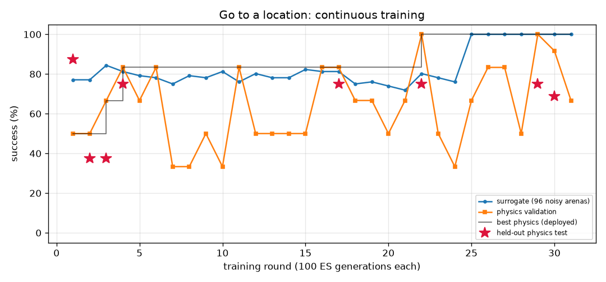

# Go to a location (`goto`) — training report

*Auto-generated by `train_brains.py`, last updated 2026-09-25T15:59:11.*

| | |
|---|---|
| rounds | 31 |
| ES generations | 3100 |
| physics runs | 298 |
| status | level 2/3 |
| best brain | round 30: physics validation **92%** on 12 arenas, surrogate 100% |
| held-out physics test | **69%** on 16 unseen arenas (errors: [2.22, 0.76, 2.09, 1.04, 1.8, 0.69, 0.95, 2.89, 1.42, 2.15, 1.82, 1.11, 0.62, 2.12, 1.0, 0.45]) |

Physics error per arena: mm from target at the end (< 2 = success).

| round | level | gens | sigma | surrogate | physics val | val errors | test | note |
|---:|---:|---:|---:|---:|---:|---|---:|---|
| 1 | 1 | 100 | 0.037 | 77% | 50% | [1.65, 3.38, 2.35, 2.3, 1.35, 1.23] | 88% | new best |
| 2 | 1 | 200 | 0.037 | 77% | 50% | [2.36, 2.36, 1.87, 1.62, 4.67, 1.66] | 38% | new best |
| 3 | 1 | 300 | 0.037 | 84% | 67% | [1.43, 1.31, 2.31, 2.51, 1.84, 1.24] | 38% | new best |
| 4 | 1 | 400 | 0.033 | 81% | 83% | [1.71, 2.71, 1.91, 1.98, 1.74, 1.67] | 75% | new best |
| 5 | 1 | 500 | 0.035 | 79% | 67% | [2.0, 1.96, 1.65, 5.0, 1.79, 0.79] |  |  |
| 6 | 1 | 600 | 0.036 | 78% | 83% | [1.93, 1.49, 2.46, 1.96, 0.99, 1.77] |  |  |
| 7 | 1 | 700 | 0.036 | 75% | 33% | [2.53, 13.9, 1.76, 1.36, 2.06, 2.91] |  |  |
| 8 | 1 | 800 | 0.038 | 79% | 33% | [2.62, 1.66, 1.2, 2.46, 3.49, 2.54] |  | restart from best |
| 9 | 1 | 900 | 0.035 | 78% | 50% | [2.99, 1.61, 2.11, 0.65, 2.31, 1.23] |  |  |
| 10 | 1 | 1000 | 0.036 | 81% | 33% | [1.3, 2.74, 2.44, 2.34, 1.64, 2.01] |  |  |
| 11 | 1 | 1100 | 0.035 | 76% | 83% | [1.74, 1.12, 1.16, 1.98, 2.05, 2.0] |  |  |
| 12 | 1 | 1200 | 0.037 | 80% | 50% | [2.22, 2.24, 1.12, 1.54, 1.01, 2.11] |  | restart from best |
| 13 | 1 | 1300 | 0.035 | 78% | 50% | [2.62, 2.76, 1.25, 1.33, 1.43, 2.11] |  |  |
| 14 | 1 | 1400 | 0.036 | 78% | 50% | [1.38, 12.4, 0.97, 2.07, 2.05, 1.95] |  |  |
| 15 | 1 | 1500 | 0.036 | 82% | 50% | [1.81, 1.18, 1.64, 3.08, 2.78, 2.59] |  |  |
| 16 | 1 | 1600 | 0.034 | 81% | 83% | [2.1, 1.27, 1.99, 1.57, 1.77, 1.52] |  | restart from best |
| 17 | 1 | 1700 | 0.035 | 81% | 83% | [1.66, 2.37, 1.01, 1.5, 1.77, 1.44] | 75% | new best |
| 18 | 1 | 1800 | 0.035 | 75% | 67% | [2.47, 1.98, 1.4, 1.95, 1.25, 2.03] |  |  |
| 19 | 1 | 1900 | 0.038 | 76% | 67% | [1.68, 1.83, 2.38, 1.98, 1.7, 2.77] |  |  |
| 20 | 1 | 2000 | 0.037 | 74% | 50% | [1.11, 3.72, 2.08, 2.0, 1.18, 1.4] |  |  |
| 21 | 1 | 2100 | 0.039 | 72% | 67% | [2.67, 1.7, 1.18, 1.69, 1.7, 2.54] |  | restart from best |
| 22 | 1 | 2200 | 0.035 | 80% | 100% | [1.88, 1.99, 1.66, 1.06, 1.45, 1.74] | 75% | new best |
| 23 | 1 | 2300 | 0.035 | 78% | 50% | [1.93, 1.79, 2.09, 2.1, 1.97, 2.62] |  |  |
| 24 | 1 | 2400 | 0.036 | 76% | 33% | [2.34, 1.38, 2.77, 2.19, 2.2, 1.84] |  | reseed: fresh weights |
| 25 | 1 | 2500 | 0.079 | 100% | 67% | [0.03, 2.4, 1.41, 1.1, 0.5, 2.6] |  |  |
| 26 | 1 | 2600 | 0.024 | 100% | 83% | [1.62, 0.93, 1.87, 1.28, 2.07, 1.07] |  |  |
| 27 | 1 | 2700 | 0.024 | 100% | 83% | [4.47, 1.58, 1.58, 1.06, 0.95, 0.77] |  |  |
| 28 | 1 | 2800 | 0.024 | 100% | 50% | [2.6, 3.28, 1.52, 0.52, 3.21, 0.96] |  |  |
| 29 | 1 | 2900 | 0.024 | 100% | 100% | [0.74, 0.61, 0.49, 0.86, 0.36, 0.81] | 75% | new best |
| 30 | 2 | 3000 | 0.024 | 100% | 92% | [1.15, 0.61, 0.52, 0.83, 1.9, 0.58, 1.58, 0.26, 0.71, 1.01, 2.78, 0.62] | 69% | new best |
| 31 | 2 | 3100 | 0.024 | 100% | 67% | [0.91, 1.64, 2.5, 0.26, 0.39, 1.89, 0.74, 3.24, 0.22, 2.13, 0.45, 2.78] |  |  |
