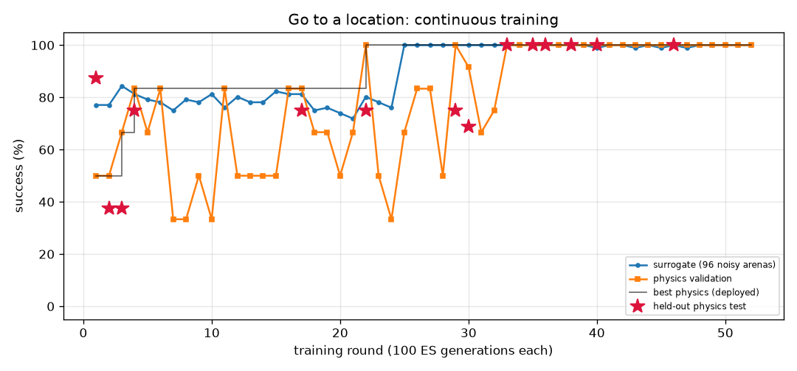

# Go to a location (`goto`) — training report

*Auto-generated by `train_brains.py`, last updated 2026-10-06T21:52:05.*

| | |
|---|---|
| rounds | 56 |
| ES generations | 5600 |
| physics runs | 1134 |
| status | **optimal** |
| best brain | round 46: physics validation **100%** on 24 arenas, surrogate 100% |
| held-out physics test | **100%** on 32 unseen arenas (95% CI 89%-100%) (errors: [0.51, 0.56, 0.44, 0.63, 0.46, 0.45, 0.47, 0.6, 0.49, 0.48, 0.49, 0.47, 0.44, 0.55, 0.6, 0.51, 0.48, 0.52, 0.45, 0.45, 0.52, 0.49, 0.58, 0.47, 0.45, 0.46, 0.55, 0.46, 0.44, 0.58, 0.63, 0.61]) |

Physics error per arena: mm from target at the end (< 1.5 and standing still = success).

| round | level | gens | sigma | surrogate | physics val | val errors | test | note |
|---:|---:|---:|---:|---:|---:|---|---:|---|
| 17 | 1 | 1700 | 0.035 | 81% | 83% | [1.66, 2.37, 1.01, 1.5, 1.77, 1.44] | 75% | new best |
| 18 | 1 | 1800 | 0.035 | 75% | 67% | [2.47, 1.98, 1.4, 1.95, 1.25, 2.03] |  |  |
| 19 | 1 | 1900 | 0.038 | 76% | 67% | [1.68, 1.83, 2.38, 1.98, 1.7, 2.77] |  |  |
| 20 | 1 | 2000 | 0.037 | 74% | 50% | [1.11, 3.72, 2.08, 2.0, 1.18, 1.4] |  |  |
| 21 | 1 | 2100 | 0.039 | 72% | 67% | [2.67, 1.7, 1.18, 1.69, 1.7, 2.54] |  | restart from best |
| 22 | 1 | 2200 | 0.035 | 80% | 100% | [1.88, 1.99, 1.66, 1.06, 1.45, 1.74] | 75% | new best |
| 23 | 1 | 2300 | 0.035 | 78% | 50% | [1.93, 1.79, 2.09, 2.1, 1.97, 2.62] |  |  |
| 24 | 1 | 2400 | 0.036 | 76% | 33% | [2.34, 1.38, 2.77, 2.19, 2.2, 1.84] |  | reseed: fresh weights |
| 25 | 1 | 2500 | 0.079 | 100% | 67% | [0.03, 2.4, 1.41, 1.1, 0.5, 2.6] |  |  |
| 26 | 1 | 2600 | 0.024 | 100% | 83% | [1.62, 0.93, 1.87, 1.28, 2.07, 1.07] |  |  |
| 27 | 1 | 2700 | 0.024 | 100% | 83% | [4.47, 1.58, 1.58, 1.06, 0.95, 0.77] |  |  |
| 28 | 1 | 2800 | 0.024 | 100% | 50% | [2.6, 3.28, 1.52, 0.52, 3.21, 0.96] |  |  |
| 29 | 1 | 2900 | 0.024 | 100% | 100% | [0.74, 0.61, 0.49, 0.86, 0.36, 0.81] | 75% | new best |
| 30 | 2 | 3000 | 0.024 | 100% | 92% | [1.15, 0.61, 0.52, 0.83, 1.9, 0.58, 1.58, 0.26, 0.71, 1.01, 2.78, 0.62] | 69% | new best |
| 31 | 2 | 3100 | 0.024 | 100% | 67% | [0.91, 1.64, 2.5, 0.26, 0.39, 1.89, 0.74, 3.24, 0.22, 2.13, 0.45, 2.78] |  |  |
| 32 | 2 | 3200 | 0.024 | 100% | 75% | [0.62, 3.55, 1.4, 1.44, 1.75, 0.32, 1.47, 1.38, 3.76, 1.76, 0.02, 2.5] |  |  |
| 33 | 1 | 3300 | 0.024 | 100% | 100% | [0.73, 0.74, 0.75, 0.75, 0.72, 0.75] | 100% | new best |
| 34 | 3 | 3400 | 0.026 | 100% | 100% | [0.75, 0.72, 0.64, 0.62, 0.75, 0.64, 0.73, 0.68, 0.66, 0.63, 0.74, 0.62, 0.69, 0.61, 0.65, 0.7, 0.75, 0.66, 0.64, 0.64, 0.71, 0.64, 0.71, 0.62] |  |  |
| 35 | 3 | 3500 | 0.024 | 100% | 100% | [0.8, 0.78, 0.65, 0.64, 0.77, 0.65, 0.79, 0.68, 0.7, 0.64, 0.74, 0.64, 0.71, 0.63, 0.64, 0.7, 0.8, 0.7, 0.64, 0.67, 0.74, 0.64, 0.73, 0.62] | 100% | new best |
| 36 | 3 | 3600 | 0.024 | 100% | 100% | [0.68, 0.65, 0.5, 0.51, 0.67, 0.51, 0.67, 0.55, 0.58, 0.52, 0.64, 0.5, 0.58, 0.51, 0.54, 0.58, 0.69, 0.55, 0.51, 0.55, 0.6, 0.51, 0.62, 0.49] | 100% | new best |
| 37 | 3 | 3700 | 0.024 | 100% | 100% | [0.95, 0.96, 0.79, 0.8, 0.95, 0.81, 0.92, 0.81, 0.89, 0.81, 0.92, 0.8, 0.88, 0.83, 0.87, 0.89, 0.93, 0.83, 0.81, 0.86, 0.87, 0.8, 0.91, 0.82] |  |  |
| 38 | 3 | 3800 | 0.024 | 100% | 100% | [0.74, 0.71, 0.55, 0.57, 0.72, 0.56, 0.72, 0.6, 0.64, 0.57, 0.63, 0.57, 0.65, 0.56, 0.62, 0.66, 0.75, 0.6, 0.56, 0.63, 0.63, 0.57, 0.67, 0.57] | 100% | new best |
| 39 | 3 | 3900 | 0.024 | 100% | 100% | [0.9, 0.85, 0.73, 0.74, 0.77, 0.73, 0.9, 0.72, 0.84, 0.68, 0.76, 0.72, 0.82, 0.65, 0.71, 0.75, 0.88, 0.74, 0.68, 0.81, 0.73, 0.7, 0.86, 0.74] |  |  |
| 40 | 3 | 4000 | 0.024 | 99% | 100% | [0.51, 0.48, 0.35, 0.37, 0.5, 0.38, 0.51, 0.39, 0.4, 0.36, 0.43, 0.38, 0.43, 0.35, 0.34, 0.42, 0.5, 0.41, 0.36, 0.41, 0.42, 0.36, 0.45, 0.36] | 100% | new best |
| 41 | 3 | 4100 | 0.025 | 100% | 100% | [0.78, 0.78, 0.63, 0.63, 0.8, 0.63, 0.78, 0.68, 0.7, 0.65, 0.72, 0.64, 0.7, 0.64, 0.69, 0.72, 0.78, 0.67, 0.64, 0.69, 0.72, 0.64, 0.73, 0.64] |  |  |
| 42 | 3 | 4200 | 0.024 | 100% | 100% | [0.63, 0.61, 0.51, 0.52, 0.54, 0.51, 0.62, 0.56, 0.53, 0.53, 0.62, 0.52, 0.58, 0.53, 0.55, 0.58, 0.63, 0.52, 0.52, 0.54, 0.58, 0.53, 0.6, 0.52] |  |  |
| 43 | 3 | 4300 | 0.024 | 99% | 100% | [0.71, 0.73, 0.57, 0.63, 0.57, 0.62, 0.71, 0.64, 0.66, 0.59, 0.58, 0.62, 0.69, 0.59, 0.63, 0.65, 0.74, 0.62, 0.58, 0.64, 0.63, 0.59, 0.73, 0.62] |  |  |
| 44 | 3 | 4400 | 0.025 | 100% | 100% | [0.59, 0.61, 0.45, 0.48, 0.48, 0.48, 0.57, 0.5, 0.52, 0.46, 0.45, 0.47, 0.55, 0.49, 0.51, 0.54, 0.58, 0.5, 0.46, 0.52, 0.53, 0.47, 0.58, 0.48] |  | restart from best |
| 45 | 3 | 4500 | 0.025 | 99% | 100% | [0.72, 0.7, 0.59, 0.58, 0.73, 0.61, 0.74, 0.6, 0.64, 0.57, 0.64, 0.58, 0.66, 0.54, 0.51, 0.62, 0.74, 0.65, 0.57, 0.62, 0.63, 0.57, 0.68, 0.57] |  |  |
| 46 | 3 | 4600 | 0.025 | 100% | 100% | [0.62, 0.6, 0.45, 0.49, 0.59, 0.48, 0.52, 0.48, 0.52, 0.47, 0.55, 0.47, 0.55, 0.47, 0.52, 0.52, 0.63, 0.51, 0.45, 0.53, 0.5, 0.47, 0.59, 0.48] | 100% | new best |
| 47 | 3 | 4700 | 0.024 | 99% | 100% | [0.7, 0.67, 0.5, 0.6, 0.6, 0.58, 0.69, 0.51, 0.64, 0.49, 0.55, 0.57, 0.68, 0.46, 0.52, 0.54, 0.69, 0.6, 0.5, 0.59, 0.53, 0.48, 0.69, 0.58] |  |  |
| 48 | 3 | 4800 | 0.025 | 100% | 100% | [0.65, 0.62, 0.48, 0.49, 0.47, 0.51, 0.64, 0.6, 0.52, 0.46, 0.45, 0.48, 0.58, 0.44, 0.49, 0.52, 0.62, 0.51, 0.46, 0.54, 0.51, 0.45, 0.6, 0.48] |  |  |
| 49 | 3 | 4900 | 0.024 | 100% | 100% | [0.62, 0.64, 0.51, 0.54, 0.51, 0.53, 0.64, 0.54, 0.58, 0.51, 0.5, 0.52, 0.61, 0.5, 0.54, 0.58, 0.62, 0.53, 0.51, 0.57, 0.54, 0.51, 0.61, 0.52] |  |  |
| 50 | 3 | 5000 | 0.024 | 100% | 100% | [0.48, 0.46, 0.34, 0.39, 0.36, 0.37, 0.49, 0.39, 0.41, 0.36, 0.33, 0.38, 0.45, 0.35, 0.43, 0.43, 0.45, 0.37, 0.34, 0.41, 0.4, 0.35, 0.44, 0.37] |  | restart from best |
| 51 | 3 | 5100 | 0.024 | 100% | 100% | [0.64, 0.58, 0.45, 0.54, 0.43, 0.5, 0.6, 0.46, 0.58, 0.46, 0.51, 0.53, 0.6, 0.45, 0.47, 0.51, 0.63, 0.54, 0.45, 0.56, 0.49, 0.46, 0.62, 0.51] |  |  |
| 52 | 3 | 5200 | 0.024 | 100% | 100% | [0.79, 0.77, 0.64, 0.69, 0.66, 0.68, 0.76, 0.68, 0.72, 0.65, 0.73, 0.68, 0.73, 0.65, 0.67, 0.67, 0.79, 0.69, 0.65, 0.71, 0.66, 0.64, 0.78, 0.67] |  |  |
| 53 | 3 | 5300 | 0.024 | 100% | 100% | [0.58, 0.54, 0.42, 0.51, 0.48, 0.48, 0.58, 0.44, 0.55, 0.43, 0.47, 0.5, 0.55, 0.4, 0.43, 0.46, 0.56, 0.49, 0.42, 0.52, 0.44, 0.43, 0.55, 0.49] |  |  |
| 54 | 3 | 5400 | 0.024 | 96% | 100% | [0.2, 0.24, 0.18, 0.23, 0.19, 0.2, 0.23, 0.25, 0.25, 0.19, 0.17, 0.2, 0.24, 0.2, 0.2, 0.23, 0.22, 0.21, 0.19, 0.24, 0.24, 0.17, 0.2, 0.21] |  | restart from best |
| 55 | 3 | 5500 | 0.024 | 100% | 100% | [0.78, 0.74, 0.6, 0.62, 0.76, 0.61, 0.79, 0.64, 0.65, 0.61, 0.71, 0.62, 0.68, 0.61, 0.66, 0.68, 0.76, 0.66, 0.6, 0.67, 0.67, 0.62, 0.73, 0.61] |  |  |
| 56 | 3 | 5600 | 0.024 | 100% | 100% | [0.72, 0.69, 0.54, 0.56, 0.69, 0.55, 0.72, 0.58, 0.61, 0.55, 0.64, 0.56, 0.64, 0.53, 0.59, 0.63, 0.71, 0.58, 0.54, 0.62, 0.6, 0.56, 0.66, 0.54] |  |  |
