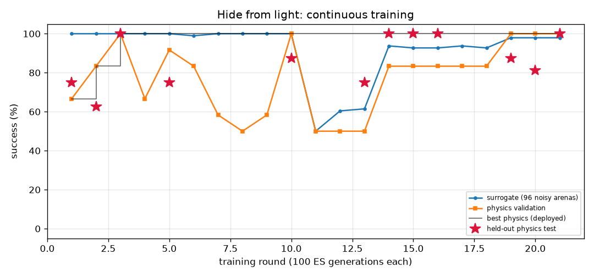

# Hide from light (`light_avoid`) — training report

*Auto-generated by `train_brains.py`, last updated 2026-09-26T23:10:12.*

| | |
|---|---|
| rounds | 21 |
| ES generations | 2100 |
| physics runs | 616 |
| status | **optimal** |
| best brain | round 21: physics validation **96%** on 24 arenas, surrogate 99% |
| held-out physics test | **97%** on 32 unseen arenas (95% CI 84%-99%) (errors: [11.2, 24.8, 25.0, 27.2, 26.8, 12.4, 13.9, 18.6, 19.7, 11.7, 13.6, 25.9, 26.6, 13.0, 25.5, 19.3, 23.7, 19.3, 23.0, 20.6, 25.7, 19.1, 20.9, 24.2, 13.6, 12.6, 23.4, 25.7, 21.3, 14.8, 24.2, 20.4]) |

Physics error per arena: mm gained away from source (> 6 without first approaching it = success).

| round | level | gens | sigma | surrogate | physics val | val errors | test | note |
|---:|---:|---:|---:|---:|---:|---|---:|---|
| 1 | 1 | 100 | 0.025 | 100% | 67% | [-6.7, 63.6, 63.4, 24.0, 62.8, -7.0] | 75% | new best |
| 2 | 1 | 200 | 0.024 | 100% | 83% | [-6.5, 63.7, 63.5, 31.7, 63.0, 15.4] | 62% | new best |
| 3 | 1 | 300 | 0.024 | 100% | 100% | [15.6, 63.8, 63.5, 10.1, 63.1, 29.7] | 100% | new best |
| 4 | 2 | 400 | 0.024 | 100% | 67% | [-6.7, 63.8, 63.5, -4.7, 63.1, -7.1, 62.3, 43.0, 41.3, -5.3, 32.8, 62.9] |  |  |
| 5 | 2 | 500 | 0.024 | 100% | 92% | [-6.4, 63.8, 63.5, 23.7, 63.1, 13.6, 62.3, 20.0, 36.4, 40.8, 31.3, 62.9] | 75% | new best |
| 6 | 2 | 600 | 0.024 | 99% | 83% | [-6.5, 63.8, 63.5, 35.9, 63.0, 27.6, 62.3, -3.0, 25.4, 42.2, 34.4, 62.9] |  |  |
| 7 | 2 | 700 | 0.025 | 100% | 58% | [26.3, 63.8, 63.5, -5.3, 63.1, -7.2, 62.3, -1.3, -6.3, 41.4, -7.3, 62.9] |  |  |
| 8 | 2 | 800 | 0.024 | 100% | 50% | [-6.6, 63.8, 63.5, -5.4, 63.1, -7.1, 62.3, -2.8, 33.9, -5.4, -7.1, 62.9] |  |  |
| 9 | 2 | 900 | 0.024 | 100% | 58% | [35.1, 63.8, 63.6, -5.4, 63.1, -7.0, 62.4, 42.2, -6.4, -5.4, -7.1, 62.9] |  | restart from best |
| 10 | 2 | 1000 | 0.024 | 100% | 100% | [37.5, 63.8, 63.5, 28.3, 63.0, 34.2, 62.4, 48.8, 40.1, 40.0, 33.2, 62.9] | 88% | new best |
| 11 | 1 | 1100 | 0.064 | 50% | 50% | [34.3, 63.8, 63.5, -5.0, 63.2, -6.8] |  |  |
| 12 | 1 | 1200 | 0.052 | 60% | 50% | [14.0, 63.3, 63.0, -5.0, 62.9, -6.9] |  |  |
| 13 | 1 | 1300 | 0.046 | 61% | 50% | [41.1, 63.7, 63.5, 37.5, 63.0, 37.0] | 75% | new best |
| 14 | 1 | 1400 | 0.046 | 94% | 83% | [6.2, 49.7, 50.1, 7.3, 45.0, 4.3] | 100% | new best |
| 15 | 1 | 1500 | 0.028 | 93% | 83% | [6.2, 48.6, 48.9, 7.3, 44.0, 4.3] | 100% | new best |
| 16 | 1 | 1600 | 0.028 | 93% | 83% | [6.2, 47.9, 48.3, 7.3, 43.1, 4.3] | 100% | new best |
| 17 | 1 | 1700 | 0.028 | 94% | 83% | [6.2, 61.6, 61.6, 7.3, 59.0, 4.3] |  |  |
| 18 | 1 | 1800 | 0.028 | 93% | 83% | [6.2, 54.2, 54.4, 7.3, 49.5, 4.3] |  | reseed: fresh weights |
| 19 | 1 | 1900 | 0.051 | 98% | 100% | [34.1, 34.9, 34.3, 35.6, 36.6, 35.5] | 88% | new best |
| 20 | 2 | 2000 | 0.025 | 98% | 100% | [29.3, 30.3, 27.7, 30.7, 29.9, 28.7, 27.9, 18.4, 26.7, 26.3, 27.5, 31.0] | 81% | new best |
| 21 | 3 | 2100 | 0.025 | 98% | 100% | [22.2, 27.4, 27.0, 25.8, 27.8, 27.5, 25.6, 14.4, 23.1, 21.2, 22.6, 27.7, 9.0, 24.1, 27.2, 21.9, 13.8, 28.1, 27.7, 7.0, 25.1, 23.5, 25.5, 27.3] | 100% | new best |
