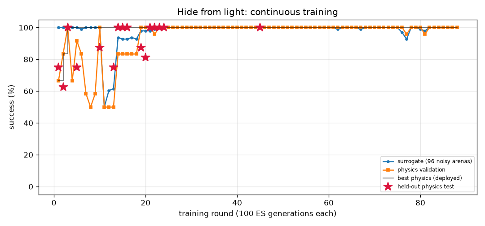

# Hide from light (`light_avoid`) — training report

*Auto-generated by `train_brains.py`, last updated 2026-10-08T09:42:52.*

| | |
|---|---|
| rounds | 133 |
| ES generations | 13300 |
| physics runs | 3432 |
| status | **optimal** |
| best brain | round 45: physics validation **100%** on 24 arenas, surrogate 100% |
| held-out physics test | **100%** on 32 unseen arenas (95% CI 89%-100%) (errors: [14.4, 28.9, 31.6, 32.2, 31.9, 13.9, 14.5, 34.1, 33.7, 13.3, 14.0, 31.3, 31.1, 13.1, 32.4, 33.8, 32.9, 32.2, 31.7, 32.0, 29.0, 12.3, 31.9, 33.2, 14.2, 13.7, 33.6, 32.5, 33.2, 13.2, 28.1, 33.7]) |

Physics error per arena: mm gained away from source (> 6 without first approaching it = success).

| round | level | gens | sigma | surrogate | physics val | val errors | test | note |
|---:|---:|---:|---:|---:|---:|---|---:|---|
| 94 | 3 | 9400 | 0.024 | 99% | 100% | [37.1, 37.9, 37.6, 38.9, 40.4, 36.4, 35.8, 14.5, 11.3, 13.5, 39.0, 40.4, 14.4, 39.0, 37.6, 38.2, 14.2, 40.2, 38.1, 14.4, 35.8, 39.5, 35.4, 40.5] |  |  |
| 95 | 3 | 9500 | 0.025 | 100% | 100% | [44.4, 46.2, 45.9, 46.4, 50.0, 46.1, 44.1, 14.5, 46.3, 11.5, 47.0, 50.0, 14.4, 47.5, 46.1, 47.3, 14.2, 49.8, 46.3, 14.4, 42.8, 47.7, 44.6, 50.4] |  |  |
| 96 | 3 | 9600 | 0.024 | 100% | 100% | [56.4, 59.2, 58.9, 56.8, 58.4, 55.7, 57.7, 14.5, 53.5, 13.3, 57.1, 58.2, 14.4, 58.0, 59.1, 55.7, 14.2, 58.9, 59.5, 14.4, 55.6, 56.9, 57.6, 57.6] |  |  |
| 97 | 3 | 9700 | 0.024 | 100% | 100% | [53.0, 54.7, 54.6, 52.9, 52.6, 52.3, 54.0, 14.5, 50.2, 13.3, 52.7, 52.3, 14.4, 54.1, 54.7, 51.8, 14.2, 53.3, 54.7, 14.4, 51.3, 52.9, 53.6, 51.6] |  | restart from best |
| 98 | 3 | 9800 | 0.024 | 100% | 100% | [53.0, 55.0, 54.8, 53.2, 53.4, 53.5, 53.9, 14.5, 52.2, 13.1, 54.3, 53.3, 14.4, 51.6, 55.0, 53.5, 14.2, 54.1, 55.2, 14.4, 52.0, 54.2, 53.8, 52.3] |  |  |
| 99 | 3 | 9900 | 0.024 | 100% | 100% | [40.5, 39.3, 38.7, 38.9, 42.0, 39.2, 36.9, 14.5, 40.7, 13.2, 41.3, 42.0, 14.4, 40.9, 38.0, 40.3, 14.2, 41.6, 39.5, 14.4, 38.0, 40.6, 36.4, 41.8] |  |  |
| 100 | 3 | 10000 | 0.024 | 100% | 96% | [52.6, 53.6, 54.0, 52.3, 49.7, 51.6, 54.1, 14.5, 42.4, 13.2, 49.3, 49.1, 14.3, 49.2, 53.9, 52.7, 14.2, 50.6, 53.5, 14.4, 50.2, 48.9, 53.8, 48.1] |  |  |
| 101 | 3 | 10100 | 0.024 | 100% | 100% | [44.2, 44.5, 42.4, 43.5, 46.0, 43.8, 40.7, 14.5, 42.7, 13.2, 44.3, 45.3, 14.4, 44.1, 42.3, 44.3, 14.2, 45.2, 45.4, 14.4, 42.8, 43.1, 40.0, 45.0] |  | restart from best |
| 102 | 3 | 10200 | 0.024 | 100% | 100% | [40.5, 42.2, 41.5, 41.8, 44.6, 41.6, 39.9, 14.5, 41.7, 13.0, 43.6, 44.5, 14.4, 43.6, 41.9, 41.2, 14.2, 44.5, 42.3, 14.4, 42.6, 44.2, 40.7, 44.4] |  |  |
| 103 | 3 | 10300 | 0.024 | 100% | 100% | [34.1, 31.6, 32.2, 35.2, 36.8, 33.9, 32.0, 14.5, 32.7, 13.3, 35.2, 36.9, 14.4, 35.2, 32.7, 36.5, 14.2, 36.9, 34.6, 14.4, 35.5, 34.7, 29.5, 35.7] |  |  |
| 104 | 3 | 10400 | 0.024 | 100% | 100% | [46.0, 47.2, 46.7, 47.3, 51.1, 46.4, 44.1, 14.5, 39.9, 13.3, 48.7, 50.9, 14.4, 47.2, 46.9, 46.9, 14.2, 50.3, 47.7, 14.4, 47.0, 48.9, 45.0, 50.9] |  |  |
| 105 | 3 | 10500 | 0.024 | 100% | 100% | [56.6, 58.8, 58.6, 56.0, 56.3, 56.3, 57.9, 14.5, 51.2, 13.4, 57.0, 56.3, 14.4, 57.8, 58.7, 56.5, 14.2, 57.3, 58.8, 14.4, 54.6, 57.5, 57.6, 55.3] |  | restart from best |
| 106 | 3 | 10600 | 0.024 | 100% | 100% | [49.7, 51.2, 50.8, 50.4, 51.0, 50.5, 49.6, 14.5, 38.6, 13.5, 49.1, 50.8, 14.4, 50.8, 51.0, 50.0, 14.2, 51.4, 51.4, 14.4, 48.6, 49.3, 49.3, 50.3] |  |  |
| 107 | 3 | 10700 | 0.024 | 100% | 100% | [52.9, 55.1, 55.0, 53.5, 54.3, 52.1, 53.9, 14.5, 47.7, 13.4, 53.3, 54.1, 14.3, 54.6, 55.1, 52.2, 14.2, 54.8, 55.4, 14.4, 51.2, 53.4, 53.7, 53.5] |  |  |
| 108 | 3 | 10800 | 0.024 | 100% | 100% | [42.1, 41.0, 40.4, 41.9, 42.8, 40.4, 39.0, 14.5, 38.5, 13.1, 40.0, 43.0, 14.4, 41.1, 41.1, 42.3, 14.2, 43.2, 41.7, 14.4, 42.2, 40.2, 38.5, 43.7] |  |  |
| 109 | 3 | 10900 | 0.024 | 100% | 100% | [43.3, 45.2, 44.7, 45.5, 48.9, 45.0, 42.1, 14.5, 43.5, 13.1, 44.5, 49.3, 14.4, 45.8, 44.9, 43.8, 14.2, 48.6, 45.0, 14.4, 41.9, 45.0, 41.9, 48.9] |  | restart from best |
| 110 | 3 | 11000 | 0.024 | 100% | 100% | [42.6, 43.2, 42.9, 43.3, 44.7, 43.6, 40.7, 14.5, 40.6, 13.4, 43.5, 44.8, 14.4, 42.3, 42.6, 44.5, 14.2, 44.8, 43.0, 14.4, 41.5, 43.4, 41.3, 44.4] |  |  |
| 111 | 3 | 11100 | 0.024 | 99% | 100% | [31.3, 30.8, 30.5, 31.1, 33.2, 31.6, 28.8, 14.5, 12.7, 13.3, 31.4, 33.3, 14.4, 30.9, 30.6, 32.4, 14.2, 32.2, 31.8, 14.4, 31.3, 30.1, 28.3, 32.7] |  |  |
| 112 | 3 | 11200 | 0.025 | 99% | 100% | [31.8, 31.0, 30.7, 31.1, 33.7, 31.5, 28.2, 14.5, 13.0, 13.4, 9.9, 33.8, 14.4, 31.9, 30.5, 32.1, 14.2, 34.1, 31.4, 14.4, 31.9, 10.8, 28.3, 34.2] |  |  |
| 113 | 3 | 11300 | 0.025 | 97% | 96% | [32.3, 33.1, 32.8, 33.1, 36.6, 32.5, 31.1, 14.5, 13.0, 13.4, 10.2, 36.8, 14.4, 7.8, 33.2, 33.6, 14.2, 36.3, 34.0, 14.4, 30.8, 11.3, 30.6, 36.7] |  | restart from best |
| 114 | 3 | 11400 | 0.024 | 100% | 100% | [41.1, 42.2, 41.4, 41.7, 43.0, 42.2, 39.8, 14.5, 41.0, 13.1, 43.0, 43.4, 14.4, 43.3, 41.6, 41.6, 14.2, 43.8, 42.0, 14.4, 40.3, 43.6, 39.0, 43.2] |  |  |
| 115 | 3 | 11500 | 0.024 | 100% | 100% | [39.3, 39.6, 38.6, 40.0, 42.9, 39.3, 37.0, 14.5, 34.1, 13.3, 42.1, 43.1, 14.4, 41.3, 39.2, 42.2, 14.2, 43.0, 39.8, 14.4, 37.8, 41.2, 36.6, 43.1] |  |  |
| 116 | 3 | 11600 | 0.024 | 100% | 100% | [47.2, 47.8, 47.2, 48.4, 51.1, 47.0, 45.2, 14.5, 50.3, 13.3, 51.7, 51.3, 14.4, 51.2, 47.1, 47.5, 14.2, 51.0, 48.3, 14.4, 44.3, 51.2, 46.1, 52.2] |  |  |
| 117 | 3 | 11700 | 0.024 | 100% | 96% | [51.0, 52.8, 52.5, 51.8, 52.4, 50.1, 51.3, 14.5, 41.6, 13.3, 51.3, 52.1, 14.4, 52.3, 52.7, 50.7, 14.2, 52.8, 53.2, 14.4, 51.1, 50.9, 51.0, 51.7] |  | restart from best |
| 118 | 3 | 11800 | 0.024 | 100% | 100% | [38.0, 39.4, 39.4, 37.8, 36.9, 38.4, 38.8, 14.5, 34.7, 13.2, 38.3, 36.5, 14.4, 39.8, 39.4, 37.6, 14.2, 37.6, 39.6, 14.4, 36.2, 38.0, 38.4, 35.7] |  |  |
| 119 | 3 | 11900 | 0.024 | 100% | 100% | [45.4, 44.8, 44.0, 45.8, 46.4, 45.1, 42.4, 14.5, 45.1, 40.5, 46.5, 46.3, 14.4, 44.8, 43.8, 46.2, 14.2, 46.4, 44.0, 14.4, 45.3, 46.4, 43.4, 46.1] |  |  |
| 120 | 3 | 12000 | 0.024 | 100% | 100% | [51.3, 52.8, 52.6, 51.5, 51.6, 50.8, 51.6, 14.5, 47.3, 13.3, 52.0, 51.3, 14.4, 49.9, 52.7, 51.0, 14.2, 52.1, 53.0, 14.4, 50.3, 51.9, 51.3, 50.8] |  |  |
| 121 | 3 | 12100 | 0.024 | 100% | 100% | [46.7, 47.4, 47.1, 47.9, 49.0, 45.1, 44.9, 14.5, 44.8, 13.4, 48.1, 48.9, 14.4, 48.1, 47.0, 47.8, 14.2, 49.2, 47.0, 14.4, 46.4, 48.0, 45.6, 48.8] |  | restart from best |
| 122 | 3 | 12200 | 0.024 | 100% | 100% | [30.3, 29.7, 29.1, 31.2, 31.2, 31.1, 27.8, 14.5, 29.2, 13.3, 30.5, 31.6, 14.4, 29.4, 29.8, 31.3, 14.2, 32.1, 29.7, 14.4, 28.7, 28.8, 26.5, 32.4] |  |  |
| 123 | 3 | 12300 | 0.024 | 100% | 100% | [47.9, 51.9, 51.5, 49.0, 52.8, 48.4, 50.1, 14.5, 45.6, 13.1, 50.7, 52.4, 14.4, 51.0, 52.0, 48.0, 14.2, 52.9, 52.7, 14.4, 49.4, 50.7, 50.1, 52.2] |  |  |
| 124 | 3 | 12400 | 0.024 | 100% | 100% | [43.4, 41.4, 40.9, 41.5, 44.5, 41.3, 38.6, 14.5, 41.4, 37.5, 42.9, 44.5, 14.4, 43.5, 41.0, 42.8, 14.2, 44.5, 42.1, 14.4, 41.9, 43.6, 39.4, 44.6] |  |  |
| 125 | 3 | 12500 | 0.024 | 100% | 100% | [50.2, 51.8, 51.7, 49.8, 50.5, 50.2, 50.7, 14.5, 46.8, 13.4, 50.1, 50.3, 14.4, 51.6, 51.8, 48.7, 14.2, 51.1, 52.0, 14.4, 11.7, 50.1, 50.3, 49.6] |  | restart from best |
| 126 | 3 | 12600 | 0.024 | 100% | 100% | [51.1, 53.1, 52.8, 50.7, 52.6, 50.2, 51.5, 14.5, 47.3, 13.4, 53.0, 52.4, 14.4, 51.1, 52.9, 49.7, 14.2, 53.1, 53.4, 14.4, 51.0, 53.0, 51.3, 51.9] |  |  |
| 127 | 3 | 12700 | 0.024 | 99% | 100% | [34.5, 36.3, 36.4, 35.9, 31.3, 35.3, 37.1, 14.5, 13.0, 13.4, 10.1, 31.0, 14.4, 27.8, 36.3, 33.8, 14.2, 32.4, 35.7, 14.4, 31.5, 11.1, 35.9, 29.2] |  |  |
| 128 | 3 | 12800 | 0.025 | 98% | 96% | [43.0, 43.8, 43.6, 42.6, 42.2, 42.5, 42.7, 14.5, 13.0, 13.4, 10.2, 42.0, 14.4, 7.9, 43.7, 42.7, 14.2, 42.8, 44.1, 14.4, 43.8, 11.3, 42.3, 41.2] |  |  |
| 129 | 3 | 12900 | 0.025 | 98% | 96% | [39.7, 42.8, 42.9, 39.1, 39.0, 41.9, 42.9, 14.5, 13.0, 13.4, 10.2, 38.7, 14.4, 7.9, 43.0, 40.3, 14.2, 40.2, 42.8, 14.4, 40.6, 11.3, 42.2, 37.6] |  | restart from best |
| 130 | 3 | 13000 | 0.024 | 100% | 100% | [45.4, 46.5, 45.8, 46.2, 49.6, 45.9, 43.8, 14.5, 43.7, 13.3, 48.7, 49.7, 14.4, 48.7, 46.2, 45.4, 14.2, 49.5, 46.9, 14.4, 43.1, 49.3, 44.8, 49.5] |  |  |
| 131 | 3 | 13100 | 0.024 | 100% | 100% | [44.0, 45.0, 45.6, 44.5, 42.1, 44.4, 46.4, 14.5, 33.5, 13.3, 42.4, 41.6, 14.3, 40.9, 45.5, 43.7, 14.2, 42.4, 45.5, 14.4, 40.2, 42.8, 45.3, 40.8] |  |  |
| 132 | 3 | 13200 | 0.024 | 100% | 100% | [55.0, 57.4, 57.6, 55.2, 53.7, 54.9, 57.3, 14.5, 53.6, 13.1, 50.4, 53.7, 14.4, 52.2, 57.6, 54.5, 14.2, 55.4, 57.1, 14.4, 53.9, 53.1, 57.4, 52.4] |  |  |
| 133 | 3 | 13300 | 0.024 | 100% | 96% | [33.5, 37.3, 36.9, 34.5, 32.2, 34.0, 37.0, 14.5, 15.9, 13.3, 31.6, 33.4, 14.4, 33.1, 37.8, 31.7, 14.2, 33.9, 35.7, 14.4, 31.5, 32.4, 36.5, 32.8] |  | restart from best |
