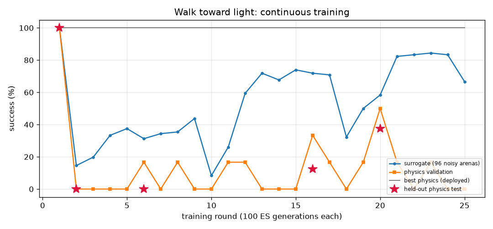

# Walk toward light (`light_seek`) — training report

*Auto-generated by `train_brains.py`, last updated 2026-09-25T23:09:25.*

| | |
|---|---|
| rounds | 25 |
| ES generations | 2500 |
| physics runs | 288 |
| status | level 1/3 |
| best brain | round 20: physics validation **50%** on 6 arenas, surrogate 58% |
| held-out physics test | **38%** on 8 unseen arenas (95% CI 14%-69%) (errors: [0.04, 0.38, 0.09, 0.24, 0.19, 0.45, 0.21, 0.12]) |

Physics error per arena: mm from target at the end (< 1.5 and standing still = success).

| round | level | gens | sigma | surrogate | physics val | val errors | test | note |
|---:|---:|---:|---:|---:|---:|---|---:|---|
| 1 | 1 | 100 | 0.024 | 100% | 100% | [0.53, 0.08, 0.13, 0.17, 0.21, 0.12] | 100% | new best |
| 2 | 1 | 200 | 0.080 | 15% | 0% | [0.0, 0.03, 0.26, 0.16, 0.56, 0.11] | 0% | new best |
| 3 | 1 | 300 | 0.072 | 20% | 0% | [0.02, 0.17, 0.05, 0.04, 0.17, 0.03] |  |  |
| 4 | 1 | 400 | 0.069 | 33% | 0% | [0.18, 0.09, 0.07, 0.07, 0.08, 0.14] |  |  |
| 5 | 1 | 500 | 0.061 | 38% | 0% | [0.04, 0.08, 0.04, 0.08, 0.14, 0.11] |  |  |
| 6 | 1 | 600 | 0.059 | 31% | 17% | [0.15, 0.17, 0.13, 0.13, 0.02, 0.31] | 0% | new best |
| 7 | 1 | 700 | 0.062 | 34% | 0% | [0.07, 0.11, 0.09, 0.09, 0.05, 0.08] |  |  |
| 8 | 1 | 800 | 0.061 | 35% | 17% | [0.01, 0.05, 0.1, 0.08, 0.05, 0.18] |  |  |
| 9 | 1 | 900 | 0.060 | 44% | 0% | [0.22, 0.13, 0.03, 0.08, 0.02, 0.08] |  | reseed: fresh weights |
| 10 | 1 | 1000 | 0.080 | 8% | 0% | [0.48, 1.6, 0.63, 0.65, 0.9, 0.61] |  |  |
| 11 | 1 | 1100 | 0.075 | 26% | 17% | [1.18, 0.5, 0.13, 0.12, 0.74, 0.52] |  |  |
| 12 | 1 | 1200 | 0.065 | 59% | 17% | [0.06, 0.13, 0.14, 0.22, 0.38, 0.41] |  |  |
| 13 | 1 | 1300 | 0.047 | 72% | 0% | [0.12, 0.04, 0.23, 0.12, 0.15, 0.33] |  |  |
| 14 | 1 | 1400 | 0.040 | 68% | 0% | [0.25, 0.32, 0.1, 0.16, 0.7, 0.16] |  |  |
| 15 | 1 | 1500 | 0.042 | 74% | 0% | [0.11, 1.79, 0.13, 0.33, 0.54, 3.85] |  |  |
| 16 | 1 | 1600 | 0.039 | 72% | 33% | [1.2, 0.13, 0.14, 0.07, 0.12, 0.96] | 12% | new best |
| 17 | 1 | 1700 | 0.040 | 71% | 17% | [0.25, 0.19, 0.1, 0.14, 0.1, 0.54] |  | reseed: fresh weights |
| 18 | 1 | 1800 | 0.080 | 32% | 0% | [0.67, 0.62, 0.72, 0.92, 3.41, 0.51] |  |  |
| 19 | 1 | 1900 | 0.062 | 50% | 17% | [0.12, 0.26, 0.23, 0.15, 0.12, 0.22] |  |  |
| 20 | 1 | 2000 | 0.052 | 58% | 50% | [0.12, 0.29, 0.18, 0.12, 0.01, 0.34] | 38% | new best |
| 21 | 1 | 2100 | 0.047 | 82% | 17% | [0.05, 0.07, 0.32, 0.44, 0.33, 0.62] |  |  |
| 22 | 1 | 2200 | 0.034 | 83% | 0% | [0.33, 0.32, 0.25, 0.07, 0.48, 0.33] |  |  |
| 23 | 1 | 2300 | 0.033 | 84% | 17% | [0.13, 0.62, 0.31, 0.03, 0.9, 0.64] |  |  |
| 24 | 1 | 2400 | 0.033 | 83% | 0% | [0.12, 0.39, 0.13, 0.04, 0.58, 0.16] |  | restart from best |
| 25 | 1 | 2500 | 0.047 | 67% | 0% | [0.13, 0.31, 0.33, 0.07, 0.28, 0.07] |  | reseed: fresh weights |
