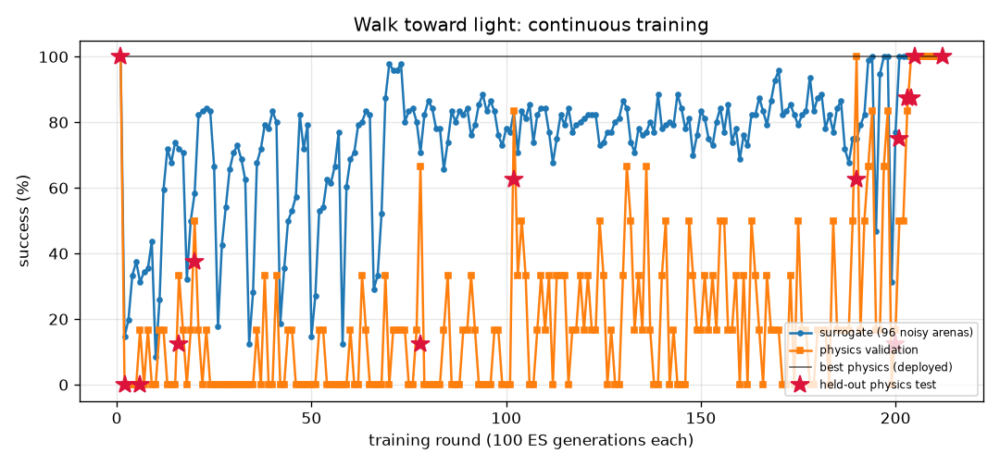

# Walk toward light (`light_seek`) — training report

*Auto-generated by `train_brains.py`, last updated 2026-10-07T21:20:35.*

| | |
|---|---|
| rounds | 238 |
| ES generations | 23800 |
| physics runs | 2464 |
| status | **optimal** |
| best brain | round 235: physics validation **100%** on 24 arenas, surrogate 100% |
| held-out physics test | **100%** on 32 unseen arenas (95% CI 89%-100%) (errors: [0.42, 0.43, 0.43, 0.46, 0.47, 0.42, 0.43, 0.45, 0.47, 0.5, 0.42, 0.42, 0.47, 0.88, 0.89, 0.46, 0.46, 0.43, 0.45, 0.48, 0.43, 0.84, 0.43, 0.43, 0.43, 0.44, 0.44, 0.47, 0.44, 0.43, 0.44, 0.8]) |

Physics error per arena: mm from target at the end (< 1.5 and standing still = success).

| round | level | gens | sigma | surrogate | physics val | val errors | test | note |
|---:|---:|---:|---:|---:|---:|---|---:|---|
| 199 | 1 | 19900 | 0.076 | 31% | 0% | [0.35, 0.29, 0.26, 0.19, 0.61, 0.38] |  |  |
| 200 | 1 | 20000 | 0.062 | 77% | 17% | [0.83, 0.56, 0.66, 0.93, 0.63, 0.67] | 12% | new best |
| 201 | 1 | 20100 | 0.037 | 100% | 50% | [0.78, 0.56, 0.4, 0.9, 0.65, 0.69] | 75% | new best |
| 202 | 1 | 20200 | 0.024 | 100% | 50% | [0.91, 0.73, 0.85, 0.92, 0.45, 0.66] |  |  |
| 203 | 1 | 20300 | 0.024 | 100% | 83% | [1.03, 0.39, 0.39, 0.38, 0.38, 0.39] | 88% | new best |
| 204 | 1 | 20400 | 0.024 | 100% | 100% | [0.38, 0.37, 0.38, 0.74, 0.69, 0.37] | 88% | new best |
| 205 | 2 | 20500 | 0.024 | 100% | 100% | [0.41, 0.41, 0.48, 0.5, 0.41, 0.42, 0.43, 0.42, 0.74, 0.41, 0.41, 0.53] | 100% | new best |
| 206 | 3 | 20600 | 0.024 | 100% | 100% | [0.4, 0.42, 0.4, 0.41, 0.42, 0.41, 0.41, 0.39, 0.39, 0.39, 0.39, 0.4, 0.4, 0.4, 0.39, 0.4, 0.41, 0.4, 0.42, 0.4, 0.41, 0.4, 0.39, 0.4] |  |  |
| 207 | 3 | 20700 | 0.024 | 100% | 100% | [0.42, 0.88, 0.5, 0.43, 0.44, 0.77, 0.46, 0.42, 0.45, 0.44, 0.43, 0.46, 0.42, 0.44, 0.46, 0.42, 0.43, 0.46, 0.45, 0.44, 0.44, 0.78, 0.43, 0.41] |  |  |
| 208 | 3 | 20800 | 0.024 | 100% | 100% | [0.48, 0.49, 0.5, 0.49, 0.49, 0.49, 0.48, 0.6, 0.48, 0.49, 0.49, 0.49, 0.49, 0.48, 0.49, 0.5, 0.49, 0.5, 0.5, 0.48, 0.48, 0.49, 0.49, 0.49] |  |  |
| 209 | 3 | 20900 | 0.024 | 100% | 100% | [0.45, 0.46, 0.45, 0.45, 0.47, 0.45, 0.46, 0.45, 0.5, 0.46, 0.46, 0.47, 0.46, 0.45, 0.45, 0.46, 0.46, 0.46, 0.46, 0.49, 0.45, 0.54, 0.46, 0.45] |  | restart from best |
| 210 | 3 | 21000 | 0.024 | 100% | 100% | [0.42, 0.44, 0.43, 0.43, 0.68, 0.41, 0.43, 0.41, 0.47, 0.45, 0.42, 0.47, 0.43, 0.44, 0.45, 0.42, 0.42, 0.49, 0.42, 0.44, 0.43, 0.42, 0.41, 0.43] |  |  |
| 211 | 3 | 21100 | 0.024 | 100% | 100% | [0.94, 0.49, 0.45, 0.47, 0.92, 0.42, 0.46, 0.46, 0.51, 0.42, 0.48, 0.71, 0.41, 0.72, 0.45, 0.48, 0.52, 0.42, 0.45, 0.52, 0.4, 0.69, 0.51, 0.4] |  |  |
| 212 | 3 | 21200 | 0.024 | 100% | 100% | [0.4, 0.43, 0.41, 0.4, 0.4, 0.49, 0.41, 0.41, 0.41, 0.4, 0.41, 0.44, 0.4, 0.52, 0.4, 0.41, 0.41, 0.4, 0.42, 0.39, 0.42, 0.42, 0.42, 0.41] | 100% | new best |
| 213 | 3 | 21300 | 0.024 | 100% | 100% | [0.51, 0.43, 0.45, 0.4, 0.41, 0.41, 0.5, 0.41, 0.44, 0.4, 0.42, 0.48, 0.41, 0.45, 0.43, 0.43, 0.41, 0.42, 0.44, 0.46, 0.46, 0.48, 0.45, 0.54] | 100% | new best |
| 214 | 3 | 21400 | 0.024 | 100% | 100% | [0.59, 0.52, 0.46, 0.6, 0.86, 0.54, 0.55, 0.59, 0.58, 0.44, 0.62, 0.49, 0.49, 0.53, 0.58, 0.64, 0.6, 0.54, 0.46, 0.55, 0.65, 0.52, 0.58, 0.6] |  |  |
| 215 | 3 | 21500 | 0.024 | 100% | 100% | [0.41, 0.48, 0.43, 0.43, 0.43, 0.49, 0.54, 0.54, 0.41, 0.45, 0.48, 0.53, 0.48, 0.79, 0.79, 0.51, 0.43, 0.51, 0.5, 0.41, 0.44, 0.5, 0.42, 0.59] |  |  |
| 216 | 3 | 21600 | 0.024 | 100% | 100% | [0.42, 0.39, 0.38, 0.37, 0.49, 0.37, 0.47, 0.45, 0.41, 0.44, 0.43, 0.48, 0.37, 0.44, 0.5, 0.37, 0.39, 0.4, 0.38, 0.47, 0.39, 0.49, 0.37, 0.37] | 97% | new best |
| 217 | 3 | 21700 | 0.024 | 100% | 100% | [0.77, 0.7, 0.42, 0.42, 0.42, 0.38, 0.48, 0.38, 0.77, 0.59, 0.4, 0.64, 0.4, 0.34, 0.41, 0.68, 0.36, 0.38, 0.74, 0.71, 0.78, 0.39, 0.36, 0.46] |  |  |
| 218 | 3 | 21800 | 0.024 | 100% | 96% | [0.48, 0.5, 0.52, 0.48, 0.47, 0.52, 0.63, 0.48, 0.47, 0.47, 0.67, 0.47, 0.48, 0.52, 0.48, 0.57, 0.47, 3.54, 0.48, 0.52, 0.49, 0.48, 0.5, 0.5] |  |  |
| 219 | 3 | 21900 | 0.024 | 100% | 100% | [0.5, 0.57, 0.51, 0.51, 0.89, 0.58, 0.94, 0.53, 0.57, 0.53, 0.51, 0.5, 0.83, 0.64, 0.56, 0.53, 0.51, 0.52, 0.53, 0.57, 0.63, 0.51, 0.54, 0.61] |  |  |
| 220 | 3 | 22000 | 0.024 | 100% | 100% | [0.63, 0.54, 0.53, 0.55, 0.49, 0.63, 0.69, 0.6, 0.54, 0.56, 0.48, 1.4, 0.49, 0.48, 0.96, 0.52, 0.49, 0.49, 0.57, 0.5, 0.65, 0.55, 0.56, 0.49] |  | restart from best |
| 221 | 3 | 22100 | 0.024 | 100% | 100% | [0.74, 0.8, 0.56, 0.58, 0.68, 0.76, 0.65, 0.61, 0.57, 0.5, 0.54, 0.64, 0.6, 1.23, 0.51, 0.66, 1.11, 0.54, 0.66, 1.02, 0.66, 0.67, 1.2, 0.98] |  |  |
| 222 | 3 | 22200 | 0.024 | 100% | 100% | [1.1, 0.59, 0.64, 0.47, 0.67, 0.59, 0.73, 0.59, 0.52, 0.82, 0.56, 0.5, 0.47, 0.47, 0.51, 0.49, 0.48, 0.68, 0.63, 0.99, 0.48, 0.99, 0.47, 0.6] |  |  |
| 223 | 3 | 22300 | 0.024 | 100% | 100% | [0.99, 0.51, 0.47, 0.46, 0.45, 0.57, 0.43, 0.42, 0.45, 0.45, 0.46, 0.49, 0.55, 0.45, 0.43, 0.63, 0.54, 0.42, 0.43, 0.46, 0.47, 0.47, 0.54, 0.79] |  |  |
| 224 | 3 | 22400 | 0.024 | 100% | 100% | [0.93, 0.52, 0.78, 0.48, 0.88, 0.48, 0.6, 0.97, 0.61, 0.51, 0.45, 0.53, 0.52, 0.97, 0.53, 0.62, 0.48, 0.54, 0.64, 0.57, 0.69, 1.02, 0.6, 0.96] |  | restart from best |
| 225 | 3 | 22500 | 0.024 | 100% | 100% | [0.4, 0.6, 0.47, 0.41, 0.41, 0.48, 0.41, 0.49, 0.57, 0.54, 0.44, 0.43, 0.96, 0.55, 0.53, 0.43, 0.86, 0.48, 0.42, 0.46, 0.41, 0.52, 0.41, 0.49] |  |  |
| 226 | 3 | 22600 | 0.024 | 100% | 100% | [0.49, 0.43, 0.41, 0.42, 0.45, 0.41, 0.41, 0.43, 0.45, 0.41, 0.41, 0.41, 0.42, 0.41, 0.42, 0.41, 0.41, 0.41, 0.47, 0.41, 0.43, 0.41, 0.4, 0.46] |  |  |
| 227 | 3 | 22700 | 0.024 | 100% | 100% | [0.53, 0.57, 1.32, 0.5, 0.51, 0.47, 0.48, 0.48, 0.57, 0.54, 0.53, 0.58, 0.48, 0.49, 0.46, 0.46, 0.62, 0.52, 0.55, 0.49, 0.85, 0.93, 0.49, 0.5] |  |  |
| 228 | 3 | 22800 | 0.024 | 100% | 100% | [0.59, 0.44, 0.47, 1.33, 0.45, 0.55, 0.43, 0.48, 0.49, 0.44, 0.61, 0.45, 0.49, 0.45, 0.67, 0.52, 0.53, 0.44, 0.6, 0.52, 0.5, 0.68, 0.62, 0.46] |  | restart from best |
| 229 | 3 | 22900 | 0.024 | 100% | 100% | [0.52, 0.49, 0.53, 0.6, 0.51, 0.86, 0.55, 0.55, 0.59, 0.49, 0.57, 0.49, 0.55, 0.58, 0.64, 0.48, 0.49, 0.55, 0.54, 0.55, 0.56, 0.55, 0.61, 0.93] |  |  |
| 230 | 3 | 23000 | 0.024 | 100% | 100% | [0.41, 0.44, 0.45, 0.41, 0.48, 0.43, 0.41, 0.43, 0.41, 0.42, 0.41, 0.41, 0.52, 0.4, 0.43, 0.42, 0.41, 0.42, 0.46, 0.42, 0.43, 0.42, 0.42, 0.43] |  |  |
| 231 | 3 | 23100 | 0.024 | 100% | 100% | [0.43, 0.44, 0.44, 0.43, 0.5, 0.55, 0.42, 0.53, 0.43, 0.43, 0.44, 0.45, 0.47, 0.49, 0.44, 0.44, 0.42, 0.44, 0.46, 0.43, 0.44, 0.44, 0.43, 0.43] |  |  |
| 232 | 3 | 23200 | 0.024 | 100% | 100% | [0.4, 0.42, 0.41, 0.4, 0.4, 0.41, 0.41, 0.41, 0.48, 0.4, 0.42, 0.4, 0.4, 0.41, 0.44, 0.4, 0.41, 0.44, 0.39, 0.44, 0.4, 0.42, 0.4, 0.39] |  | restart from best |
| 233 | 3 | 23300 | 0.024 | 100% | 100% | [0.97, 0.59, 0.58, 0.56, 0.82, 0.89, 0.92, 0.8, 0.51, 0.56, 0.56, 0.58, 0.58, 0.53, 0.75, 0.59, 0.61, 0.53, 0.9, 0.93, 0.57, 0.88, 0.99, 0.59] |  |  |
| 234 | 3 | 23400 | 0.024 | 100% | 92% | [3.34, 0.58, 0.47, 0.56, 0.52, 0.76, 0.91, 0.77, 1.07, 0.53, 0.56, 0.56, 1.38, 0.6, 1.15, 0.48, 0.48, 0.59, 0.48, 1.79, 1.05, 0.54, 1.13, 1.37] |  |  |
| 235 | 3 | 23500 | 0.024 | 100% | 100% | [0.52, 0.45, 0.48, 0.56, 0.43, 0.45, 0.5, 0.51, 0.45, 0.47, 0.47, 0.46, 0.44, 0.43, 0.47, 0.48, 0.46, 0.45, 0.45, 0.45, 0.46, 0.42, 0.43, 0.49] | 100% | new best |
| 236 | 3 | 23600 | 0.024 | 100% | 100% | [0.61, 0.51, 0.54, 0.53, 0.5, 0.45, 0.49, 0.5, 0.52, 0.6, 0.51, 0.59, 1.11, 0.55, 0.6, 0.46, 0.55, 0.52, 0.59, 0.46, 0.63, 0.51, 0.49, 0.53] |  |  |
| 237 | 3 | 23700 | 0.024 | 100% | 100% | [0.49, 0.5, 0.55, 0.53, 0.46, 0.47, 0.5, 0.57, 0.47, 0.45, 0.53, 0.48, 0.5, 0.59, 0.54, 0.47, 0.49, 0.52, 0.53, 0.51, 0.46, 0.47, 0.5, 0.45] |  |  |
| 238 | 3 | 23800 | 0.024 | 100% | 100% | [0.52, 0.53, 0.51, 0.54, 0.64, 0.51, 0.83, 0.52, 0.62, 0.54, 0.56, 0.59, 0.56, 0.57, 0.82, 0.5, 0.53, 0.49, 0.57, 0.72, 0.6, 0.62, 0.52, 0.65] |  |  |
