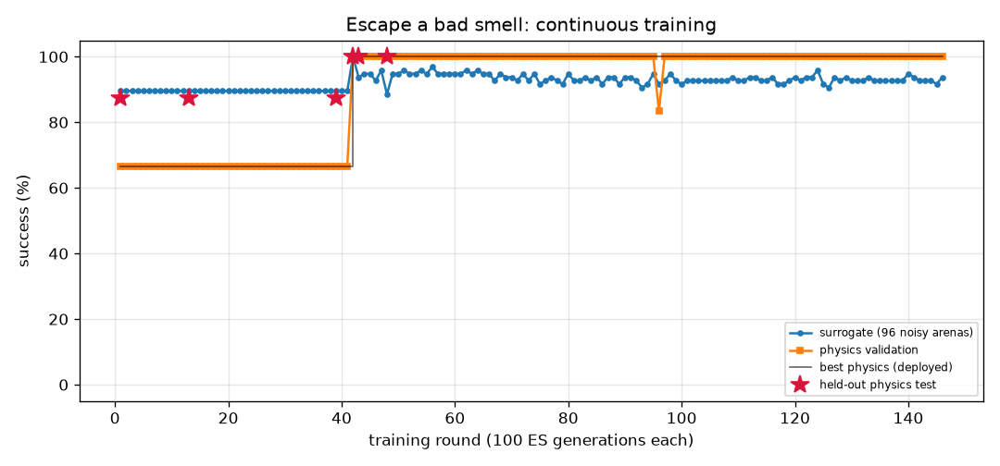

# Escape a bad smell (`odor_avoid`) — training report

*Auto-generated by `train_brains.py`, last updated 2026-09-25T23:11:52.*

| | |
|---|---|
| rounds | 146 |
| ES generations | 14600 |
| physics runs | 1022 |
| status | level 1/3 |
| best brain | round 48: physics validation **100%** on 6 arenas, surrogate 89% |
| held-out physics test | **100%** on 8 unseen arenas (95% CI 68%-100%) (errors: [22.3, 22.1, 21.9, 22.3, 22.6, 23.2, 21.7, 23.7]) |

Physics error per arena: mm gained away from source (> 6 without first approaching it = success).

| round | level | gens | sigma | surrogate | physics val | val errors | test | note |
|---:|---:|---:|---:|---:|---:|---|---:|---|
| 107 | 1 | 10700 | 0.028 | 93% | 100% | [28.7, 28.9, 28.1, 28.8, 27.5, 27.4] |  |  |
| 108 | 1 | 10800 | 0.028 | 93% | 100% | [36.6, 35.7, 36.0, 36.7, 37.4, 36.8] |  | restart from best |
| 109 | 1 | 10900 | 0.032 | 94% | 100% | [29.0, 28.7, 27.9, 28.7, 27.7, 27.3] |  |  |
| 110 | 1 | 11000 | 0.028 | 93% | 100% | [31.6, 31.2, 30.7, 31.4, 29.8, 29.7] |  |  |
| 111 | 1 | 11100 | 0.028 | 93% | 100% | [32.4, 31.8, 31.6, 32.2, 31.5, 31.1] |  |  |
| 112 | 1 | 11200 | 0.028 | 94% | 100% | [34.2, 33.0, 32.1, 33.2, 32.7, 31.7] |  | restart from best |
| 113 | 1 | 11300 | 0.032 | 94% | 100% | [26.4, 26.6, 26.3, 26.8, 25.5, 25.2] |  |  |
| 114 | 1 | 11400 | 0.028 | 93% | 100% | [27.6, 27.3, 27.4, 27.6, 26.9, 26.4] |  |  |
| 115 | 1 | 11500 | 0.028 | 93% | 100% | [21.2, 22.0, 21.5, 22.1, 20.0, 19.7] |  |  |
| 116 | 1 | 11600 | 0.028 | 94% | 100% | [28.4, 28.6, 28.1, 28.8, 27.5, 27.0] |  | restart from best |
| 117 | 1 | 11700 | 0.032 | 92% | 100% | [31.2, 30.7, 30.0, 30.9, 29.9, 29.7] |  |  |
| 118 | 1 | 11800 | 0.029 | 92% | 100% | [28.5, 28.5, 28.0, 28.6, 27.1, 26.5] |  |  |
| 119 | 1 | 11900 | 0.029 | 93% | 100% | [29.3, 29.0, 28.7, 29.0, 28.0, 27.8] |  |  |
| 120 | 1 | 12000 | 0.028 | 94% | 100% | [32.1, 31.4, 31.1, 31.6, 30.7, 29.8] |  | restart from best |
| 121 | 1 | 12100 | 0.032 | 93% | 100% | [20.7, 21.5, 20.8, 21.2, 19.3, 18.6] |  |  |
| 122 | 1 | 12200 | 0.028 | 94% | 100% | [22.2, 23.0, 22.4, 23.1, 20.6, 20.3] |  |  |
| 123 | 1 | 12300 | 0.028 | 94% | 100% | [31.5, 31.1, 31.1, 31.2, 30.7, 29.8] |  |  |
| 124 | 1 | 12400 | 0.028 | 96% | 100% | [42.9, 42.2, 41.6, 42.4, 41.9, 41.9] |  | restart from best |
| 125 | 1 | 12500 | 0.032 | 92% | 100% | [24.3, 24.2, 24.0, 23.9, 23.5, 23.1] |  |  |
| 126 | 1 | 12600 | 0.029 | 91% | 100% | [35.6, 35.3, 34.3, 35.4, 34.4, 33.5] |  |  |
| 127 | 1 | 12700 | 0.029 | 94% | 100% | [39.7, 38.6, 38.0, 38.7, 39.5, 38.9] |  |  |
| 128 | 1 | 12800 | 0.028 | 93% | 100% | [44.3, 42.7, 42.2, 43.0, 42.7, 42.4] |  | restart from best |
| 129 | 1 | 12900 | 0.032 | 94% | 100% | [23.0, 23.1, 22.8, 23.3, 22.0, 21.6] |  |  |
| 130 | 1 | 13000 | 0.028 | 93% | 100% | [26.0, 26.5, 26.0, 26.7, 25.0, 24.6] |  |  |
| 131 | 1 | 13100 | 0.028 | 93% | 100% | [28.4, 27.6, 27.7, 27.8, 27.3, 26.8] |  |  |
| 132 | 1 | 13200 | 0.028 | 93% | 100% | [36.9, 36.8, 36.4, 36.8, 36.3, 36.1] |  | restart from best |
| 133 | 1 | 13300 | 0.032 | 94% | 100% | [23.4, 23.1, 23.3, 23.2, 22.8, 22.2] |  |  |
| 134 | 1 | 13400 | 0.028 | 93% | 100% | [28.0, 27.4, 27.2, 27.5, 26.2, 26.2] |  |  |
| 135 | 1 | 13500 | 0.028 | 93% | 100% | [31.3, 31.2, 30.2, 31.2, 29.1, 29.8] |  |  |
| 136 | 1 | 13600 | 0.028 | 93% | 100% | [43.2, 42.0, 41.0, 42.1, 41.8, 41.7] |  | restart from best |
| 137 | 1 | 13700 | 0.032 | 93% | 100% | [27.6, 27.2, 26.4, 27.4, 26.1, 26.1] |  |  |
| 138 | 1 | 13800 | 0.028 | 93% | 100% | [25.2, 25.2, 24.9, 25.3, 24.0, 23.8] |  |  |
| 139 | 1 | 13900 | 0.028 | 93% | 100% | [26.0, 26.1, 25.4, 26.2, 24.7, 23.7] |  |  |
| 140 | 1 | 14000 | 0.028 | 95% | 100% | [29.1, 29.0, 28.4, 29.1, 27.7, 27.2] |  | restart from best |
| 141 | 1 | 14100 | 0.032 | 94% | 100% | [21.7, 21.6, 21.3, 21.6, 20.4, 19.9] |  |  |
| 142 | 1 | 14200 | 0.028 | 93% | 100% | [28.8, 28.3, 27.6, 28.3, 27.4, 27.0] |  |  |
| 143 | 1 | 14300 | 0.028 | 93% | 100% | [32.0, 31.2, 31.1, 31.3, 30.4, 30.0] |  |  |
| 144 | 1 | 14400 | 0.028 | 93% | 100% | [29.9, 29.4, 28.9, 29.3, 29.0, 28.7] |  | restart from best |
| 145 | 1 | 14500 | 0.032 | 92% | 100% | [31.3, 30.2, 29.1, 30.2, 29.2, 29.1] |  |  |
| 146 | 1 | 14600 | 0.029 | 94% | 100% | [30.6, 29.9, 29.6, 30.0, 29.2, 28.8] |  |  |
