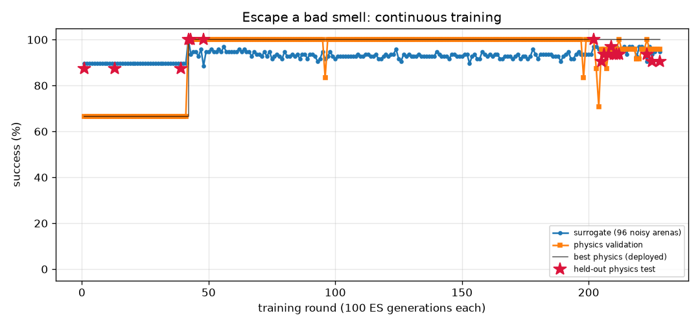

# Escape a bad smell (`odor_avoid`) — training report

*Auto-generated by `train_brains.py`, last updated 2026-10-07T00:08:30.*

| | |
|---|---|
| rounds | 321 |
| ES generations | 32100 |
| physics runs | 4914 |
| status | **optimal** |
| best brain | round 288: physics validation **100%** on 24 arenas, surrogate 98% |
| held-out physics test | **100%** on 32 unseen arenas (95% CI 89%-100%) (errors: [61.2, 57.1, 61.4, 61.0, 13.5, 61.1, 61.1, 60.7, 60.0, 56.9, 60.8, 56.8, 60.8, 60.0, 58.7, 59.7, 60.7, 54.4, 60.9, 54.7, 61.1, 60.5, 57.7, 58.7, 59.8, 55.9, 55.7, 45.8, 55.9, 58.2, 59.2, 28.5]) |

Physics error per arena: mm gained away from source (> 6 without first approaching it = success).

| round | level | gens | sigma | surrogate | physics val | val errors | test | note |
|---:|---:|---:|---:|---:|---:|---|---:|---|
| 282 | 3 | 28200 | 0.028 | 94% | 92% | [59.1, 55.2, 50.2, 55.9, 58.1, 56.3, 57.4, 58.3, 57.3, 57.7, 27.8, 56.2, 27.8, 43.9, 37.8, 57.1, 55.4, 55.1, 42.8, 55.3, 31.7, 57.8, 55.6, 57.4] |  |  |
| 283 | 3 | 28300 | 0.028 | 95% | 96% | [59.3, 56.2, 52.2, 56.8, 59.4, 58.0, 59.2, 55.0, 59.1, 43.3, 58.4, 59.6, 49.4, 53.4, 39.5, 59.4, 59.4, 58.3, 52.2, 55.6, 59.7, 43.4, 57.2, 35.5] |  |  |
| 284 | 3 | 28400 | 0.027 | 95% | 100% | [58.3, 52.1, 54.8, 55.8, 60.1, 59.3, 58.7, 37.5, 58.8, 56.9, 59.0, 59.3, 49.4, 54.1, 49.9, 59.8, 59.7, 59.4, 52.7, 52.0, 59.6, 46.7, 56.5, 45.1] |  | restart from best |
| 285 | 3 | 28500 | 0.026 | 96% | 92% | [57.1, 53.9, 52.7, 54.8, 56.8, 54.5, 57.2, 4.0, 56.3, 37.0, 55.4, 57.3, 48.1, 51.0, 31.7, 57.1, 57.3, 54.5, 50.4, 50.2, 57.2, 23.0, 55.1, 14.5] |  |  |
| 286 | 3 | 28600 | 0.026 | 95% | 96% | [58.9, 58.3, 55.0, 57.7, 59.9, 60.0, 59.6, 52.2, 59.5, 59.3, 59.2, 59.5, 51.0, 54.1, 39.8, 59.6, 59.8, 58.6, 52.5, 57.5, 60.1, 59.4, 57.1, 42.6] |  |  |
| 287 | 3 | 28700 | 0.027 | 97% | 96% | [61.9, 55.9, 56.6, 56.7, 60.0, 60.1, 60.3, 57.1, 58.8, 59.3, 60.7, 59.8, 54.3, 56.4, 41.6, 60.9, 60.1, 60.2, 54.0, 53.5, 60.4, 59.2, 56.2, 58.6] |  |  |
| 288 | 3 | 28800 | 0.026 | 98% | 100% | [61.9, 59.0, 55.6, 58.9, 61.2, 60.8, 59.8, 15.9, 59.7, 35.8, 52.4, 61.3, 50.8, 53.6, 12.5, 57.0, 61.4, 52.0, 54.4, 58.3, 61.0, 38.7, 59.1, 57.0] | 100% | new best |
| 289 | 3 | 28900 | 0.025 | 95% | 96% | [61.8, 58.8, 56.8, 59.2, 61.2, 61.4, 60.4, 25.7, 61.0, 58.6, 61.4, 60.4, 54.3, 56.7, 41.0, 60.7, 61.2, 59.8, 54.3, 55.2, 61.1, 60.8, 58.7, 58.7] |  |  |
| 290 | 3 | 29000 | 0.027 | 97% | 96% | [60.5, 56.8, 57.0, 57.3, 60.1, 59.2, 60.4, 50.9, 60.9, 42.3, 59.9, 60.0, 52.9, 54.8, 39.7, 60.1, 60.4, 59.6, 53.6, 57.1, 59.7, 51.1, 58.4, 50.6] |  |  |
| 291 | 3 | 29100 | 0.026 | 94% | 96% | [59.4, 57.5, 56.1, 57.5, 59.5, 60.6, 60.0, 50.3, 60.0, 59.5, 58.2, 59.7, 52.7, 54.1, 34.1, 59.4, 59.5, 60.1, 53.5, 56.4, 59.7, 56.1, 57.8, 47.1] |  |  |
| 292 | 3 | 29200 | 0.028 | 94% | 96% | [57.3, 54.4, 52.4, 54.2, 52.4, 51.6, 57.4, 29.6, 56.7, 45.3, 37.6, 57.0, 48.8, 50.8, 35.2, 50.9, 57.1, 50.8, 50.2, 54.4, 57.1, 54.7, 54.3, 54.9] |  | restart from best |
| 293 | 3 | 29300 | 0.025 | 92% | 96% | [62.1, 56.6, 57.1, 60.7, 60.6, 59.8, 61.0, 49.1, 59.8, 40.1, 58.1, 60.6, 52.8, 55.1, 32.4, 61.6, 61.2, 60.1, 54.5, 56.2, 60.7, 56.7, 58.4, 61.2] |  |  |
| 294 | 3 | 29400 | 0.029 | 95% | 96% | [61.4, 60.4, 57.6, 59.5, 60.5, 61.3, 61.7, 58.8, 61.7, 61.0, 59.1, 60.9, 52.1, 54.9, 39.7, 61.0, 61.2, 61.2, 54.0, 59.4, 60.7, 61.8, 60.4, 61.2] |  |  |
| 295 | 3 | 29500 | 0.027 | 95% | 100% | [62.0, 60.2, 56.3, 59.3, 55.5, 59.1, 62.0, 57.4, 61.6, 42.9, 12.2, 61.1, 52.3, 55.5, 46.3, 60.4, 61.0, 48.1, 51.6, 59.9, 60.7, 45.5, 57.0, 60.3] |  |  |
| 296 | 3 | 29600 | 0.027 | 98% | 92% | [60.7, 59.0, 56.9, 58.8, 61.5, 60.5, 60.9, 41.2, 61.1, 31.8, 61.0, 60.7, 50.2, 57.3, 44.6, 60.5, 60.8, 58.8, 54.1, 58.9, 60.6, 60.8, 58.9, 41.0] |  | restart from best |
| 297 | 3 | 29700 | 0.025 | 96% | 100% | [62.3, 58.6, 55.8, 60.8, 61.7, 61.9, 60.6, 57.4, 61.1, 61.7, 61.5, 62.0, 53.0, 55.5, 40.8, 60.7, 62.2, 61.6, 54.8, 57.1, 61.9, 61.7, 59.4, 60.5] |  |  |
| 298 | 3 | 29800 | 0.026 | 97% | 96% | [62.7, 58.8, 58.2, 57.9, 61.1, 62.0, 60.8, 27.5, 60.5, 57.7, 60.9, 60.3, 53.4, 58.1, 37.1, 60.1, 60.2, 60.9, 54.1, 55.0, 59.7, 60.1, 58.3, 46.1] |  |  |
| 299 | 3 | 29900 | 0.026 | 97% | 100% | [62.8, 58.6, 58.3, 57.7, 60.9, 61.9, 59.8, 49.4, 60.0, 51.0, 60.9, 60.8, 52.6, 57.4, 42.5, 61.3, 59.8, 60.7, 53.2, 57.1, 60.2, 55.2, 58.1, 51.9] |  |  |
| 300 | 3 | 30000 | 0.026 | 96% | 100% | [61.9, 59.0, 57.9, 59.2, 60.3, 60.6, 60.3, 45.6, 58.7, 60.0, 60.9, 59.7, 53.6, 54.9, 42.6, 60.3, 60.7, 61.2, 54.3, 55.9, 59.9, 59.0, 58.7, 47.7] |  | restart from best |
| 301 | 3 | 30100 | 0.025 | 97% | 96% | [60.5, 55.6, 54.9, 55.9, 58.9, 59.3, 59.2, 19.3, 58.5, 27.4, 58.6, 59.7, 51.8, 54.5, 15.6, 56.1, 60.1, 59.2, 53.6, 52.6, 59.8, 40.4, 55.2, 51.9] |  |  |
| 302 | 3 | 30200 | 0.026 | 95% | 100% | [58.5, 57.9, 54.2, 58.0, 57.7, 53.8, 57.6, 56.7, 58.5, 35.5, 55.3, 58.6, 49.3, 54.4, 40.2, 55.1, 58.8, 56.2, 51.6, 56.7, 58.8, 55.8, 54.7, 57.3] |  |  |
| 303 | 3 | 30300 | 0.027 | 95% | 96% | [57.7, 56.0, 53.7, 55.3, 57.3, 47.6, 58.5, 52.3, 58.3, 54.1, 50.5, 58.2, 48.8, 50.0, 9.8, 56.7, 58.5, 53.9, 50.5, 53.5, 58.6, 52.2, 57.2, 55.7] |  |  |
| 304 | 3 | 30400 | 0.027 | 93% | 96% | [59.9, 57.7, 55.2, 59.1, 60.3, 59.6, 58.4, 58.3, 59.6, 59.3, 60.3, 59.9, 53.8, 56.5, 50.6, 60.0, 60.3, 59.7, 53.7, 55.6, 60.4, 58.8, 58.9, 59.3] |  | restart from best |
| 305 | 3 | 30500 | 0.025 | 97% | 96% | [63.0, 60.9, 56.1, 59.1, 62.3, 62.1, 61.0, 50.0, 60.8, 61.5, 61.5, 61.9, 53.3, 56.1, 36.4, 61.0, 61.6, 60.7, 55.1, 59.6, 61.7, 61.7, 58.8, 58.8] |  |  |
| 306 | 3 | 30600 | 0.026 | 94% | 100% | [60.9, 60.0, 55.5, 60.0, 55.0, 55.1, 61.2, 58.5, 61.4, 41.8, 6.4, 61.1, 49.1, 53.6, 37.1, 59.8, 60.9, 48.8, 50.8, 57.0, 61.1, 59.9, 59.1, 60.6] |  |  |
| 307 | 3 | 30700 | 0.028 | 95% | 100% | [62.4, 60.6, 55.2, 60.7, 60.5, 61.6, 62.1, 60.0, 61.9, 60.7, 37.6, 61.6, 52.7, 55.3, 25.8, 61.7, 61.9, 61.3, 51.5, 59.4, 61.5, 60.9, 61.2, 61.9] | 100% |  |
| 308 | 3 | 30800 | 0.025 | 96% | 100% | [61.9, 60.3, 56.3, 60.6, 60.7, 60.7, 60.0, 61.3, 60.9, 60.2, 59.7, 61.0, 47.0, 50.6, 34.5, 61.1, 61.3, 59.2, 50.6, 60.4, 61.3, 61.4, 59.4, 61.9] |  |  |
| 309 | 3 | 30900 | 0.026 | 95% | 96% | [62.5, 57.4, 56.3, 55.3, 60.4, 61.4, 59.2, 46.1, 59.2, 43.6, 59.8, 61.0, 52.4, 55.6, 42.8, 61.3, 61.6, 61.5, 54.5, 56.8, 61.4, 56.6, 56.9, 55.3] |  |  |
| 310 | 3 | 31000 | 0.027 | 93% | 96% | [62.8, 57.3, 52.9, 54.6, 59.1, 60.9, 56.2, 35.7, 59.9, 54.6, 59.6, 61.0, 52.6, 55.5, 42.5, 60.5, 60.8, 58.1, 49.3, 56.4, 61.0, 59.4, 57.1, 58.9] |  |  |
| 311 | 3 | 31100 | 0.028 | 98% | 96% | [63.5, 57.2, 56.1, 57.6, 61.8, 62.3, 61.3, 59.9, 60.0, 61.8, 61.6, 62.0, 54.6, 56.4, 48.0, 62.1, 62.1, 62.2, 55.1, 56.9, 62.0, 61.7, 57.4, 61.3] |  | restart from best |
| 312 | 3 | 31200 | 0.025 | 94% | 100% | [59.2, 55.9, 55.3, 58.8, 61.0, 60.7, 60.5, 51.2, 59.9, 59.2, 60.6, 60.6, 54.1, 56.3, 47.6, 60.2, 61.2, 60.6, 54.6, 54.7, 60.4, 45.4, 58.3, 41.9] |  |  |
| 313 | 3 | 31300 | 0.028 | 95% | 96% | [58.7, 54.4, 53.8, 55.9, 59.1, 59.1, 59.1, 37.9, 58.1, 58.3, 31.2, 59.6, 51.8, 52.9, 45.3, 59.2, 58.9, 59.2, 52.1, 51.8, 59.3, 42.0, 55.9, 56.0] |  |  |
| 314 | 3 | 31400 | 0.027 | 95% | 96% | [57.6, 54.4, 53.8, 54.5, 53.9, 55.6, 57.9, 55.9, 57.4, 54.9, 27.6, 58.2, 46.6, 52.3, -0.8, 55.3, 58.3, 55.1, 47.4, 52.9, 57.9, 56.0, 51.0, 56.3] |  |  |
| 315 | 3 | 31500 | 0.027 | 95% | 96% | [60.7, 58.7, 56.2, 60.2, 60.8, 61.9, 61.5, 56.7, 60.9, 61.6, 60.4, 61.3, 52.7, 55.3, 37.6, 61.1, 61.6, 61.7, 54.6, 59.4, 61.1, 61.0, 60.4, 60.6] |  | restart from best |
| 316 | 3 | 31600 | 0.025 | 96% | 100% | [61.4, 58.1, 55.5, 59.1, 60.8, 58.3, 59.3, 13.0, 59.4, 28.7, 61.5, 60.9, 54.1, 56.4, 51.5, 60.8, 61.2, 60.6, 54.6, 54.6, 61.5, 59.5, 59.8, 32.5] |  |  |
| 317 | 3 | 31700 | 0.026 | 96% | 96% | [61.0, 57.7, 56.9, 58.1, 60.0, 59.2, 58.4, 16.1, 58.6, 32.5, 60.4, 60.4, 49.2, 55.3, 37.7, 59.6, 60.5, 59.2, 54.3, 55.3, 60.4, 45.3, 59.1, 35.4] |  |  |
| 318 | 3 | 31800 | 0.026 | 93% | 96% | [60.7, 58.2, 56.7, 58.1, 59.9, 60.0, 60.8, 38.7, 60.8, 52.1, 30.3, 60.1, 51.6, 54.4, 34.6, 60.6, 60.4, 59.3, 54.2, 59.0, 60.0, 61.1, 58.8, 60.4] |  |  |
| 319 | 3 | 31900 | 0.028 | 96% | 96% | [61.8, 59.4, 58.3, 58.7, 61.5, 62.0, 60.4, 58.6, 61.7, 60.6, 60.7, 60.0, 53.8, 56.6, 38.6, 61.8, 60.9, 61.7, 54.2, 56.1, 60.6, 61.3, 59.2, 61.7] |  | restart from best |
| 320 | 3 | 32000 | 0.025 | 93% | 100% | [60.7, 59.0, 55.6, 56.8, 61.1, 57.6, 59.6, 8.3, 60.0, 58.6, 60.7, 61.0, 54.3, 55.4, 42.5, 60.4, 60.8, 59.6, 54.5, 54.4, 61.0, 35.5, 57.6, 30.8] |  |  |
| 321 | 3 | 32100 | 0.028 | 95% | 96% | [60.5, 57.6, 54.1, 57.6, 59.6, 59.8, 58.8, 24.9, 60.1, 36.7, 57.6, 58.6, 50.2, 53.5, 34.6, 55.5, 58.8, 57.2, 48.2, 55.5, 58.2, 49.1, 57.9, 50.2] |  |  |
