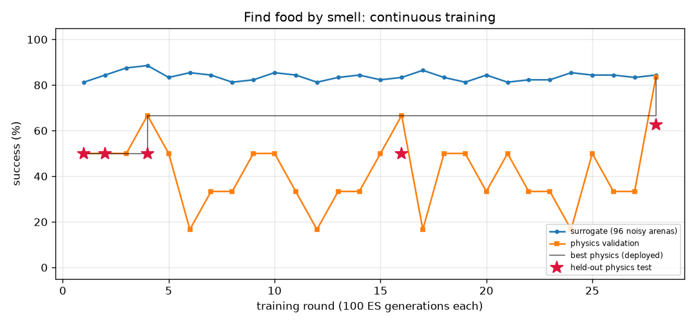

# Find food by smell (`odor_seek`) — training report

*Auto-generated by `train_brains.py`, last updated 2026-09-25T02:29:59.*

| | |
|---|---|
| rounds | 28 |
| ES generations | 2800 |
| physics runs | 208 |
| status | training |
| best brain | round 28: physics validation **83%**, surrogate 84% |
| held-out physics test | **62%** on 8 unseen arenas (errors: [2.14, 0.1, 1.92, 2.12, 1.72, 1.42, 1.42, 2.92]) |

Physics error per arena: mm from target at the end (< 2 = success).

| round | gens | sigma | surrogate | physics val | val errors | test | note |
|---:|---:|---:|---:|---:|---|---:|---|
| 1 | 100 | 0.033 | 81% | 50% | [2.91, 1.92, 1.41, 2.59, 2.0, 2.86] | 50% | new best |
| 2 | 200 | 0.035 | 84% | 50% | [0.71, 2.76, 2.96, 1.92, 2.53, 1.47] | 50% | new best |
| 3 | 300 | 0.033 | 88% | 50% | [2.44, 1.81, 2.49, 0.72, 2.22, 1.47] |  |  |
| 4 | 400 | 0.031 | 89% | 67% | [1.91, 2.37, 1.66, 1.45, 1.17, 2.39] | 50% | new best |
| 5 | 500 | 0.030 | 83% | 50% | [2.07, 0.88, 1.61, 2.69, 2.45, 1.95] |  |  |
| 6 | 600 | 0.033 | 85% | 17% | [2.95, 2.29, 2.84, 2.41, 3.27, 0.91] |  |  |
| 7 | 700 | 0.032 | 84% | 33% | [2.84, 1.79, 2.05, 2.72, 2.37, 1.64] |  |  |
| 8 | 800 | 0.033 | 81% | 33% | [3.02, 0.86, 1.84, 2.51, 2.12, 2.68] |  | restart from best |
| 9 | 900 | 0.030 | 82% | 50% | [2.43, 1.65, 1.36, 2.28, 2.34, 1.13] |  |  |
| 10 | 1000 | 0.034 | 85% | 50% | [2.23, 3.11, 2.69, 1.8, 1.64, 1.71] |  |  |
| 11 | 1100 | 0.032 | 84% | 33% | [2.97, 3.59, 2.57, 1.53, 1.4, 2.58] |  |  |
| 12 | 1200 | 0.033 | 81% | 17% | [4.18, 1.87, 2.47, 2.37, 2.21, 2.47] |  | restart from best |
| 13 | 1300 | 0.030 | 83% | 33% | [3.43, 3.26, 2.65, 0.16, 0.61, 2.49] |  |  |
| 14 | 1400 | 0.033 | 84% | 33% | [1.94, 3.96, 2.4, 2.22, 1.42, 2.03] |  |  |
| 15 | 1500 | 0.033 | 82% | 50% | [1.87, 1.54, 2.26, 2.2, 1.75, 2.38] |  |  |
| 16 | 1600 | 0.034 | 83% | 67% | [1.59, 2.42, 0.96, 2.19, 1.3, 0.63] | 50% | new best |
| 17 | 1700 | 0.033 | 86% | 17% | [2.36, 3.03, 1.78, 2.92, 2.62, 2.08] |  |  |
| 18 | 1800 | 0.032 | 83% | 50% | [1.62, 1.17, 1.92, 2.38, 2.46, 3.65] |  |  |
| 19 | 1900 | 0.033 | 81% | 50% | [1.86, 1.29, 1.89, 3.47, 2.87, 2.04] |  |  |
| 20 | 2000 | 0.035 | 84% | 33% | [2.04, 3.07, 1.91, 1.76, 3.17, 2.69] |  | restart from best |
| 21 | 2100 | 0.033 | 81% | 50% | [2.03, 1.79, 2.84, 2.1, 1.74, 2.0] |  |  |
| 22 | 2200 | 0.035 | 82% | 33% | [2.45, 3.41, 2.04, 2.53, 1.97, 1.59] |  |  |
| 23 | 2300 | 0.034 | 82% | 33% | [3.62, 1.91, 2.12, 1.91, 2.0, 2.18] |  |  |
| 24 | 2400 | 0.034 | 85% | 17% | [2.56, 1.52, 2.08, 2.01, 2.4, 2.27] |  | restart from best |
| 25 | 2500 | 0.033 | 84% | 50% | [15.46, 1.64, 2.49, 2.61, 1.74, 1.5] |  |  |
| 26 | 2600 | 0.033 | 84% | 33% | [1.26, 2.92, 2.12, 2.61, 1.97, 2.55] |  |  |
| 27 | 2700 | 0.033 | 83% | 33% | [2.89, 1.5, 3.31, 3.97, 2.02, 1.13] |  |  |
| 28 | 2800 | 0.033 | 84% | 83% | [1.1, 1.91, 2.31, 1.67, 1.49, 1.98] | 62% | new best |
