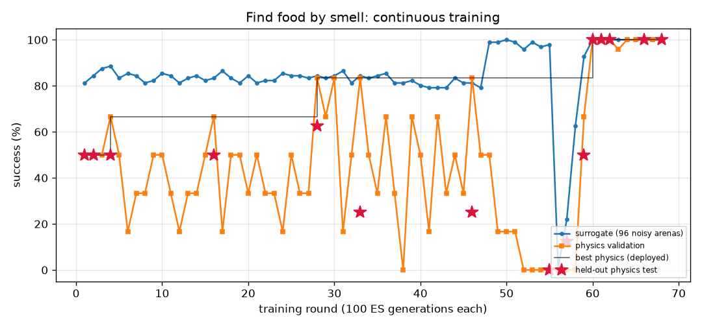

# Find food by smell (`odor_seek`) — training report

*Auto-generated by `train_brains.py`, last updated 2026-10-04T15:27:11.*

| | |
|---|---|
| rounds | 72 |
| ES generations | 7200 |
| physics runs | 966 |
| status | **optimal** |
| best brain | round 72: physics validation **100%** on 24 arenas, surrogate 100% |
| held-out physics test | **100%** on 32 unseen arenas (95% CI 89%-100%) (errors: [0.11, 0.13, 0.14, 0.19, 0.18, 0.23, 0.26, 0.18, 0.19, 0.22, 0.14, 0.2, 0.19, 0.23, 0.22, 0.26, 0.22, 0.19, 0.1, 0.23, 0.21, 0.21, 0.22, 0.22, 0.13, 0.18, 0.26, 0.13, 0.19, 0.21, 0.11, 0.11]) |

Physics error per arena: mm from target at the end (< 1.5 and standing still = success).

| round | level | gens | sigma | surrogate | physics val | val errors | test | note |
|---:|---:|---:|---:|---:|---:|---|---:|---|
| 33 | 1 | 3300 | 0.035 | 84% | 83% | [1.44, 1.67, 1.61, 1.52, 1.5, 2.33] | 25% | new best |
| 34 | 1 | 3400 | 0.033 | 83% | 50% | [2.69, 3.06, 0.89, 2.56, 1.96, 1.82] |  |  |
| 35 | 1 | 3500 | 0.033 | 84% | 33% | [1.8, 2.48, 2.59, 2.06, 1.58, 2.12] |  |  |
| 36 | 1 | 3600 | 0.033 | 85% | 67% | [0.82, 1.49, 3.29, 2.06, 1.64, 1.36] |  |  |
| 37 | 1 | 3700 | 0.032 | 81% | 33% | [1.82, 0.98, 2.68, 2.6, 2.44, 3.63] |  | reseed: fresh weights |
| 38 | 1 | 3800 | 0.080 | 81% | 0% | [2.7, 2.31, 2.61, 2.96, 2.55, 2.53] |  |  |
| 39 | 1 | 3900 | 0.035 | 82% | 67% | [1.53, 2.39, 1.91, 1.53, 2.74, 1.54] |  |  |
| 40 | 1 | 4000 | 0.034 | 80% | 50% | [2.55, 1.85, 2.52, 1.28, 3.91, 1.87] |  |  |
| 41 | 1 | 4100 | 0.035 | 79% | 17% | [2.31, 2.23, 2.27, 1.49, 2.36, 2.21] |  |  |
| 42 | 1 | 4200 | 0.036 | 79% | 67% | [1.71, 1.81, 2.54, 2.44, 1.25, 1.93] |  |  |
| 43 | 1 | 4300 | 0.036 | 79% | 33% | [1.98, 4.56, 2.06, 1.93, 2.63, 2.08] |  |  |
| 44 | 1 | 4400 | 0.036 | 83% | 50% | [0.29, 2.56, 2.95, 1.74, 2.25, 1.88] |  |  |
| 45 | 1 | 4500 | 0.033 | 81% | 33% | [1.21, 1.66, 2.0, 2.46, 2.6, 2.51] |  | reseed: fresh weights |
| 46 | 1 | 4600 | 0.080 | 81% | 83% | [1.32, 1.7, 1.75, 1.8, 1.54, 3.38] | 25% | new best |
| 47 | 1 | 4700 | 0.035 | 79% | 50% | [1.47, 2.33, 1.42, 1.51, 2.59, 2.21] |  |  |
| 48 | 1 | 4800 | 0.037 | 99% | 50% | [3.21, 2.13, 3.1, 1.76, 1.97, 1.7] |  |  |
| 49 | 1 | 4900 | 0.025 | 99% | 17% | [2.14, 1.47, 3.1, 2.49, 2.61, 3.4] |  |  |
| 50 | 1 | 5000 | 0.025 | 100% | 17% | [2.55, 1.86, 3.72, 2.63, 3.68, 3.36] |  |  |
| 51 | 1 | 5100 | 0.024 | 99% | 17% | [3.55, 3.31, 1.73, 2.08, 3.81, 3.9] |  |  |
| 52 | 1 | 5200 | 0.027 | 96% | 0% | [3.22, 4.13, 3.79, 1.88, 1.53, 2.89] |  |  |
| 53 | 1 | 5300 | 0.026 | 99% | 0% | [3.41, 3.94, 1.82, 2.68, 2.04, 3.77] |  |  |
| 54 | 1 | 5400 | 0.025 | 97% | 0% | [3.59, 2.19, 3.65, 4.14, 3.62, 2.43] |  |  |
| 55 | 1 | 5500 | 0.026 | 98% | 0% | [2.82, 0.29, 1.41, 3.77, 3.34, 1.7] | 0% | new best |
| 56 | 1 | 5600 | 0.078 | 1% | 0% | [2.57, 2.72, 3.56, 1.7, 1.5, 0.85] |  |  |
| 57 | 1 | 5700 | 0.079 | 22% | 0% | [1.95, 1.02, 1.04, 2.27, 1.03, 1.84] | 12% | new best |
| 58 | 1 | 5800 | 0.068 | 62% | 0% | [1.67, 0.2, 1.17, 2.06, 1.33, 3.19] |  |  |
| 59 | 1 | 5900 | 0.045 | 93% | 67% | [2.87, 0.58, 0.93, 0.99, 0.27, 3.34] | 50% | new best |
| 60 | 1 | 6000 | 0.028 | 100% | 100% | [0.24, 0.27, 0.15, 0.8, 0.31, 0.26] | 100% | new best |
| 61 | 2 | 6100 | 0.024 | 100% | 100% | [0.22, 0.19, 0.28, 0.28, 0.21, 0.3, 0.21, 0.22, 0.19, 0.23, 0.26, 0.26] | 100% | new best |
| 62 | 3 | 6200 | 0.024 | 100% | 100% | [0.29, 0.32, 0.28, 0.33, 0.29, 0.31, 0.26, 0.27, 0.26, 0.32, 0.29, 0.28, 0.26, 0.29, 0.29, 0.26, 0.26, 0.27, 0.25, 0.24, 0.27, 0.27, 0.24, 0.26] | 100% | new best |
| 63 | 3 | 6300 | 0.024 | 100% | 96% | [0.34, 0.27, 0.28, 0.26, 0.27, 0.3, 1.57, 0.26, 0.28, 0.29, 0.25, 0.26, 0.27, 0.3, 0.26, 0.3, 0.22, 0.27, 0.26, 0.26, 0.29, 0.24, 0.28, 0.25] |  |  |
| 64 | 3 | 6400 | 0.024 | 100% | 100% | [0.23, 0.27, 0.27, 0.26, 0.28, 0.26, 0.3, 0.22, 0.26, 0.26, 0.3, 0.27, 0.31, 0.22, 0.28, 0.2, 0.35, 0.32, 0.23, 0.22, 0.26, 0.28, 0.24, 0.23] |  |  |
| 65 | 3 | 6500 | 0.024 | 100% | 100% | [0.27, 0.27, 0.21, 0.2, 0.27, 0.33, 0.27, 0.28, 0.3, 0.26, 0.31, 0.24, 0.29, 0.24, 0.24, 0.26, 0.3, 0.27, 0.24, 0.29, 0.24, 0.34, 0.25, 0.25] |  |  |
| 66 | 3 | 6600 | 0.024 | 100% | 100% | [0.25, 0.22, 0.25, 0.16, 0.31, 0.25, 0.24, 0.23, 0.19, 0.19, 0.27, 0.28, 0.3, 0.27, 0.24, 0.29, 0.3, 0.26, 0.2, 0.23, 0.19, 0.2, 0.23, 0.24] | 100% | new best |
| 67 | 3 | 6700 | 0.024 | 100% | 100% | [0.21, 0.13, 0.2, 0.17, 0.27, 0.19, 0.21, 0.2, 0.17, 0.21, 0.21, 0.18, 0.24, 0.27, 0.13, 0.13, 0.23, 0.19, 0.19, 0.19, 0.26, 0.3, 0.17, 0.23] |  |  |
| 68 | 3 | 6800 | 0.024 | 100% | 100% | [0.3, 0.26, 0.23, 0.13, 0.25, 0.27, 0.34, 0.24, 0.26, 0.25, 0.25, 0.32, 0.26, 0.29, 0.27, 0.3, 0.3, 0.22, 0.23, 0.3, 0.3, 0.29, 0.29, 0.25] | 100% | new best |
| 69 | 3 | 6900 | 0.024 | 100% | 100% | [0.3, 0.35, 0.3, 0.27, 0.29, 0.25, 0.34, 0.26, 0.26, 0.28, 0.3, 0.32, 0.24, 0.35, 0.31, 0.22, 0.32, 0.32, 0.27, 0.28, 0.24, 0.31, 0.24, 0.26] |  |  |
| 70 | 3 | 7000 | 0.024 | 100% | 100% | [0.21, 0.25, 0.21, 0.3, 0.25, 0.28, 0.25, 0.22, 0.24, 0.29, 0.28, 0.28, 0.24, 0.22, 0.34, 0.25, 0.27, 0.25, 0.33, 0.26, 0.24, 0.26, 0.26, 0.24] |  |  |
| 71 | 3 | 7100 | 0.024 | 100% | 100% | [0.21, 0.26, 0.27, 0.24, 0.23, 0.24, 0.23, 0.2, 0.28, 0.27, 0.28, 0.27, 0.24, 0.27, 0.21, 0.29, 0.25, 0.24, 0.24, 0.28, 0.27, 0.23, 0.25, 0.23] |  |  |
| 72 | 3 | 7200 | 0.024 | 100% | 100% | [0.2, 0.18, 0.2, 0.19, 0.2, 0.25, 0.21, 0.19, 0.22, 0.23, 0.24, 0.12, 0.18, 0.15, 0.18, 0.25, 0.22, 0.22, 0.11, 0.14, 0.2, 0.1, 0.18, 0.23] | 100% | new best |
