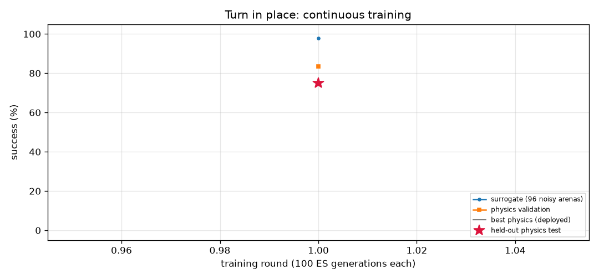

# Turn in place (`turn`) — training report

*Auto-generated by `train_brains.py`, last updated 2026-09-25T00:14:41.*

| | |
|---|---|
| rounds | 1 |
| ES generations | 100 |
| physics runs | 14 |
| status | training |
| best brain | round 1: physics validation **83%**, surrogate 98% |
| held-out physics test | **75%** on 8 unseen arenas (errors: [0.5, 5.2, 8.0, 4.6, 0.9, 1.4, 1.0, 2.2]) |

Physics error per arena: deg from target heading (< 20 = success).

| round | gens | sigma | surrogate | physics val | val errors | test | note |
|---:|---:|---:|---:|---:|---|---:|---|
| 1 | 100 | 0.053 | 98% | 83% | [9.0, 10.3, 9.9, 3.6, 4.8, 1.4] | 75% | new best |
