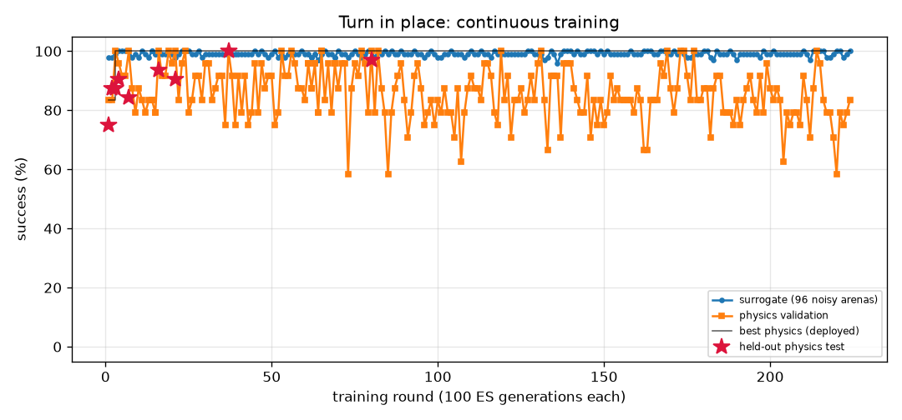

# Turn in place (`turn`) — training report

*Auto-generated by `train_brains.py`, last updated 2026-10-08T20:28:18.*

| | |
|---|---|
| rounds | 244 |
| ES generations | 24400 |
| physics runs | 6102 |
| status | **optimal** |
| best brain | round 80: physics validation **100%** on 24 arenas, surrogate 100% |
| held-out physics test | **97%** on 32 unseen arenas (95% CI 84%-99%) (errors: [1.6, 3.3, 6.3, 3.7, 1.1, 0.4, 2.4, 2.9, 0.1, 2.6, 0.5, 2.7, 1.5, 3.1, 4.5, 0.2, 0.5, 1.1, 2.0, 4.4, 2.8, 3.2, 0.3, 2.2, 0.5, 3.0, 0.3, 5.4, 0.4, 1.0, 4.7, 10.7]) |

Physics error per arena: deg from target heading (< 20 = success).

| round | level | gens | sigma | surrogate | physics val | val errors | test | note |
|---:|---:|---:|---:|---:|---:|---|---:|---|
| 205 | 3 | 20500 | 0.024 | 99% | 79% | [0.4, 3.0, 1.0, 1.4, 3.4, 5.6, 6.7, 7.8, 5.1, 1.2, 4.9, 0.7, 0.9, 3.0, 3.7, 1.8, 1.1, 1.3, 2.6, 0.2, 5.7, 0.5, 4.3, 1.3] |  |  |
| 206 | 3 | 20600 | 0.025 | 99% | 75% | [8.1, 2.9, 1.9, 0.6, 4.2, 7.4, 5.9, 7.8, 5.8, 13.9, 4.7, 1.1, 0.7, 1.3, 5.0, 2.9, 0.1, 2.7, 2.9, 0.8, 4.6, 1.1, 4.6, 6.9] |  |  |
| 207 | 3 | 20700 | 0.025 | 99% | 79% | [7.2, 8.9, 9.0, 3.3, 7.0, 3.1, 5.9, 0.1, 3.1, 0.2, 3.7, 2.1, 1.2, 4.5, 3.6, 0.4, 2.4, 0.4, 0.8, 2.2, 4.1, 2.3, 2.8, 3.2] |  |  |
| 208 | 3 | 20800 | 0.025 | 99% | 79% | [5.2, 5.4, 3.9, 2.4, 3.1, 2.3, 4.8, 0.4, 6.0, 0.2, 4.3, 0.1, 1.3, 3.5, 3.6, 0.3, 0.1, 0.5, 0.1, 0.1, 7.5, 1.4, 6.0, 1.3] |  | restart from best |
| 209 | 3 | 20900 | 0.024 | 99% | 75% | [7.0, 4.4, 1.1, 3.2, 3.9, 0.5, 3.9, 4.6, 3.5, 1.4, 5.1, 0.6, 0.1, 1.5, 3.7, 0.0, 0.1, 1.3, 0.1, 0.7, 3.6, 1.5, 5.8, 3.5] |  |  |
| 210 | 3 | 21000 | 0.025 | 100% | 92% | [2.6, 4.0, 2.0, 1.4, 1.7, 0.1, 4.3, 1.1, 7.1, 0.6, 2.0, 0.7, 0.9, 2.3, 1.7, 0.3, 0.9, 1.4, 12.0, 0.7, 3.4, 1.4, 7.4, 6.6] |  |  |
| 211 | 3 | 21100 | 0.024 | 99% | 83% | [7.6, 9.5, 3.7, 3.5, 5.1, 1.4, 2.9, 0.2, 3.3, 0.3, 3.5, 1.1, 1.8, 3.0, 3.5, 1.4, 1.3, 1.2, 0.8, 1.1, 3.3, 1.0, 2.7, 1.8] |  |  |
| 212 | 3 | 21200 | 0.025 | 97% | 71% | [9.5, 9.2, 0.3, 2.0, 7.3, 0.2, 4.5, 2.0, 4.5, 0.1, 4.1, 2.1, 1.6, 0.3, 4.8, 0.5, 1.9, 1.2, 0.5, 0.5, 4.4, 0.8, 4.6, 1.9] |  | restart from best |
| 213 | 3 | 21300 | 0.024 | 100% | 88% | [5.9, 6.3, 1.5, 1.1, 3.0, 1.3, 4.8, 1.7, 3.6, 0.6, 3.2, 1.8, 0.6, 3.4, 3.7, 0.6, 2.0, 0.2, 11.3, 0.1, 6.3, 0.1, 3.3, 5.7] |  |  |
| 214 | 3 | 21400 | 0.024 | 100% | 100% | [0.4, 2.5, 5.8, 0.2, 4.1, 1.8, 3.2, 7.8, 3.3, 1.7, 4.4, 0.8, 1.0, 0.9, 4.6, 3.5, 0.5, 2.3, 1.8, 3.2, 2.3, 1.4, 5.6, 4.5] |  |  |
| 215 | 3 | 21500 | 0.024 | 100% | 96% | [1.4, 5.8, 4.5, 2.8, 0.4, 2.9, 3.6, 1.1, 4.7, 0.1, 2.4, 0.2, 3.5, 1.1, 2.2, 1.3, 0.5, 1.0, 9.0, 0.5, 6.6, 0.9, 4.0, 0.3] |  |  |
| 216 | 3 | 21600 | 0.024 | 100% | 83% | [4.2, 0.2, 2.3, 1.0, 1.8, 1.3, 6.9, 7.1, 6.9, 13.7, 4.6, 1.7, 1.2, 1.5, 4.6, 3.7, 2.5, 2.2, 11.0, 4.6, 3.0, 1.6, 6.7, 7.7] |  | restart from best |
| 217 | 3 | 21700 | 0.024 | 98% | 79% | [11.5, 10.5, 3.3, 3.1, 6.0, 3.5, 3.4, 6.5, 3.3, 2.0, 2.2, 3.3, 2.0, 1.0, 2.7, 2.1, 3.3, 0.9, 1.7, 2.0, 6.5, 2.0, 2.8, 8.5] |  |  |
| 218 | 3 | 21800 | 0.025 | 98% | 79% | [6.0, 1.4, 4.1, 1.1, 5.1, 3.7, 4.7, 2.7, 4.9, 14.3, 5.0, 0.6, 0.1, 0.3, 4.5, 1.1, 1.4, 2.3, 0.8, 1.3, 4.5, 2.1, 5.3, 4.4] |  |  |
| 219 | 3 | 21900 | 0.025 | 99% | 71% | [3.4, 6.7, 5.0, 3.8, 2.5, 1.6, 4.4, 3.3, 4.0, 0.1, 4.4, 0.3, 1.3, 0.5, 3.4, 0.5, 0.5, 0.8, 0.6, 0.6, 4.0, 1.0, 4.3, 4.1] |  |  |
| 220 | 3 | 22000 | 0.025 | 100% | 58% | [8.7, 8.5, 0.5, 0.8, 0.4, 1.7, 4.7, 5.6, 3.5, 0.6, 3.1, 2.5, 2.1, 3.5, 3.3, 2.3, 2.2, 0.5, 2.3, 2.3, 8.6, 1.4, 3.5, 1.8] |  | restart from best |
| 221 | 3 | 22100 | 0.024 | 100% | 79% | [2.2, 8.2, 0.9, 3.1, 5.8, 1.9, 4.1, 5.9, 2.6, 1.0, 2.7, 1.7, 2.6, 4.6, 2.6, 1.3, 1.2, 0.4, 3.1, 0.1, 4.2, 0.5, 5.1, 3.9] |  |  |
| 222 | 3 | 22200 | 0.024 | 98% | 75% | [3.1, 3.5, 8.4, 1.2, 3.0, 0.3, 7.3, 9.5, 8.1, 2.1, 6.8, 3.2, 2.1, 0.1, 4.3, 2.2, 3.8, 3.5, 2.6, 5.8, 1.2, 3.7, 7.8, 6.5] |  |  |
| 223 | 3 | 22300 | 0.025 | 99% | 79% | [1.3, 0.1, 4.3, 1.7, 0.3, 2.0, 5.2, 7.5, 6.3, 0.5, 6.4, 1.8, 0.6, 1.2, 5.4, 2.2, 1.3, 2.4, 1.3, 3.1, 5.5, 2.2, 6.8, 8.2] |  |  |
| 224 | 3 | 22400 | 0.025 | 100% | 83% | [3.1, 3.1, 4.6, 0.6, 2.0, 1.3, 7.1, 6.0, 5.6, 1.2, 4.0, 0.7, 1.8, 1.6, 4.2, 2.8, 0.4, 0.8, 2.9, 3.8, 4.5, 1.3, 6.2, 3.5] |  | restart from best |
| 225 | 3 | 22500 | 0.024 | 98% | 67% | [2.9, 5.0, 6.6, 0.5, 1.5, 2.9, 7.5, 8.3, 7.3, 1.3, 7.3, 0.8, 2.6, 1.7, 6.1, 2.0, 1.6, 3.2, 2.6, 2.1, 3.9, 1.2, 7.2, 7.8] |  |  |
| 226 | 3 | 22600 | 0.025 | 100% | 79% | [4.0, 0.9, 1.2, 0.3, 1.4, 0.2, 7.4, 6.8, 7.8, 1.5, 5.2, 1.2, 1.1, 1.0, 4.7, 3.3, 1.7, 2.2, 3.1, 4.2, 3.7, 1.2, 6.8, 3.5] |  |  |
| 227 | 3 | 22700 | 0.024 | 100% | 79% | [5.0, 1.4, 2.7, 0.9, 1.5, 0.9, 5.0, 8.6, 7.6, 0.4, 5.0, 0.4, 0.3, 1.0, 5.4, 2.5, 0.7, 2.5, 1.4, 2.6, 5.7, 0.9, 6.6, 8.4] |  |  |
| 228 | 3 | 22800 | 0.024 | 100% | 83% | [0.5, 1.8, 5.8, 2.0, 2.1, 1.9, 7.4, 8.8, 8.0, 1.2, 2.8, 1.5, 0.4, 0.2, 2.5, 4.1, 1.6, 3.6, 2.8, 2.1, 4.3, 0.1, 7.1, 6.7] |  | restart from best |
| 229 | 3 | 22900 | 0.024 | 96% | 67% | [7.0, 0.3, 4.4, 1.0, 13.8, 0.1, 6.7, 8.3, 4.4, 0.2, 4.9, 1.9, 0.2, 1.9, 5.9, 0.9, 1.4, 2.6, 1.1, 1.4, 8.5, 1.8, 4.6, 7.8] |  |  |
| 230 | 3 | 23000 | 0.026 | 100% | 75% | [1.0, 1.3, 2.3, 0.9, 2.2, 4.1, 6.3, 8.9, 6.5, 2.6, 4.7, 2.9, 0.8, 0.3, 5.2, 3.8, 3.2, 2.9, 5.0, 1.2, 1.6, 0.2, 6.9, 6.8] |  |  |
| 231 | 3 | 23100 | 0.024 | 100% | 62% | [3.4, 3.0, 5.5, 1.6, 0.1, 2.7, 5.6, 2.1, 6.2, 14.9, 5.0, 0.3, 2.7, 1.6, 5.2, 0.6, 0.6, 2.3, 0.9, 1.1, 2.7, 0.8, 7.1, 8.5] |  |  |
| 232 | 3 | 23200 | 0.024 | 99% | 83% | [9.2, 10.9, 0.8, 1.2, 3.4, 0.3, 2.5, 2.8, 2.3, 2.6, 2.4, 2.0, 2.0, 2.2, 2.5, 0.2, 2.6, 1.6, 2.5, 2.7, 7.5, 1.6, 3.1, 5.1] |  | restart from best |
| 233 | 3 | 23300 | 0.024 | 100% | 92% | [8.6, 8.7, 7.6, 4.6, 4.2, 0.5, 2.2, 0.1, 3.8, 1.3, 2.9, 1.8, 1.1, 0.8, 2.2, 0.6, 2.0, 0.8, 2.0, 2.2, 4.0, 0.3, 3.1, 1.7] |  |  |
| 234 | 3 | 23400 | 0.024 | 98% | 75% | [5.6, 8.7, 5.2, 3.2, 0.1, 4.3, 6.0, 2.3, 3.9, 1.0, 3.8, 0.4, 1.6, 1.5, 3.7, 0.6, 0.5, 1.7, 1.4, 1.8, 4.7, 1.1, 3.0, 2.1] |  |  |
| 235 | 3 | 23500 | 0.025 | 99% | 96% | [8.0, 8.9, 7.1, 3.3, 4.1, 3.7, 2.8, 0.3, 4.0, 1.6, 3.1, 2.4, 2.9, 4.0, 3.8, 1.0, 1.3, 0.8, 1.2, 1.2, 5.0, 0.8, 1.3, 0.6] |  |  |
| 236 | 3 | 23600 | 0.025 | 98% | 71% | [6.6, 5.6, 4.4, 0.6, 0.1, 3.2, 5.2, 3.6, 4.2, 1.1, 4.0, 0.9, 1.6, 3.9, 4.6, 0.3, 0.5, 1.9, 0.5, 2.5, 4.7, 0.6, 3.1, 4.7] |  | restart from best |
| 237 | 3 | 23700 | 0.024 | 99% | 79% | [10.6, 4.1, 9.5, 1.6, 5.4, 4.6, 6.5, 11.3, 6.3, 1.7, 5.8, 0.9, 0.0, 2.5, 7.3, 4.0, 1.6, 5.8, 15.3, 1.0, 2.9, 4.7, 7.7, 9.1] |  |  |
| 238 | 3 | 23800 | 0.025 | 99% | 96% | [8.5, 8.5, 7.6, 4.6, 1.2, 5.0, 2.2, 1.3, 2.5, 1.5, 2.6, 2.4, 3.1, 5.0, 3.1, 1.7, 1.9, 1.4, 1.5, 1.6, 2.9, 1.0, 1.8, 3.5] |  |  |
| 239 | 3 | 23900 | 0.025 | 99% | 92% | [2.9, 0.1, 2.6, 0.6, 0.4, 0.9, 5.8, 2.8, 6.0, 14.1, 5.6, 0.7, 2.6, 1.1, 4.8, 2.8, 0.7, 2.4, 4.3, 8.2, 1.5, 2.6, 5.5, 7.7] |  |  |
| 240 | 3 | 24000 | 0.025 | 100% | 92% | [2.8, 5.2, 2.3, 2.7, 0.5, 0.6, 5.5, 6.7, 6.8, 1.0, 5.9, 2.7, 1.9, 0.3, 3.0, 3.0, 2.6, 4.0, 3.1, 1.7, 3.4, 1.9, 5.9, 2.4] |  | restart from best |
| 241 | 3 | 24100 | 0.024 | 97% | 75% | [8.0, 10.9, 7.5, 3.2, 2.2, 0.8, 3.2, 5.4, 4.6, 0.3, 2.2, 4.2, 4.1, 4.2, 1.8, 3.1, 4.0, 0.6, 1.8, 1.9, 6.0, 0.2, 3.4, 2.4] |  |  |
| 242 | 3 | 24200 | 0.026 | 99% | 88% | [2.6, 2.3, 3.9, 0.1, 15.9, 4.3, 9.0, 3.2, 7.3, 15.5, 4.9, 0.7, 2.6, 1.2, 3.6, 5.0, 0.8, 4.4, 4.7, 3.3, 4.7, 3.1, 8.4, 7.8] |  |  |
| 243 | 3 | 24300 | 0.025 | 98% | 96% | [9.1, 9.0, 5.5, 2.2, 1.9, 3.3, 3.5, 2.1, 3.2, 0.3, 2.8, 1.7, 3.7, 2.1, 3.1, 0.3, 1.8, 2.2, 1.4, 2.2, 4.2, 0.6, 2.6, 6.5] |  |  |
| 244 | 3 | 24400 | 0.025 | 98% | 88% | [5.9, 7.9, 9.3, 1.5, 1.4, 1.0, 9.9, 9.6, 8.7, 3.6, 3.5, 4.8, 2.6, 1.6, 5.5, 5.6, 5.1, 17.5, 5.7, 8.9, 3.5, 1.8, 9.2, 6.8] |  | restart from best |
