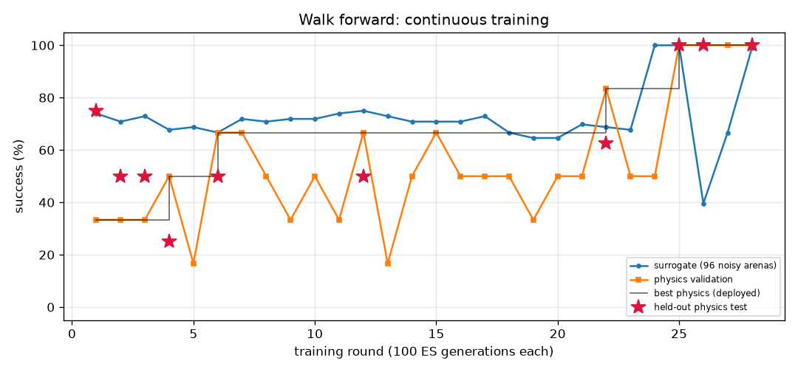

# Walk forward (`walk_forward`) — training report

*Auto-generated by `train_brains.py`, last updated 2026-09-25T21:53:00.*

| | |
|---|---|
| rounds | 28 |
| ES generations | 2800 |
| physics runs | 430 |
| status | **optimal** |
| best brain | round 28: physics validation **100%** on 24 arenas, surrogate 99% |
| held-out physics test | **100%** on 32 unseen arenas (95% CI 89%-100%) (errors: [0.76, 0.74, 0.68, 0.67, 0.76, 0.71, 0.74, 0.67, 0.67, 0.67, 0.68, 0.76, 0.67, 0.67, 0.71, 0.69, 0.76, 0.73, 0.76, 0.68, 0.68, 0.67, 0.74, 0.72, 0.76, 0.74, 0.67, 0.76, 0.74, 0.75, 0.67, 0.76]) |

Physics error per arena: mm from target at the end (< 1.5 and standing still = success).

| round | level | gens | sigma | surrogate | physics val | val errors | test | note |
|---:|---:|---:|---:|---:|---:|---|---:|---|
| 1 | 1 | 100 | 0.047 | 74% | 33% | [1.06, 2.13, 1.82, 2.52, 2.51, 2.65] | 75% | new best |
| 2 | 1 | 200 | 0.039 | 71% | 33% | [2.92, 1.74, 8.59, 2.22, 1.64, 2.24] | 50% | new best |
| 3 | 1 | 300 | 0.040 | 73% | 33% | [1.98, 2.3, 1.29, 3.25, 2.48, 2.42] | 50% | new best |
| 4 | 1 | 400 | 0.039 | 68% | 50% | [1.71, 2.2, 2.53, 2.43, 1.56, 1.49] | 25% | new best |
| 5 | 1 | 500 | 0.042 | 69% | 17% | [2.46, 2.54, 3.26, 2.74, 0.58, 2.42] |  |  |
| 6 | 1 | 600 | 0.042 | 67% | 67% | [1.99, 1.98, 1.19, 3.81, 2.4, 1.11] | 50% | new best |
| 7 | 1 | 700 | 0.043 | 72% | 67% | [1.68, 1.83, 2.69, 1.95, 1.94, 2.66] |  |  |
| 8 | 1 | 800 | 0.040 | 71% | 50% | [1.92, 0.84, 2.85, 1.69, 2.47, 2.13] |  |  |
| 9 | 1 | 900 | 0.040 | 72% | 33% | [3.54, 1.18, 2.07, 2.12, 0.85, 2.81] |  |  |
| 10 | 1 | 1000 | 0.040 | 72% | 50% | [2.05, 2.01, 1.34, 3.24, 1.7, 1.42] |  | restart from best |
| 11 | 1 | 1100 | 0.043 | 74% | 33% | [9.25, 1.85, 13.52, 6.87, 1.24, 2.7] |  |  |
| 12 | 1 | 1200 | 0.039 | 75% | 67% | [2.82, 1.02, 1.22, 2.59, 1.23, 1.68] | 50% | new best |
| 13 | 1 | 1300 | 0.038 | 73% | 17% | [2.51, 0.91, 2.74, 2.59, 2.01, 2.0] |  |  |
| 14 | 1 | 1400 | 0.039 | 71% | 50% | [1.83, 2.15, 3.52, 1.22, 4.32, 1.71] |  | reseed: fresh weights |
| 15 | 1 | 1500 | 0.080 | 71% | 67% | [1.89, 1.17, 2.88, 1.3, 1.42, 3.06] |  |  |
| 16 | 1 | 1600 | 0.040 | 71% | 50% | [2.91, 1.58, 1.89, 0.98, 2.45, 2.2] |  |  |
| 17 | 1 | 1700 | 0.040 | 73% | 50% | [2.35, 2.06, 1.43, 2.04, 1.73, 1.26] |  |  |
| 18 | 1 | 1800 | 0.039 | 67% | 50% | [2.31, 1.82, 1.84, 2.38, 3.09, 0.64] |  |  |
| 19 | 1 | 1900 | 0.043 | 65% | 33% | [1.95, 2.28, 2.37, 1.46, 2.34, 2.17] |  |  |
| 20 | 1 | 2000 | 0.044 | 65% | 50% | [1.25, 1.53, 0.9, 2.0, 2.39, 2.01] |  |  |
| 21 | 1 | 2100 | 0.044 | 70% | 50% | [2.74, 2.43, 1.02, 1.21, 2.46, 1.79] |  |  |
| 22 | 1 | 2200 | 0.041 | 69% | 83% | [1.82, 2.03, 1.53, 1.49, 0.99, 1.69] | 62% | new best |
| 23 | 1 | 2300 | 0.042 | 68% | 50% | [1.65, 2.26, 1.7, 1.42, 2.16, 2.62] |  | reseed: fresh weights |
| 24 | 1 | 2400 | 0.080 | 100% | 50% | [0.74, 3.28, 1.29, 4.29, 3.21, 0.82] |  |  |
| 25 | 1 | 2500 | 0.024 | 100% | 100% | [0.61, 0.21, 0.24, 0.27, 0.39, 0.23] | 100% | new best |
| 26 | 1 | 2600 | 0.064 | 40% | 100% | [0.27, 0.25, 0.18, 0.27, 0.26, 0.13] | 100% | new best |
| 27 | 1 | 2700 | 0.058 | 67% | 100% | [0.89, 0.87, 0.9, 0.9, 0.87, 0.89] |  |  |
| 28 | 1 | 2800 | 0.043 | 99% | 100% | [0.72, 0.68, 0.75, 0.72, 0.68, 0.76] | 100% | new best |
