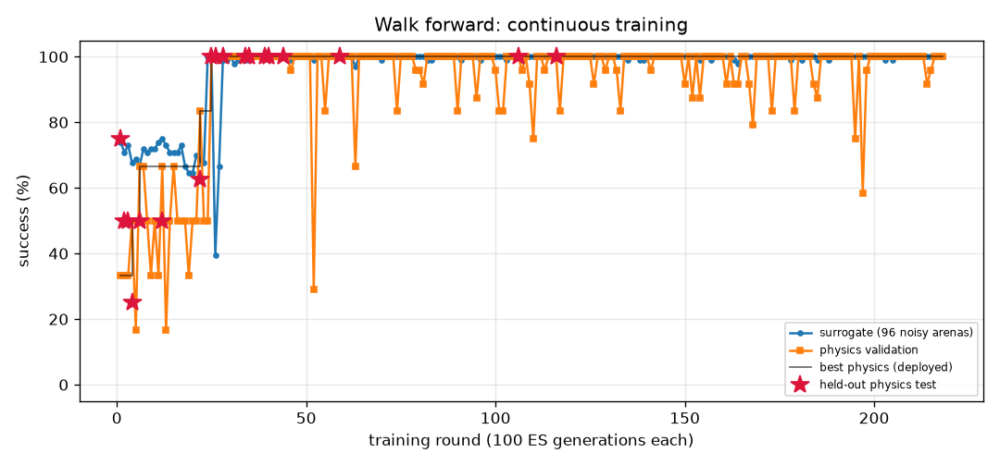

# Walk forward (`walk_forward`) — training report

*Auto-generated by `train_brains.py`, last updated 2026-10-17T14:51:07.*

| | |
|---|---|
| rounds | 105 |
| ES generations | 10500 |
| physics runs | 2470 |
| status | **optimal** |
| best brain | round 59: physics validation **100%** on 24 arenas, surrogate 100% |
| held-out physics test | **100%** on 32 unseen arenas (95% CI 89%-100%) (errors: [0.22, 0.23, 0.28, 0.29, 0.23, 0.21, 0.23, 0.3, 0.3, 0.29, 0.27, 0.23, 0.29, 0.29, 0.21, 0.23, 0.23, 0.22, 0.22, 0.25, 0.28, 0.29, 0.23, 0.21, 0.22, 0.23, 0.3, 0.22, 0.23, 0.24, 0.3, 0.22]) |

Physics error per arena: mm from target at the end (< 1.5 and standing still = success).

| round | level | gens | sigma | surrogate | physics val | val errors | test | note |
|---:|---:|---:|---:|---:|---:|---|---:|---|
| 66 | 3 | 6600 | 0.024 | 100% | 100% | [0.29, 0.34, 0.28, 0.28, 0.34, 0.28, 0.34, 0.28, 0.34, 0.34, 0.27, 0.33, 0.28, 0.28, 0.3, 0.33, 0.27, 0.33, 0.27, 0.3, 0.27, 0.34, 0.33, 0.28] |  |  |
| 67 | 3 | 6700 | 0.024 | 100% | 100% | [0.09, 0.26, 0.25, 0.09, 0.25, 0.06, 0.27, 0.15, 0.26, 0.28, 0.25, 0.28, 0.06, 0.24, 0.11, 0.28, 0.05, 0.25, 0.07, 0.22, 0.08, 0.28, 0.27, 0.08] |  | restart from best |
| 68 | 3 | 6800 | 0.024 | 100% | 100% | [0.33, 0.42, 0.35, 0.32, 0.42, 0.37, 0.42, 0.33, 0.42, 0.39, 0.37, 0.36, 0.34, 0.36, 0.36, 0.36, 0.31, 0.4, 0.33, 0.37, 0.32, 0.38, 0.36, 0.33] |  |  |
| 69 | 3 | 6900 | 0.024 | 100% | 100% | [0.08, 0.27, 0.24, 0.13, 0.27, 0.26, 0.28, 0.15, 0.28, 0.3, 0.24, 0.26, 0.13, 0.24, 0.16, 0.29, 0.09, 0.25, 0.07, 0.21, 0.14, 0.3, 0.28, 0.07] |  |  |
| 70 | 3 | 7000 | 0.024 | 99% | 100% | [0.24, 0.3, 0.04, 0.24, 0.3, 0.13, 0.29, 0.09, 0.3, 0.26, 0.24, 0.24, 0.18, 0.11, 0.28, 0.24, 0.2, 0.31, 0.17, 0.32, 0.18, 0.26, 0.22, 0.17] |  |  |
| 71 | 3 | 7100 | 0.025 | 100% | 100% | [0.52, 0.45, 0.32, 0.51, 0.45, 0.32, 0.43, 0.37, 0.44, 0.38, 0.33, 0.34, 0.35, 0.32, 0.55, 0.35, 0.49, 0.49, 0.38, 0.52, 0.41, 0.37, 0.33, 0.35] |  | restart from best |
| 72 | 3 | 7200 | 0.024 | 100% | 100% | [0.11, 0.29, 0.06, 0.07, 0.29, 0.03, 0.29, 0.09, 0.29, 0.14, 0.08, 0.08, 0.07, 0.1, 0.23, 0.08, 0.09, 0.27, 0.11, 0.26, 0.1, 0.15, 0.07, 0.12] |  |  |
| 73 | 3 | 7300 | 0.024 | 100% | 100% | [0.17, 0.29, 0.07, 0.12, 0.29, 0.08, 0.31, 0.08, 0.3, 0.21, 0.07, 0.28, 0.08, 0.06, 0.26, 0.23, 0.07, 0.29, 0.07, 0.26, 0.09, 0.16, 0.29, 0.08] |  |  |
| 74 | 3 | 7400 | 0.024 | 100% | 83% | [0.25, 0.07, 0.07, 0.1, 0.08, 0.16, 0.09, 0.14, 0.09, 0.18, 0.19, 0.21, 0.13, 0.07, 0.28, 0.19, 0.07, 0.33, 2.47, 0.12, 0.14, 0.2, 0.21, 0.17] |  |  |
| 75 | 3 | 7500 | 0.024 | 100% | 100% | [0.22, 0.3, 0.25, 0.22, 0.29, 0.25, 0.3, 0.24, 0.3, 0.31, 0.24, 0.3, 0.25, 0.25, 0.22, 0.31, 0.22, 0.27, 0.24, 0.23, 0.23, 0.31, 0.29, 0.25] |  | restart from best |
| 76 | 3 | 7600 | 0.024 | 100% | 100% | [0.18, 0.26, 0.09, 0.27, 0.23, 0.08, 0.21, 0.09, 0.22, 0.23, 0.06, 0.25, 0.08, 0.08, 0.29, 0.24, 0.2, 0.23, 0.04, 0.15, 0.11, 0.22, 0.25, 0.09] |  |  |
| 77 | 3 | 7700 | 0.024 | 100% | 100% | [0.1, 0.36, 0.06, 0.14, 0.35, 0.09, 0.35, 0.07, 0.35, 0.37, 0.04, 0.34, 0.19, 0.09, 0.11, 0.36, 0.12, 0.33, 0.07, 0.3, 0.1, 0.37, 0.15, 0.19] |  |  |
| 78 | 3 | 7800 | 0.024 | 100% | 100% | [0.17, 0.22, 0.06, 0.15, 0.21, 0.07, 0.26, 0.15, 0.19, 0.29, 0.05, 0.25, 0.16, 0.07, 0.2, 0.28, 0.13, 0.21, 0.08, 0.27, 0.08, 0.3, 0.29, 0.09] |  |  |
| 79 | 3 | 7900 | 0.024 | 100% | 96% | [0.19, 0.4, 0.06, 0.18, 0.39, 0.08, 0.4, 0.09, 0.39, 0.25, 0.01, 0.34, 0.07, 0.09, 0.19, 0.29, 0.1, 0.37, 0.1, 0.21, 0.15, 0.25, 0.35, 0.05] |  | restart from best |
| 80 | 3 | 8000 | 0.024 | 100% | 96% | [0.23, 0.31, 0.08, 0.23, 0.31, 0.22, 0.3, 0.12, 0.3, 0.31, 0.23, 0.29, 0.19, 0.21, 0.25, 0.3, 0.22, 0.29, 0.4, 0.27, 0.2, 0.3, 0.28, 0.15] |  |  |
| 81 | 3 | 8100 | 0.024 | 100% | 92% | [0.06, 0.19, 0.1, 0.07, 0.19, 0.08, 0.2, 0.1, 0.19, 0.22, 3.44, 0.17, 0.04, 0.07, 0.13, 0.17, 0.08, 0.16, 0.09, 0.14, 0.08, 0.21, 0.17, 1.28] |  |  |
| 82 | 3 | 8200 | 0.024 | 99% | 100% | [0.17, 0.28, 0.25, 0.17, 0.28, 0.25, 0.29, 0.24, 0.28, 0.3, 0.26, 0.27, 0.24, 0.25, 0.18, 0.28, 0.19, 0.24, 0.22, 0.19, 0.22, 0.29, 0.27, 0.24] |  |  |
| 83 | 3 | 8300 | 0.025 | 99% | 100% | [0.22, 0.3, 0.32, 0.23, 0.3, 0.29, 0.32, 0.29, 0.31, 0.36, 0.29, 0.35, 0.29, 0.3, 0.22, 0.36, 0.25, 0.26, 0.29, 0.22, 0.28, 0.36, 0.34, 0.29] |  | restart from best |
| 84 | 3 | 8400 | 0.024 | 100% | 100% | [0.16, 0.25, 0.09, 0.15, 0.24, 0.08, 0.23, 0.17, 0.22, 0.18, 0.07, 0.2, 0.16, 0.09, 0.17, 0.16, 0.14, 0.19, 0.17, 0.17, 0.18, 0.19, 0.22, 0.16] |  |  |
| 85 | 3 | 8500 | 0.024 | 100% | 100% | [0.23, 0.27, 0.27, 0.23, 0.27, 0.25, 0.28, 0.24, 0.27, 0.32, 0.24, 0.31, 0.25, 0.25, 0.23, 0.32, 0.24, 0.25, 0.26, 0.22, 0.25, 0.32, 0.3, 0.25] |  |  |
| 86 | 3 | 8600 | 0.024 | 100% | 100% | [0.17, 0.18, 0.15, 0.15, 0.2, 0.18, 0.2, 0.17, 0.19, 0.23, 0.12, 0.16, 0.18, 0.19, 0.22, 0.16, 0.16, 0.2, 0.2, 0.24, 0.22, 0.19, 0.15, 0.18] |  |  |
| 87 | 3 | 8700 | 0.024 | 100% | 100% | [0.26, 0.33, 0.2, 0.26, 0.3, 0.3, 0.34, 0.28, 0.32, 0.32, 0.24, 0.2, 0.27, 0.3, 0.32, 0.3, 0.27, 0.32, 0.31, 0.34, 0.29, 0.29, 0.27, 0.27] |  | restart from best |
| 88 | 3 | 8800 | 0.024 | 100% | 100% | [0.08, 0.31, 0.06, 0.08, 0.31, 0.16, 0.31, 0.07, 0.32, 0.1, 0.06, 0.12, 0.07, 0.06, 0.26, 0.1, 0.08, 0.3, 0.08, 0.28, 0.07, 0.09, 0.24, 0.09] |  |  |
| 89 | 3 | 8900 | 0.024 | 100% | 100% | [0.31, 0.34, 0.27, 0.31, 0.33, 0.26, 0.34, 0.27, 0.33, 0.33, 0.27, 0.31, 0.27, 0.27, 0.32, 0.32, 0.29, 0.35, 0.27, 0.33, 0.29, 0.32, 0.3, 0.27] |  |  |
| 90 | 3 | 9000 | 0.024 | 100% | 83% | [0.06, 0.17, 0.17, 0.06, 0.17, 0.15, 0.19, 0.21, 0.12, 0.32, 0.09, 0.38, 0.03, 0.32, 0.07, 0.36, 0.12, 0.13, 0.04, 0.14, 0.05, 0.34, 0.4, 0.03] |  |  |
| 91 | 3 | 9100 | 0.024 | 99% | 100% | [0.19, 0.31, 0.06, 0.12, 0.3, 0.12, 0.27, 0.13, 0.3, 0.35, 0.06, 0.31, 0.07, 0.05, 0.2, 0.29, 0.13, 0.24, 0.11, 0.17, 0.08, 0.34, 0.32, 0.1] |  | restart from best |
| 92 | 3 | 9200 | 0.024 | 100% | 100% | [0.28, 0.39, 0.33, 0.28, 0.39, 0.33, 0.39, 0.3, 0.39, 0.38, 0.32, 0.35, 0.31, 0.32, 0.31, 0.37, 0.28, 0.37, 0.3, 0.33, 0.3, 0.38, 0.35, 0.31] |  |  |
| 93 | 3 | 9300 | 0.024 | 100% | 100% | [0.29, 0.33, 0.26, 0.28, 0.32, 0.26, 0.33, 0.26, 0.33, 0.31, 0.26, 0.29, 0.25, 0.26, 0.3, 0.31, 0.27, 0.31, 0.25, 0.31, 0.26, 0.31, 0.3, 0.25] |  |  |
| 94 | 3 | 9400 | 0.024 | 100% | 100% | [0.2, 0.28, 0.22, 0.2, 0.28, 0.21, 0.29, 0.2, 0.29, 0.3, 0.22, 0.29, 0.2, 0.22, 0.22, 0.29, 0.2, 0.25, 0.2, 0.23, 0.2, 0.29, 0.28, 0.2] |  |  |
| 95 | 3 | 9500 | 0.024 | 100% | 88% | [0.05, 0.06, 0.02, 0.06, 0.03, 0.05, 0.07, 0.08, 0.07, 0.13, 1.49, 0.12, 0.02, 0.17, 0.1, 0.09, 0.06, 0.05, 0.06, 0.08, 0.15, 0.13, 0.07, 0.02] |  | restart from best |
| 96 | 3 | 9600 | 0.024 | 99% | 100% | [0.1, 0.19, 0.19, 0.08, 0.18, 0.08, 0.2, 0.04, 0.19, 0.24, 0.08, 0.24, 0.1, 0.08, 0.12, 0.25, 0.08, 0.17, 0.06, 0.09, 0.07, 0.25, 0.24, 0.08] |  |  |
| 97 | 3 | 9700 | 0.025 | 100% | 100% | [0.22, 0.26, 0.25, 0.22, 0.26, 0.24, 0.27, 0.25, 0.26, 0.3, 0.23, 0.31, 0.24, 0.24, 0.22, 0.3, 0.23, 0.24, 0.24, 0.23, 0.23, 0.31, 0.31, 0.24] |  |  |
| 98 | 3 | 9800 | 0.024 | 100% | 100% | [0.32, 0.33, 0.34, 0.29, 0.32, 0.18, 0.36, 0.24, 0.32, 0.45, 0.19, 0.35, 0.25, 0.21, 0.3, 0.49, 0.33, 0.38, 0.24, 0.41, 0.28, 0.37, 0.38, 0.24] |  |  |
| 99 | 3 | 9900 | 0.024 | 100% | 100% | [0.2, 0.24, 0.2, 0.19, 0.23, 0.2, 0.24, 0.19, 0.23, 0.25, 0.2, 0.24, 0.2, 0.21, 0.21, 0.25, 0.2, 0.24, 0.19, 0.21, 0.2, 0.25, 0.28, 0.2] |  | restart from best |
| 100 | 3 | 10000 | 0.024 | 100% | 96% | [0.14, 0.16, 0.12, 0.07, 0.16, 0.12, 0.11, 0.04, 0.09, 0.15, 0.07, 0.16, 0.12, 0.07, 0.08, 0.17, 0.08, 0.17, 0.13, 0.13, 0.14, 0.16, 0.14, 0.12] |  |  |
| 101 | 3 | 10100 | 0.024 | 100% | 83% | [0.07, 0.19, 0.44, 0.06, 0.18, 0.02, 0.18, 0.04, 0.16, 0.23, 0.03, 0.25, 0.04, 0.08, 0.08, 0.24, 0.06, 0.14, 0.06, 0.1, 0.07, 0.23, 0.23, 0.02] |  |  |
| 102 | 3 | 10200 | 0.024 | 100% | 83% | [0.09, 0.25, 0.11, 0.07, 0.26, 0.11, 0.26, 0.1, 0.25, 0.26, 0.22, 0.2, 0.1, 0.35, 0.2, 0.22, 0.06, 0.25, 0.06, 0.22, 0.06, 0.26, 0.18, 0.1] |  |  |
| 103 | 3 | 10300 | 0.024 | 99% | 100% | [0.24, 0.32, 0.26, 0.25, 0.31, 0.26, 0.32, 0.04, 0.32, 0.31, 0.27, 0.3, 0.23, 0.26, 0.27, 0.31, 0.24, 0.31, 0.23, 0.29, 0.23, 0.31, 0.29, 0.23] |  | restart from best |
| 104 | 3 | 10400 | 0.024 | 100% | 100% | [0.17, 0.25, 0.22, 0.16, 0.26, 0.22, 0.26, 0.18, 0.25, 0.29, 0.23, 0.28, 0.19, 0.22, 0.17, 0.28, 0.17, 0.22, 0.19, 0.19, 0.17, 0.29, 0.28, 0.19] |  |  |
| 105 | 3 | 10500 | 0.024 | 100% | 100% | [0.09, 0.18, 0.21, 0.07, 0.18, 0.21, 0.19, 0.18, 0.18, 0.26, 0.22, 0.26, 0.19, 0.21, 0.14, 0.26, 0.15, 0.17, 0.18, 0.14, 0.17, 0.26, 0.26, 0.18] |  |  |
